# Índice

- [Visión general de la arquitectura](#1-visión-general-de-la-arquitectura)
- [Infraestructura local (on-premise)](#2-infraestructura-local-on-premise)
- [Infraestructura cloud (AWS)](#3-infraestructura-cloud-aws)
      [Red (VPC)](#red-vpc)
      [Instancia virtual (EC2)](#instancia-virtual-ec2)
      [Prueba de conectividad SSH](#prueba-de-conectividad-ssh)
- [Servicios desplegados en la nube](#4-servicios-desplegados-en-la-nube)
      [DNS en la nube](#dns-en-la-nube)
      [Almacenamiento (S3)](#almacenamiento-s3)
      [Base de datos RDS](#base-de-datos-rds)
      [Servicio web](#servicio-web)
- [Funcionamiento de la arquitectura](#6-funcionamiento-de-la-arquitectura)
- [Conclusión](#7-conclusión)


# Explicación de la arquitectura propuesta

## Visión general de la arquitectura

La arquitectura propuesta para este proyecto es de tipo **híbrida**, combinando un entorno local (on-premise) con servicios desplegados en la nube mediante **Amazon Web Services (AWS)**.

El objetivo de este enfoque es mantener los servicios críticos dentro del CPD local, mientras que la nube se utiliza como complemento para ampliar capacidades, mejorar la accesibilidad y permitir la exposición de servicios a Internet. En concreto, AWS se utiliza para desplegar y alojar el servicio web público del club (diferente de la intranet interna), almacenar archivos en la nube y ubicar la base de datos del sistema.

De esta forma, se consigue un equilibrio entre control local y escalabilidad cloud.

Para la realización de este proyecto, se ha utilizado AWS Academy, un entorno de pruebas donde se han configurado estos servicios.
---

## Infraestructura local (on-premise)

El entorno local constituye el núcleo del sistema y alberga los servicios críticos de la organización. Entre ellos se incluyen:

- Active Directory
- DNS interno
- Servidor de archivos
- Servidor FTP
- Intranet corporativa
- Servicios de impresión

Estos servicios se ejecutan dentro del CPD del club, utilizando una red interna segmentada mediante VLANs, lo que permite mejorar la seguridad y organización del tráfico.

---

## Infraestructura cloud (AWS)

Como complemento al entorno local, se ha desplegado una infraestructura en la nube utilizando AWS, basada en los siguientes elementos:

### Red (VPC)

En primer lugar, se creó una VPC dentro de AWS Academy a través de del asistente de creación rápida, simulando un entorno empresarial real dentro de una arquitectura híbrida local + nube. 

Esta opción despliega una VPC, subredes públicas y privadas, tablas de enrutamiento y una Internet Gateway. De este modo se simplifica la configuración inicial y se evitan 

errores de diseño manual. Además, facilita la separación entre recursos accesibles desde Internet y recursos internos, lo que mejora la seguridad y escalabilidad. 

<div align="center">

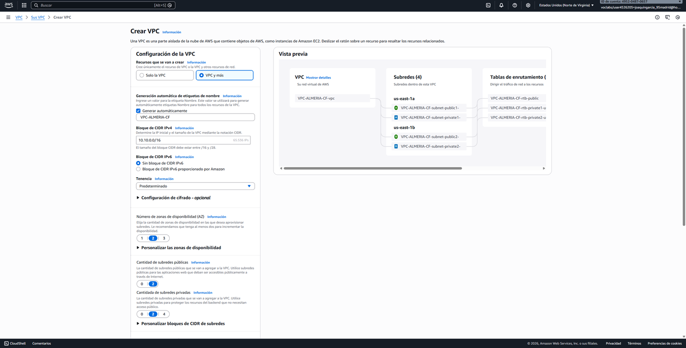
</div>

<div align="center">

*Captura tomada durante la creación de la VPC.*

</div>


---

### Instancia virtual (EC2)

Tras crear la VPC, se procedió a establecer un servidor EC2 con el que vincularla. Para el sistema operativo de la instancia EC2, se eligió Amazon Linux, una distribución mantenida directamente por AWS y optimizada para

su infraestructura cloud. Esta elección garantiza una mayor compatibilidad con los servicios de AWS, un mejor rendimiento y actualizaciones de seguridad frecuentes. 

Aunque se podría haber utilizado un sistema operativo Windows Server, Amazon Linux se considera más adecuado en este escenario por su menor coste, menor consumo de recursos y su orientación a entornos cloud.

<div align="center">

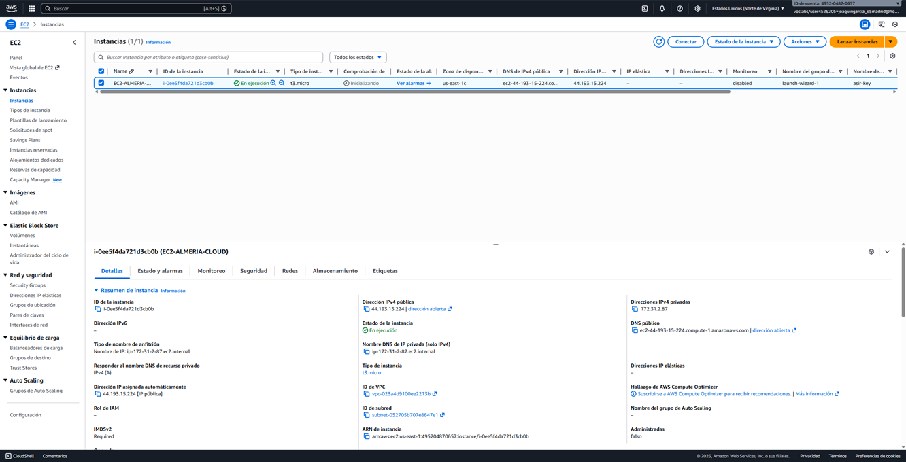
</div>

<div align="center">

*Instancia creada.*

</div>

#### Prueba de conectividad SSH

Tras crear la instancia, se realizó el primer acceso por SSH desde el equipo local, aceptando la huella digital del servidor, ya que era la primera vez que se establecía conexión con dicha máquina. Para ello, primero se 

generó una **clave llamada “asir-key.pem”** que se guardó en una carpeta del ordenador local. Después, en PowerShell, se utilizó el comando “ssh -i asir-key.pem “ec2-user@44.193.15.224”. El mensaje que aparece se debe a 

que AWS muestra la **huella digital (fingerprint)** del servidor porque es la primera vez que se conecta a esa máquina.

<div align="center">

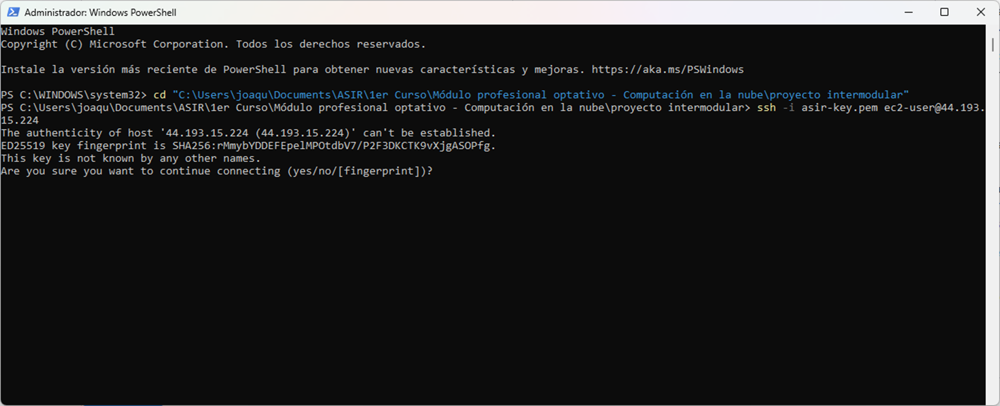
</div>

<div align="center">

*Utilizando "Yes" se pudo avanzar.*

</div>

Tras ejecutar “Yes”, **accedió a la instancia de Amazon Linux**, tal y como se puede comprobar en las capturas. También se ejecutó el comando “ip a” para mostrar la configuración de red de la instancia EC2 y comprobar 

que la interfaz de red estaba correctamente configurada y operativa.


<div align="center">

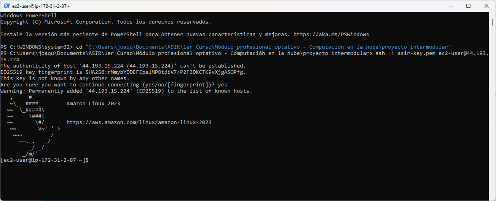
</div>

<div align="center">

*La conexión entre la instancia y el equipo local funcionó correctamente.*

</div>

<div align="center">

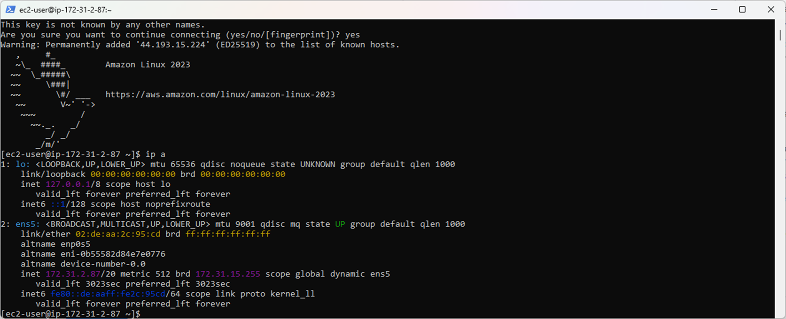
</div>

<div align="center">

*Con “ip a” se mostraron algunos como la dirección IP privada o el estado de la interfaz de red (UP).*

</div>

De esta forma, y mediante una conexión segura SSH, se puede:

- Administrar la instancia desde la red interna
- Complementar el entorno local con servicios desplegados en la nube
- Simular un escenario real de empresa con arquitectura híbrida

Además, se ha utilizado un direccionamiento IP independiente en la nube, evitando conflictos con la red local.

---

## Servicios desplegados en la nube

### DNS en la nube

Mediante la conexión SSH se ha comprobado la resolución DNS interna de la instancia EC2. El sistema devuelve un nombre de host completo (FQDN) gestionado automáticamente por AWS, lo que confirma que la infraestructura cloud dispone de un servicio de resolución de nombres operativo sin necesidad de desplegar un servidor DNS propio.

</div>

<div align="center">

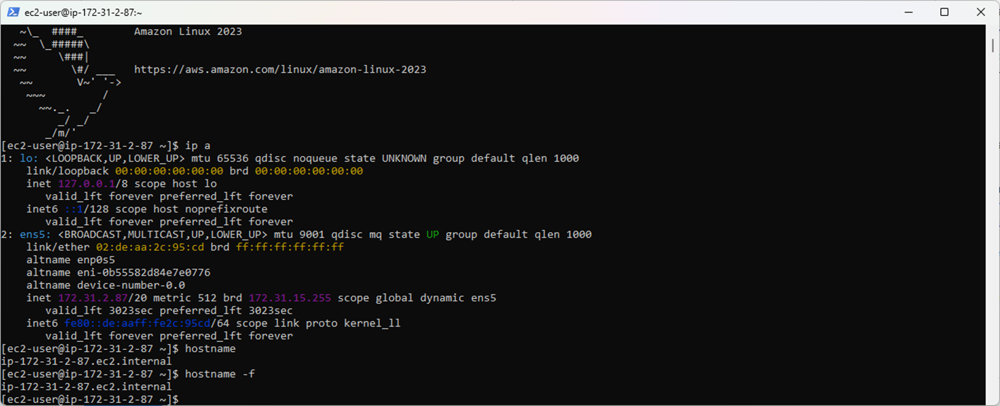
</div>

<div align="center">

*El comando hostname devuelve el nombre asignado a la instancia, mientras que hostname -f muestra el nombre completo (FQDN) gestionado por AWS DNS.*

</div>

---

### Almacenamiento (S3)

Para el almacenamiento en la nube se utilizó Amazon S3, un servicio de almacenamiento de objetos altamente escalable. 

A diferencia de un sistema de archivos tradicional (como un disco local o NAS), S3 almacena los datos en forma de objetos dentro de buckets, permitiendo su acceso mediante API, CLI o SDK.

Desde la instancia EC2 se accede al bucket mediante AWS CLI, lo que permite integrar el almacenamiento en la lógica de la aplicación web.

</div>

<div align="center">

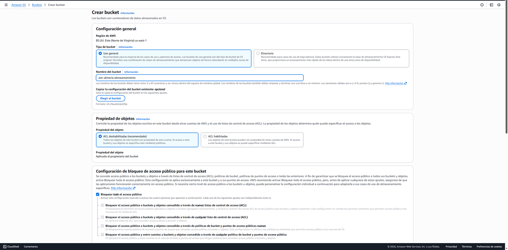
</div>

<div align="center">

*Setings utilizadas para configurar el bucket.*

</div>

A continuación se procedió a subir un archivo para, después, comprobar que se había cargado correctamente.

</div>

<div align="center">

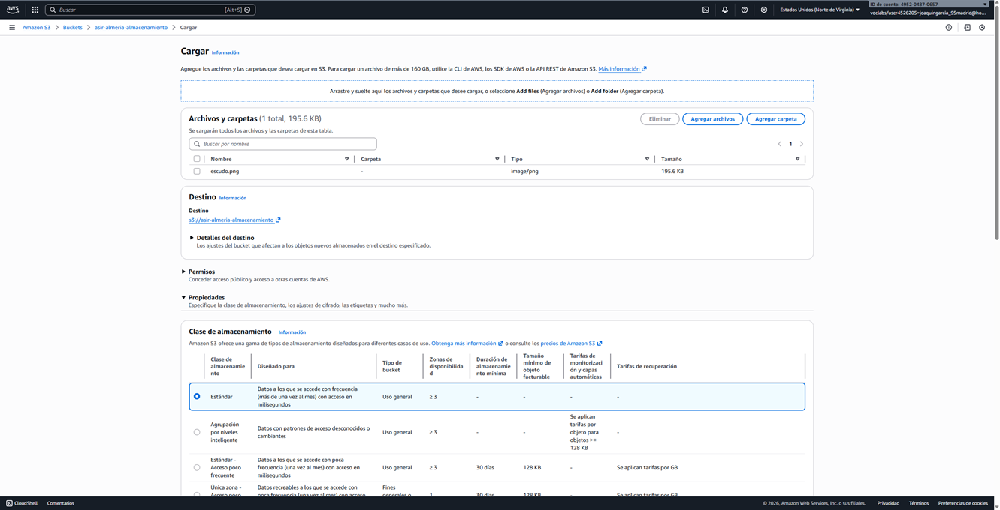
</div>

<div align="center">

*Se decidió subir el escudo del club, ya que posteriormente serviría para configurar la web pública del club.*

</div>

Inicialmente, la instancia EC2 no podía acceder al bucket debido a la ausencia de credenciales.

</div>

<div align="center">

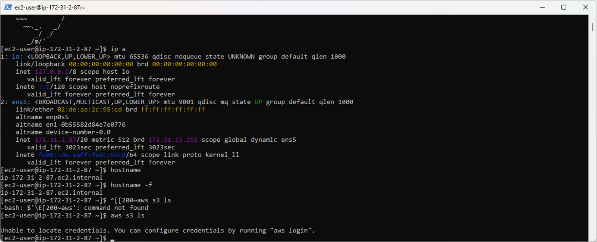
</div>

<div align="center">

*En el primer intento, no se pudo acceder al archivo subido.*

</div>

Para solucionarlo, se asignó un rol de IAM (LabInstanceProfile) a la instancia EC2 con permisos sobre Amazon S3. 

De este modo, la instancia puede acceder al almacenamiento sin necesidad de gestionar credenciales manualmente, utilizando el sistema de roles de AWS.

</div>

<div align="center">

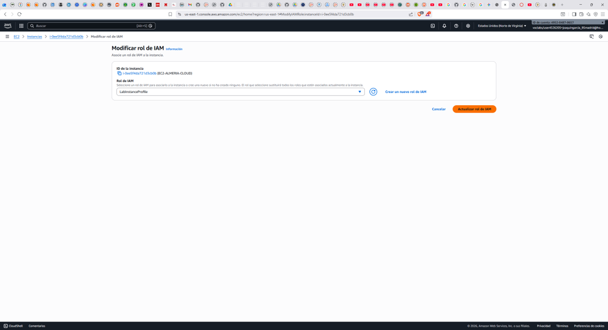
</div>

<div align="center">

*En el primer intento, no se pudo acceder al archivo subido.*

</div>

El comando "aws s3 ls" se utilizó para listar los buckets disponibles en la cuenta y verificar la correcta conexión entre la instancia EC2 y el servicio S3. El resultado fue positivo como se puede comprobar en la captura.

</div>

<div align="center">

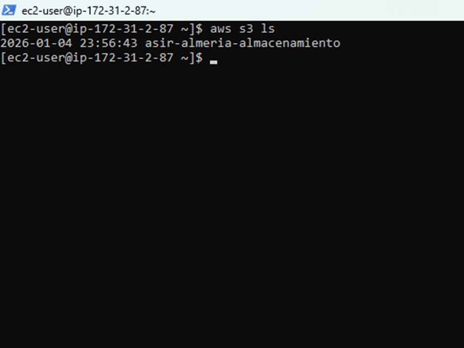
</div>

<div align="center">

*Esta vez sí se pudo acceder.*

</div>

Y aprovechando que AWS cuenta con una consola propia, llamada **CloudShell**, también se comprobó desde aquí.

</div>

<div align="center">

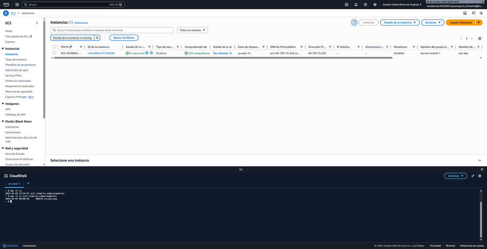
</div>

<div align="center">

*El resultado en CloudShell también fue positivo.*

</div>

---

### Base de datos RDS

Para una mayor integración de las partes del proyecto intermodular, se decidió incluir en AWS la base de datos desarrollada para ese módulo. Para ello, se creó una instancia de base de datos MySQL en Amazon RDS, accesible desde la instancia EC2.

Una vez creada, se optó por instalar MariaDB, ya que la instancia utiliza Amazon Linux 2023 y el paquete mysql no se encuentra disponible directamente en los repositorios. No hubo problema ya que MariaDB es totalmente compatible con MySQL

```bash
sudo dnf install mariadb105 -y
```

</div>

<div align="center">

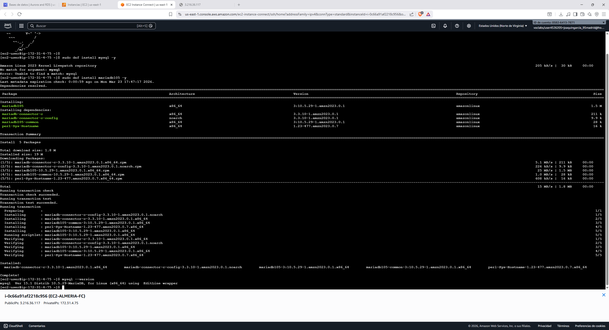
</div>

<div align="center">

*Instalación completa de MySQL.*

</div>

Una vez instalado el cliente de base de datos en la instancia EC2, se procedió a establecer la conexión con la base de datos desplegada en Amazon RDS.

Para ello, se utilizó el siguiente comando:

```bash
mysql -h database-1.cdq6a8okh4q.us-east-1.rds.amazonaws.com -P 3306 -u admin -p
```

Inicialmente se produjeron errores ya que no se estaba copiando correctamente el comando. Finalmente se logró establecer la conexión.

</div>

<div align="center">

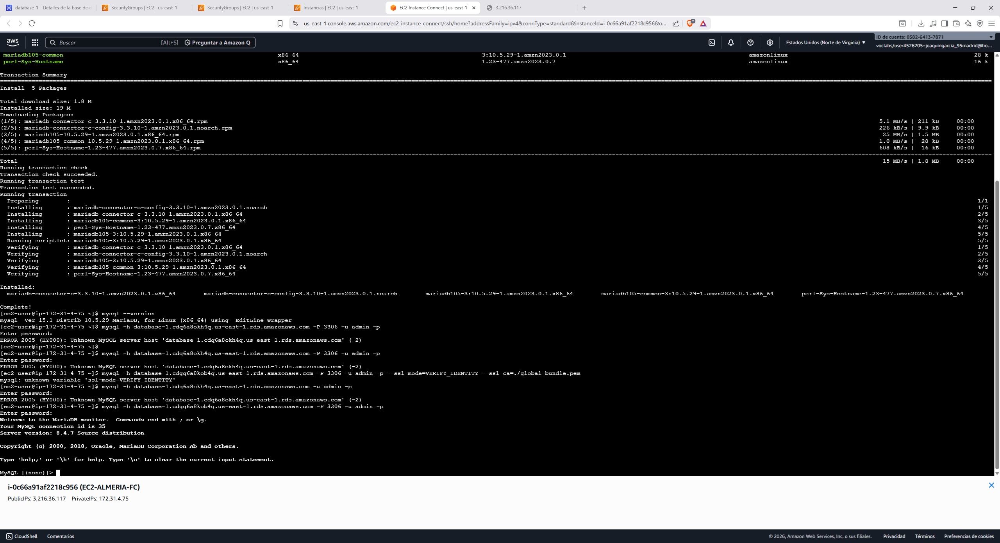
</div>

<div align="center">

*Conexión establecida con la base de datos.*

</div>

Una vez establecida la conexión con la base de datos en Amazon RDS, se procedió a la creación de la estructura de datos necesaria para el sistema.

En primer lugar, se creó la base de datos:

```sql
CREATE DATABASE club_futbol;
```

Posteriormente, se seleccionó para trabajar sobre ella:

```sql
USE club_futbol;
```

</div>

<div align="center">

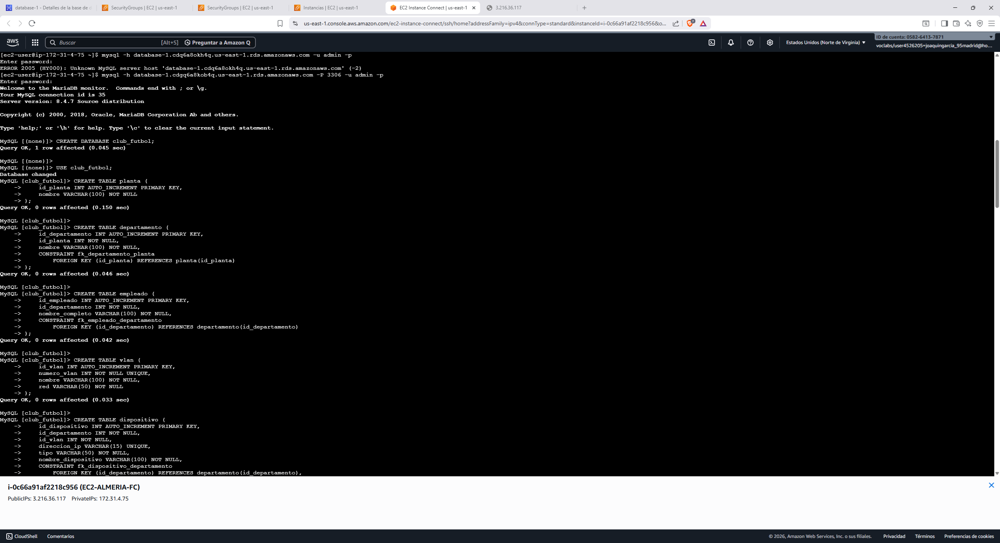
</div>

<div align="center">

*Momento en el que se creó la base de datos.*

</div>

Finalmente, se realizaron algunas querys para comprobar el correcto funcionamiento de la base de datos:

</div>

<div align="center">

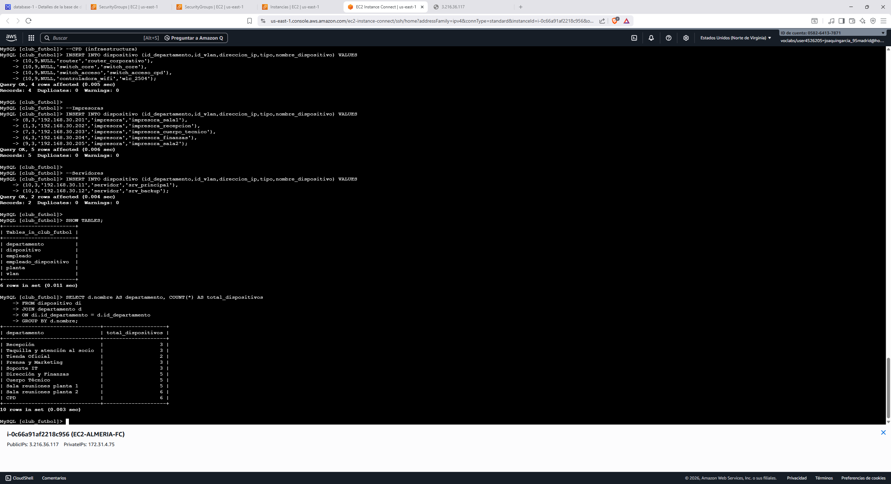
</div>

<div align="center">

*Alguna query realizada.*

</div>

### Servicio web

Para comenzar la configuración del servicio web en la instancia EC2 se utilizaron los siguientes comandos:

```bash
“sudo dnf update -y”
```
Utilizado para actualizar el sistema operativo y sus paquetes a la versión más reciente disponible.
```bash
“sudo dnf install httpd -y”
```
Mediante este comando se instaló el servidor web Apache (httpd) en la instancia EC2. Se ha escogido Apache porque es un servicio web ampliamente utilizado para publicar páginas accesibles a través del protocolo HTTP.
```bash
“sudo systemctl start httpd”
```
Este comando se emplea para iniciar el servicio Apache, permitiendo que el servidor comience a atender peticiones web en el puerto 80.
```bash
“sudo systemctl enable httpd” 
```
Permite que el servicio Apache se inicie automáticamente cada vez que la instancia EC2 arranca, garantizando la disponibilidad del servidor web sin intervención manual.
```bash
“systemctl status httpd”
```
Por último, este comando se utilizó para comprobar el estado del servidor web, verificando que el servicio se encuentra activo y funcionando correctamente.

</div>

<div align="center">

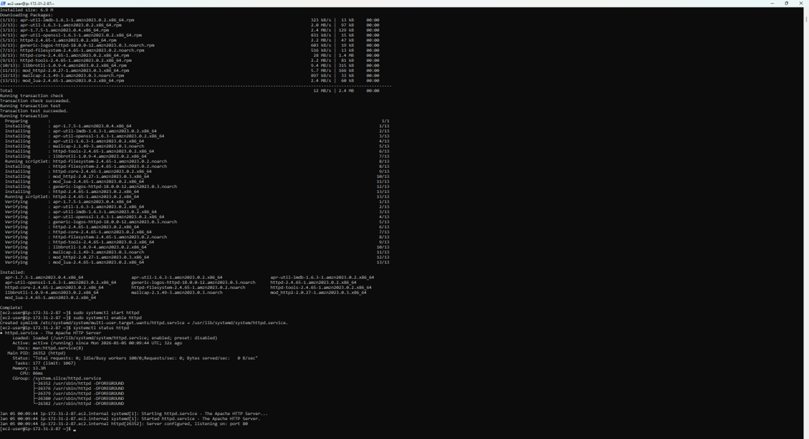
</div>

<div align="center">

*Resultado tras ejecutar los comandos mencionados anteriormente.*

</div>

El siguiente paso fue **agregar una regla** para permitir que cualquier IP se conectase al Puerto 80, es decir, a HTTP.

</div>

<div align="center">

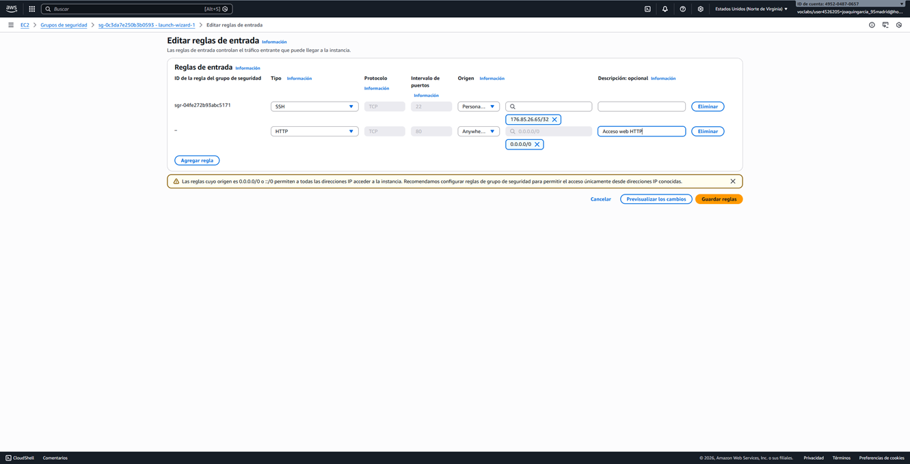
</div>

<div align="center">

*El grupo de seguridad permite acceso SSH únicamente desde mi IP para administración remota, y acceso HTTP desde cualquier origen para publicar el servicio web.*

</div>

El resultado, tal y como se indica en la captura siguiente, fue positivo. Al acceder a la dirección IP pública de la instancia EC2 mediante HTTP, se muestra la **página por defecto de Apache**, confirmando que el 

servicio web está correctamente desplegado y accesible desde Internet.

</div>

<div align="center">

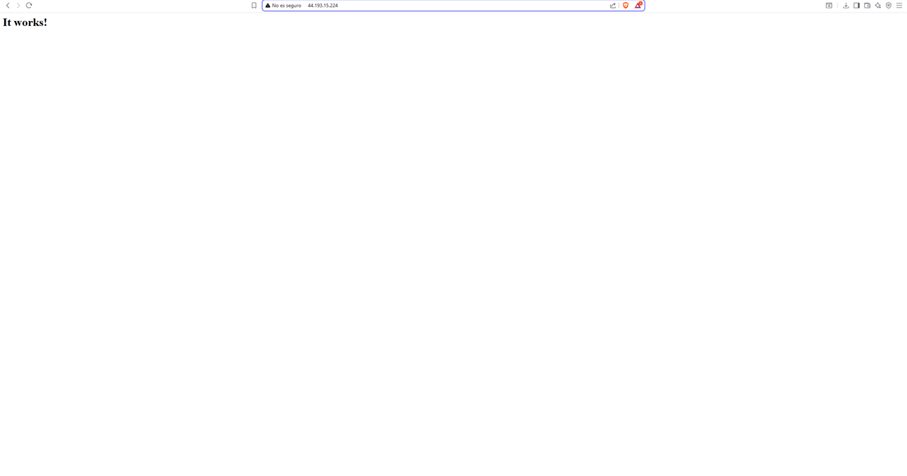
</div>

<div align="center">

*Conexión realizada con éxito.*

</div>

Por último, y para dar más realismo a la web, se procedió a añadir un HTML propio utilizando además la imagen que se había subido anteriormente. Para mantener el bucket S3 privado y aun así mostrar contenido en la web, 

se ha utilizado una URL prefirmada generada con AWS CLI desde CloudShell. Esta URL permite el acceso temporal al objeto (escudo.png) sin hacer el bucket público, demostrando un enfoque seguro de publicación de recursos 

almacenados en S3. Para ello, se ejecutó el comando **“aws s3 presign s3”** que devolvió una URL que luego fue utilizada en el código HTML.

</div>

<div align="center">

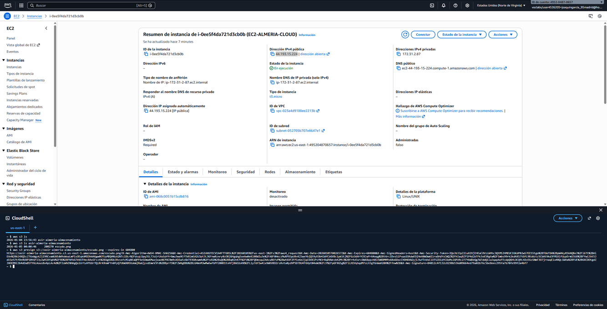
</div>

<div align="center">

*URL generada a través del comando “aws s3 presign s3”.*

</div>

A continuación, y mediante el comando **“sudo nano /var/www/html/index.html”** se accedió a otra pantalla en la que se insertó el nuevo código HTML.

</div>

<div align="center">

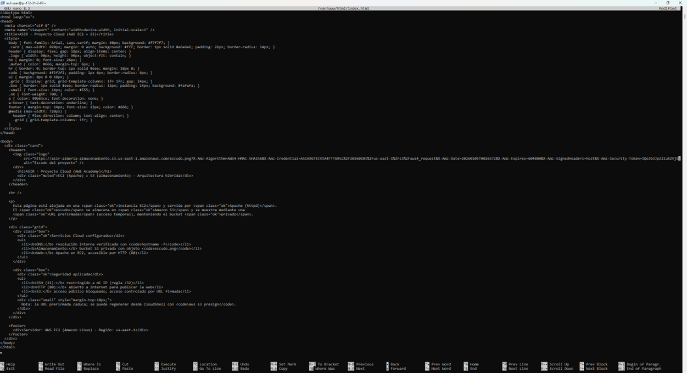
</div>

<div align="center">

*Tras guardar el nuevo código HTML, solo faltaba comprobar el resultado.*

</div>

Todo se había aplicado correctamente, tal y como se puede comprobar en la imagen siguiente.

</div>

<div align="center">

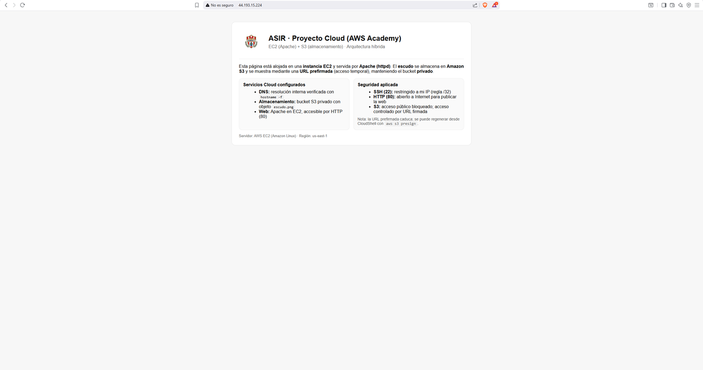
</div>

<div align="center">

*Resultado tras implementar un HTML propio y usar la imagen subida al bucket.*

</div>

Así se ha desplegado una arquitectura híbrida local–nube utilizando Amazon EC2 para el servicio web, Amazon S3 para el almacenamiento y Amazon RDS para alojar la base de datos del sistema en la nube. Además, el servidor 

web Apache se ha ejecutado en una instancia EC2 accesible por HTTP, mientras que los recursos almacenados en S3 se han mantienido privados, garantizando seguridad y control de acceso.

De este modo, se evita exponer directamente la infraestructura local a Internet, utilizando AWS como capa externa para los servicios públicos, mientras que la intranet y los servicios internos permanecen en el CPD local.

---

## Funcionamiento de la arquitectura

El funcionamiento general del sistema es el siguiente:

```bash
Acceso externo               || Acceso interno
↓                                  ↓
Usuarios externos (Internet) || Usuarios internos
↓                                  ↓
Servidor web (EC2 en AWS)    || CPD local (servicios internos)
↓
├── Base de datos (RDS)
└── Almacenamiento (S3)
```

---

## Conclusión

La arquitectura propuesta combina las ventajas del entorno local con las capacidades de la nube.

El CPD local mantiene los servicios críticos, mientras que AWS permite:

- Exponer servicios al exterior de forma segura
- Almacenar recursos en la nube
- Realizar pruebas sin afectar al sistema principal

Este enfoque híbrido permite una adopción progresiva del cloud, facilitando futuras ampliaciones como migraciones parciales, copias de seguridad en la nube o despliegue de nuevos servicios.