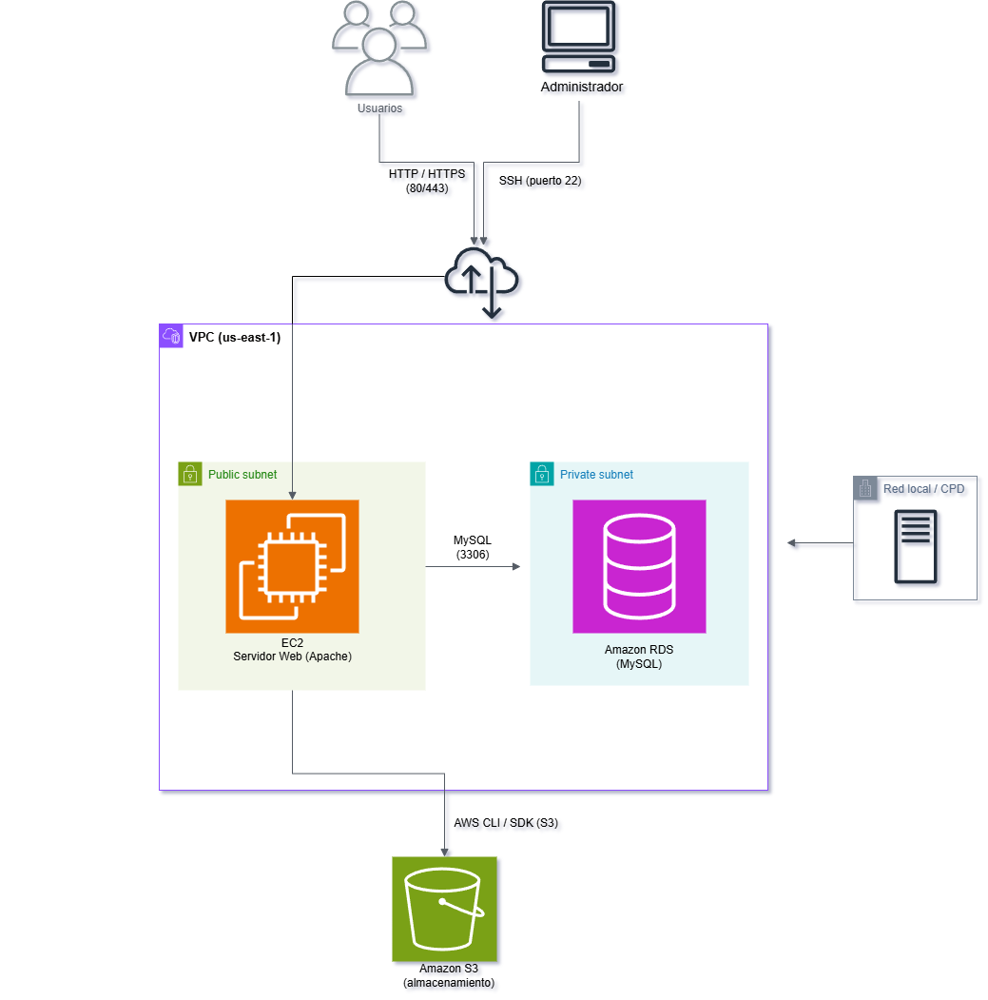

# Diagrama de la arquitectura

A continuación, se muestra el **diagrama general de la arquitectura híbrida propuesta para el proyecto.** En él se representa la integración entre la infraestructura local del club y los servicios desplegados en AWS, diferenciando claramente la red on-premise del entorno cloud. El esquema refleja el acceso de los usuarios al servidor web público alojado en una instancia EC2, la administración remota mediante SSH, la conexión con la base de datos en Amazon RDS y el uso de Amazon S3 como sistema de almacenamiento en la nube.

*Resultado del diagrama realiazado con el programa Draw.io.*

