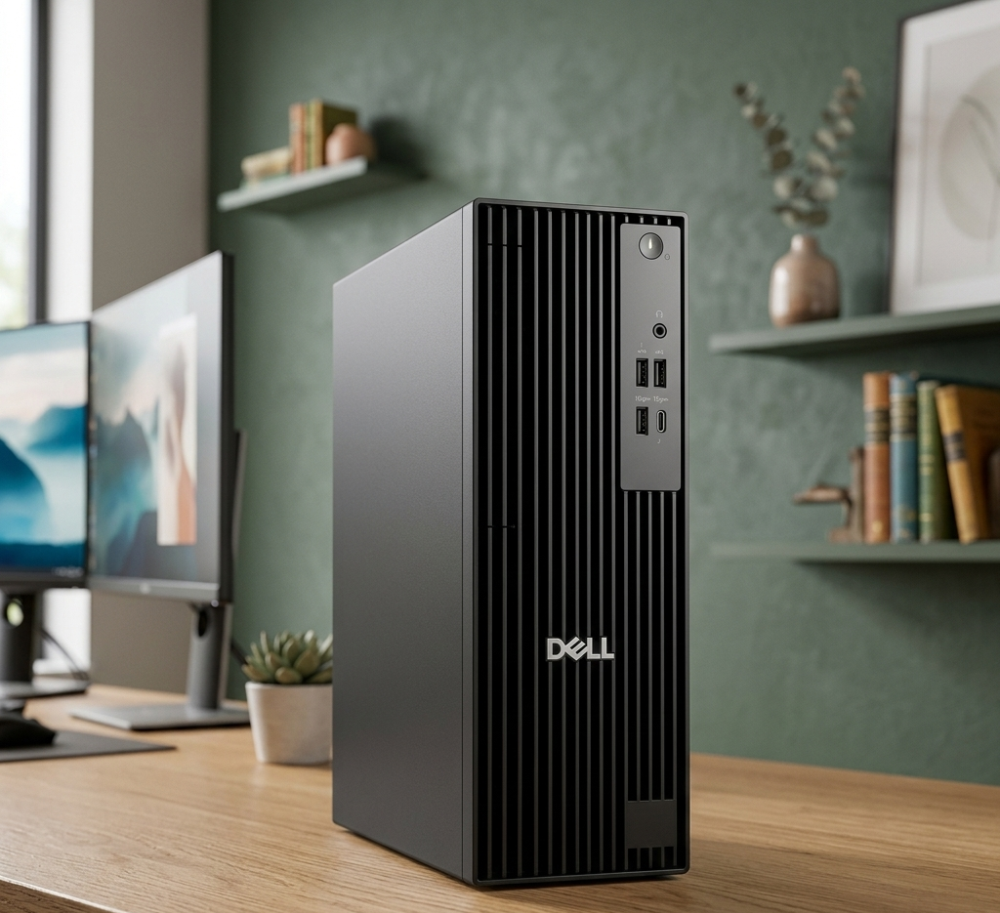
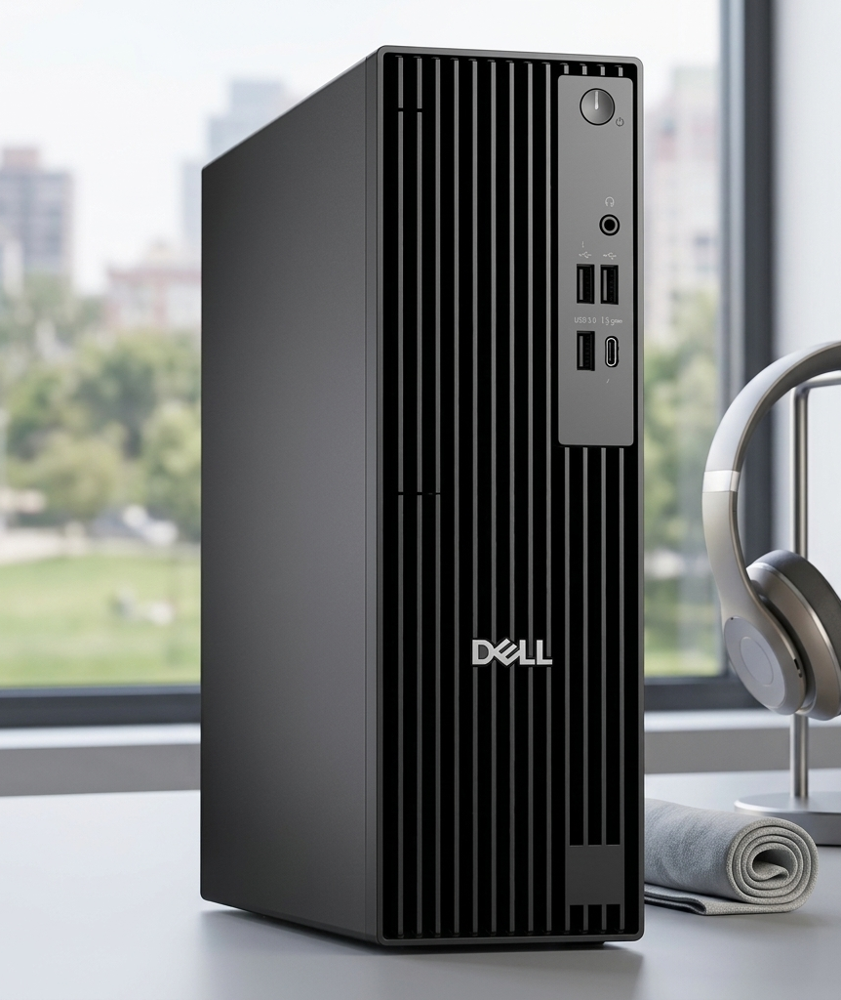
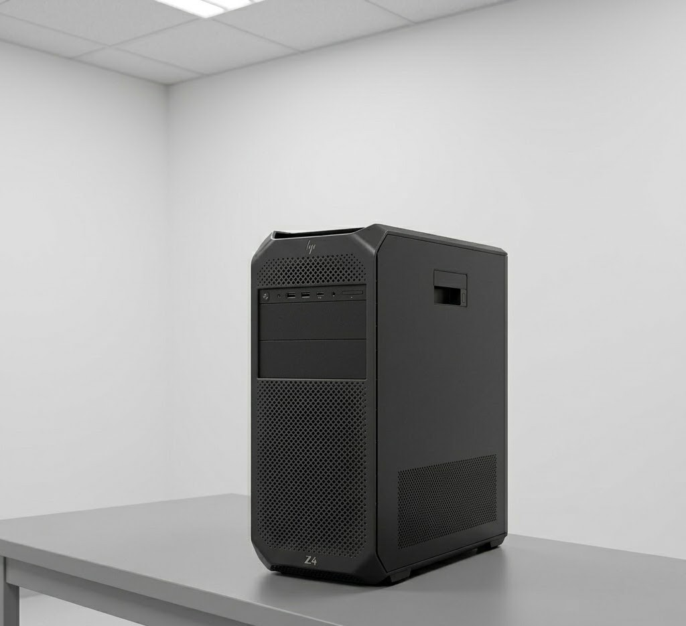
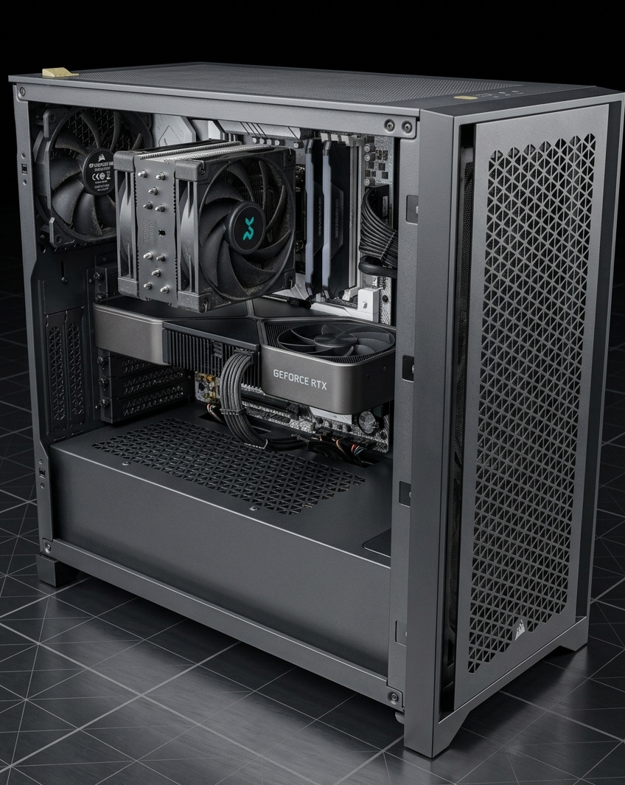
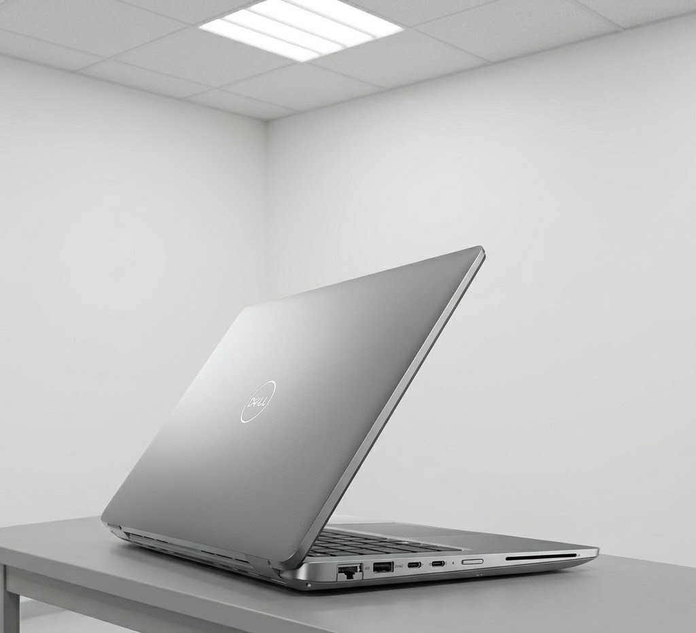
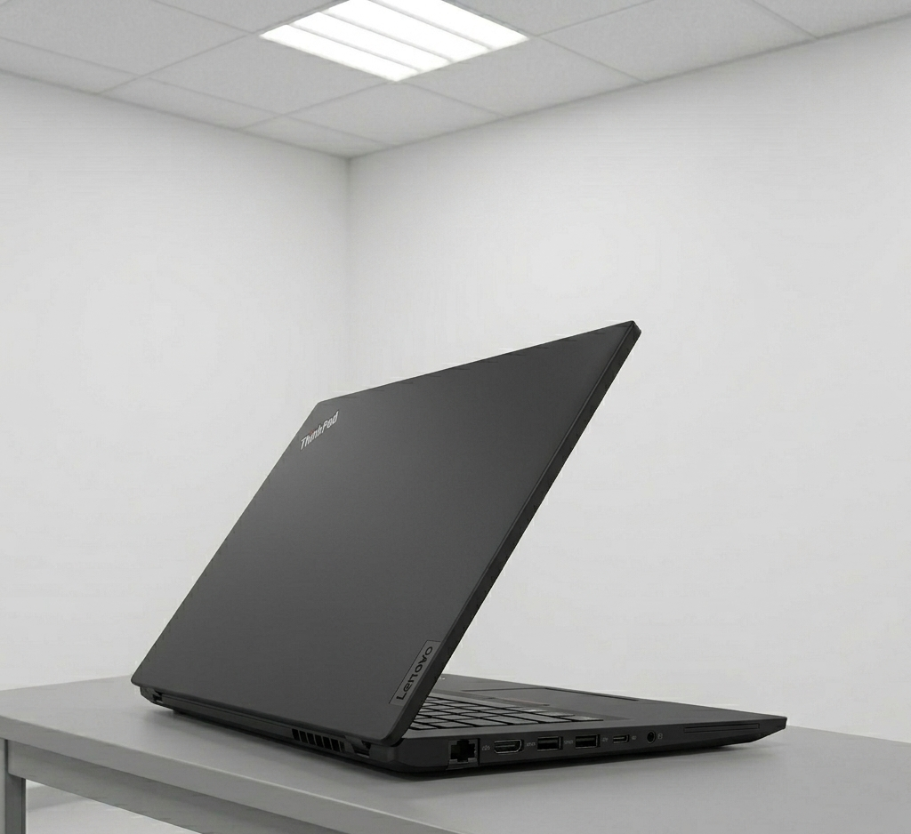

# Configuración de hardware propuesta

## Índice

- [Introducción](#introducción)
- [Configuración propuesta para el equipo de usuario estándar](#configuración-propuesta-para-el-equipo-de-usuario-estándar)
- [Configuración propuesta para el equipo estándar mejorado](#configuración-propuesta-para-el-equipo-estándar-mejorado)
- [Configuración propuesta para la workstation de Soporte IT](#configuración-propuesta-para-la-workstation-de-soporte-it)
- [Configuración propuesta para un equipo de alto rendimiento diseñado a medida](#configuración-propuesta-para-un-equipo-de-alto-rendimiento-diseñado-a-medida)
- [Configuración propuesta para el portátil estándar](#configuración-propuesta-para-el-portátil-estándar)
- [Configuración propuesta para el portátil potente de IT](configuración-propuesta-para-el-portátil-potente-de-it)
- [Comparación entre las configuraciones propuestas](#comparación-entre-las-configuraciones-propuestas)
- [Conclusión](#conclusión)

## Introducción

Para este apartado se proponen varias configuraciones de hardware representativas del sistema. La infraestructura del club no utiliza un único tipo de equipo para todos los usuarios, sino que adapta el hardware al trabajo real de cada departamento. Por ello, se diferencian seis perfiles: un **equipo de usuario estándar**, un **equipo estándar mejorado**, una **workstation profesional para Soporte IT**, un **equipo de alto rendimiento diseñado a medida**, un **portátil profesional estándar** y un **portátil profesional más potente para IT**.

Esta organización permite justificar mejor la elección del hardware, ya que no todos los puestos requieren la misma potencia, capacidad de ampliación o movilidad.

## Configuración propuesta para el equipo de usuario estándar

Como equipo de usuario estándar se propone un **Dell Pro Slim Desktop** con **Intel Core i5-14500 vPro**, **16 GB DDR5**, **512 GB SSD** y **gráficos integrados**. Se trata de una configuración adecuada para tareas de oficina, gestión administrativa, correo electrónico, navegación web y uso de aplicaciones corporativas.

## Especificaciones 
- **Procesador:** Intel Core i5-14500 vPro  
- **Placa base:** placa base propietaria Dell Pro Small Desktop compatible con Intel y DDR5  
- **Memoria RAM:** 16 GB DDR5  
- **Tarjeta gráfica:** gráficos integrados Intel  
- **Almacenamiento principal:** SSD NVMe de 512 GB  
- **Fuente de alimentación:** fuente de alimentación integrada Dell, ajustada al consumo del equipo  
- **Refrigeración:** refrigeración por aire incorporada de fábrica  
- **Caja:** chasis Dell Pro Small Desktop

### Procesador

El procesador es un **Intel Core i5-14500 vPro**, con **14 núcleos** y frecuencia de hasta **5,0 GHz**. Esta CPU es adecuada para un puesto corporativo porque ofrece un equilibrio muy bueno entre rendimiento y eficiencia. Permite trabajar con soltura en ofimática, aplicaciones de gestión y multitarea habitual, y además la plataforma **vPro** añade funciones orientadas a la administración de equipos en entornos empresariales.

### Memoria RAM

La memoria propuesta es de **16 GB DDR5**. Esta cantidad es suficiente para el trabajo diario de la mayoría de empleados, ya que permite tener abiertas varias aplicaciones sin una pérdida importante de fluidez. Además, el uso de DDR5 garantiza una plataforma moderna y con mejor margen de futuro.

### Almacenamiento

El almacenamiento principal es un **SSD de 512 GB**. Esta unidad mejora mucho el arranque del sistema, la apertura de programas y la respuesta general del equipo. Para un puesto estándar, 512 GB son una capacidad equilibrada para sistema operativo, programas y documentos de trabajo.

### Gráficos

El equipo utiliza **gráficos integrados**, una solución suficiente para tareas de oficina y uso corporativo general. No es necesario instalar una tarjeta gráfica dedicada porque este tipo de puesto no realiza edición multimedia intensiva ni trabajo 3D.

### Justificación

Esta configuración es adecuada para departamentos como Dirección y Finanzas, Recepción, Tienda oficial o parte del Cuerpo técnico, donde se necesita un equipo estable, rápido y fácil de mantener, pero no una estación de trabajo de alto rendimiento.

*Dell Pro Slim Desktop*

## Configuración propuesta para el equipo estándar mejorado

Como equipo estándar mejorado se propone un **Dell Pro Slim Desktop Plus** con **Intel Core Ultra 7 265**, **32 GB DDR5**, **512 GB SSD TLC** y **gráficos integrados**. Esta configuración está pensada para puestos que requieren más rendimiento que un equipo de oficina convencional, especialmente en multitarea o trabajo visual. Por ello, se asignarían dos al equipo de Marketing.

## Especificaciones 

- **Procesador:** Intel Core Ultra 7 265  
- **Placa base:** placa base propietaria Dell Pro Slim Desktop compatible con Intel Core Ultra y DDR5  
- **Memoria RAM:** 32 GB DDR5  
- **Tarjeta gráfica:** gráficos integrados Intel  
- **Almacenamiento principal:** SSD TLC NVMe de 512 GB  
- **Fuente de alimentación:** fuente de alimentación integrada Dell, ajustada al consumo del equipo  
- **Refrigeración:** refrigeración por aire incorporada de fábrica  
- **Caja:** chasis Dell Pro Slim Desktop

### Procesador

El procesador es un **Intel Core Ultra 7 265**, con **20 núcleos** y una frecuencia máxima de **5,3 GHz**. Esta CPU ofrece más capacidad de proceso que el equipo estándar y resulta más adecuada para usuarios que trabajan con varias aplicaciones exigentes al mismo tiempo.

### Memoria RAM

La memoria instalada es de **32 GB DDR5**. Esta cantidad mejora claramente la fluidez cuando se trabaja con archivos más pesados, programas de edición o varias aplicaciones simultáneas. Supone un salto notable respecto a los 16 GB del equipo estándar.

### Almacenamiento

El almacenamiento principal es un **SSD TLC de 512 GB**. Aunque la capacidad es la misma que en el equipo estándar, sigue siendo una muy buena elección por la velocidad de lectura y escritura, lo que mejora la carga de proyectos y el guardado de archivos.

### Gráficos

Este equipo sigue utilizando **gráficos integrados**, pero el conjunto mejora mucho gracias al procesador más potente y a la mayor cantidad de memoria RAM. Es una solución válida para diseño ligero, edición básica y multitarea visual.

### Justificación

Esta configuración encaja muy bien en **Prensa y Marketing**, donde puede ser necesario trabajar con edición de imágenes, diseño, herramientas de contenido y multitarea más intensa, sin llegar todavía a una estación de trabajo completa.

*Dell Pro Slim Desktop*

## Configuración propuesta para la workstation de Soporte IT

Para el departamento de Soporte IT se propone un **HP Z4 G5**, una estación de trabajo profesional con **Intel Xeon W3-2425**, **chipset Intel W790**, **32 GB DDR5-4800 ECC** y **SSD NVMe PCIe Gen4 de 1 TB**.

## Especificaciones 

- **Procesador:** Intel Xeon W3-2425  
- **Placa base / chipset:** plataforma HP Z4 G5 con chipset Intel W790  
- **Memoria RAM:** 32 GB DDR5-4800 ECC (2 x 16 GB)  
- **Tarjeta gráfica:** gráficos integrados Intel  
- **Almacenamiento principal:** 1 TB HP Z Turbo Drive PCIe Gen4 TLC M.2 SSD  
- **Fuente de alimentación:** fuente interna HP para workstation  
- **Refrigeración:** sistema de refrigeración profesional integrado de fábrica  
- **Caja:** chasis torre HP Z4 G5 Workstation

### Procesador

El procesador es un **Intel Xeon W3-2425**, con frecuencia de hasta **4,2 GHz**, **6 núcleos** y **12 subprocesos**. La familia Xeon está orientada a estaciones de trabajo profesionales y prioriza estabilidad, fiabilidad y compatibilidad con plataformas más robustas.

### Chipset y plataforma

La workstation utiliza **chipset Intel W790**, una plataforma superior a la de un PC de oficina convencional. Esto permite trabajar con procesadores Xeon, memoria ECC y mayor capacidad de ampliación.

### Memoria RAM

La memoria instalada es de **32 GB DDR5-4800 ECC**. Su característica más importante es que se trata de memoria **ECC**, capaz de detectar y corregir ciertos errores de memoria, lo que mejora la estabilidad del sistema en tareas técnicas avanzadas.

### Almacenamiento

El almacenamiento principal es un **SSD NVMe PCIe Gen4 de 1 TB**. Esta unidad ofrece más capacidad y más velocidad que los equipos estándar, algo muy útil en IT para imágenes del sistema, herramientas técnicas, máquinas virtuales y archivos de diagnóstico.

### Justificación

La HP Z4 G5 es adecuada para Soporte IT porque ofrece una plataforma profesional, más estable y ampliable que un PC convencional. Su procesador Xeon, la memoria ECC y el almacenamiento rápido la convierten en una opción coherente para tareas técnicas exigentes.

*HP Z4 G5*

## Configuración propuesta para un equipo de alto rendimiento diseñado a medida

Además de los equipos comerciales ya definidos, se propone un equipo de alto rendimiento diseñado desde cero para un puesto especial de **Prensa y Marketing**. Este ordenador está pensado para edición de imagen, vídeo, diseño avanzado o creación de contenido multimedia.

La configuración propuesta es la siguiente:

- **Procesador:** AMD Ryzen 9 9900X  
- **Placa base:** GIGABYTE X870 AORUS ELITE WIFI7
- **Memoria RAM:** Corsair Vengeance RGB DDR5-6000 CL40 64GB (2x32GB)
- **Tarjeta gráfica:** NVIDIA GeForce RTX 5070  
- **Almacenamiento principal:** Samsung 990 Pro NVMe PCIe 4.0 de 2 TB  
- **Fuente de alimentación:** Corsair HX1500i (2023) Black ATX 1500W Fully Modular 80+ Platinum Certified
- **Refrigeración:** DeepCool AK620 Zero Dark
- **Caja:** Corsair 4000D Airflow

AMD publica el Ryzen 9 9900X con **12 núcleos**, **24 hilos**, boost de hasta **5,6 GHz** y soporte **PCIe 5.0**. NVIDIA sitúa la RTX 5070 dentro de la familia Blackwell y recomienda una fuente mínima de **650 W**. Samsung anuncia el 990 Pro de 2 TB con hasta **7.450 MB/s de lectura** y **6.900 MB/s de escritura**.

### Procesador

El **AMD Ryzen 9 9900X** es una CPU muy potente y moderna, adecuada para multitarea avanzada, edición de contenido, trabajo con archivos pesados y software exigente. Frente a un procesador de oficina, ofrece mucha más reserva de rendimiento.

### Placa base

Se ha elegido esta placa base porque utiliza socket **AM5**, compatible con el procesador **AMD Ryzen 9 9900X**, y admite memoria **DDR5**, lo que la convierte en una opción moderna y adecuada para un equipo de alto rendimiento. Además, al ser una placa base **ATX** con chipset **X870**, ofrece una plataforma sólida, actual y con capacidad de ampliación para futuros componentes..

### Memoria RAM

Se ha elegido este kit de memoria porque ofrece una capacidad alta, adecuada para un equipo de alto rendimiento orientado a edición de contenido, multitarea avanzada y trabajo con archivos pesados. Además, al tratarse de **memoria DDR5 a 6000 MT/s con perfil AMD EXPO**, resulta una opción moderna y bien adaptada a una plataforma basada en Ryzen 9.

### Tarjeta gráfica

La gráfica elegida es la **NVIDIA GeForce RTX 5070**, una GPU moderna de gama alta muy adecuada para aceleración por GPU, creación de contenido y trabajo visual exigente. Es el componente que más diferencia este equipo de un PC corporativo normal.

### Almacenamiento

Como unidad principal se propone un **Samsung 990 Pro de 2 TB**, un SSD NVMe PCIe 4.0 de alto rendimiento. Combina mucha velocidad con una capacidad amplia, algo ideal para proyectos multimedia y archivos pesados.

### Fuente de alimentación

Se ha elegido esta fuente de alimentación porque ofrece una potencia elevada y un nivel de eficiencia muy alto, lo que la hace adecuada para un equipo de gama alta con componentes exigentes. Además, al ser totalmente modular, facilita una mejor organización del cableado y contribuye a un montaje más limpio y con mejor flujo de aire en el interior de la caja.

### Refrigeración

Se ha elegido este refrigerador por aire **DeepCool AK620 Zero Dark** porque ofrece un rendimiento muy alto sin necesidad de utilizar refrigeración líquida. Su diseño de doble torre permite disipar una gran cantidad de calor, lo que la hace adecuada para un procesador potente como el AMD Ryzen 9 9900X. Además, es compatible con socket AM5, por lo que encaja correctamente en la configuración del equipo.

### Caja

Se ha elegido la caja **Corsair 4000D Airflow** ya que resulta adecuada para una configuración de gama alta porque ofrece buen flujo de aire, espacio suficiente para una tarjeta gráfica moderna como la RTX 5070 y compatibilidad con sistemas de refrigeración más avanzados, como radiadores de 360 mm.

### Justificación

Este equipo a medida no sería lógico para todos los usuarios, pero sí como puesto especial dentro de **Prensa y Marketing**, donde realmente se puede aprovechar una GPU potente, mucha memoria y un almacenamiento rápido.

*Para representar visualmente el equipo de alto rendimiento diseñado a medida, se ha utilizado una herramienta de simulación 3D de montaje de PCs. Esta plataforma permite visualizar la distribución interna de los componentes y comprobar su compatibilidad, aunque no se ha utilizado como exportador de modelo 3D, sino como apoyo visual mediante capturas de pantalla de la configuración final.*

## Configuración propuesta para el portátil estándar

Para los puestos portátiles de uso general se propone el **Dell Latitude 5440**, un equipo profesional orientado a empresa. Dell lo comercializa con procesadores Intel Core de 13.ª generación, opciones **Intel Core i5-1335U**, **i5-1345U vPro**, **i5-1350P vPro** o superiores, memoria **DDR5-5200**, almacenamiento SSD NVMe y sistema operativo **Windows 11 Pro**. También ofrece gráfica integrada Intel y, opcionalmente, una NVIDIA GeForce MX550 en ciertas variantes.

## Especificaciones

- **Procesador:** Intel Core i5-1345U vPro  
- **Placa base:** placa base integrada Dell Latitude 5440 compatible con Intel de 13.ª generación y DDR5  
- **Memoria RAM:** 16 GB DDR5-5200  
- **Tarjeta gráfica:** gráficos integrados Intel  
- **Almacenamiento principal:** SSD NVMe de 512 GB  
- **Batería / alimentación:** batería integrada Dell y adaptador de corriente USB-C  
- **Refrigeración:** sistema de refrigeración integrado de fábrica para portátil  
- **Chasis / pantalla:** chasis Dell Latitude 5440 con pantalla de 14 pulgadas

### Procesador

Como referencia razonable para el proyecto, el Latitude 5440 puede configurarse con un **Intel Core i5 de 13.ª generación**, como el **i5-1335U** o el **i5-1345U vPro**. Estos procesadores están pensados para portátiles profesionales y ofrecen buen equilibrio entre rendimiento, autonomía y temperaturas, algo importante en movilidad. Dell también documenta variantes vPro, lo que refuerza su orientación empresarial.

### Memoria RAM

El Latitude 5440 admite **DDR5-5200**, y para el proyecto una configuración con **16 GB DDR5** resulta muy adecuada. Esta cantidad permite trabajar con fluidez en ofimática, navegación, reuniones en línea y herramientas corporativas sin convertir el portátil en un equipo excesivamente caro.

### Almacenamiento

Dell ofrece el modelo con **SSD NVMe** de **256 GB**, **512 GB** e incluso **1 TB**. Para el inventario del proyecto, una configuración con **512 GB SSD** encaja muy bien, porque proporciona un equilibrio correcto entre capacidad, velocidad y coste. 

### Gráficos

La opción más lógica para este portátil es la **gráfica integrada Intel**, suficiente para productividad, videoconferencias y trabajo de oficina. Dell también ofrece una MX550 opcional en algunas variantes, pero para el uso general no es necesaria.

### Justificación

Este portátil es adecuado para salas de reuniones, desplazamientos internos, trabajo móvil y apoyo a usuarios que no necesitan una estación de trabajo completa. Combina movilidad, prestaciones empresariales y una configuración razonable para una pyme.

*Dell Latitude 5440.*

## Configuración propuesta para el portátil potente de IT

## Especificaciones

- **Procesador:** Intel Core i7-1370P  
- **Placa base:** placa base integrada Lenovo ThinkPad T16 Gen 2 compatible con Intel de 13.ª generación y DDR5 / LPDDR5x  
- **Memoria RAM:** 32 GB DDR5-5200  
- **Tarjeta gráfica:** gráficos integrados Intel  
- **Almacenamiento principal:** SSD M.2 PCIe 4.0 de 1 TB  
- **Batería / alimentación:** batería integrada Lenovo y adaptador de corriente USB-C  
- **Refrigeración:** sistema de refrigeración integrado de fábrica para portátil  
- **Chasis / pantalla:** chasis Lenovo ThinkPad T16 Gen 2 con pantalla de 16 pulgadas

Para el personal técnico que necesita movilidad con más capacidad de trabajo se propone el **Lenovo ThinkPad T16 Gen 2**. Lenovo publica para este modelo configuraciones con hasta **Intel Core i7-1370P**, hasta **32 GB LPDDR5x** o **32 GB DDR5**, almacenamiento **PCIe 4.0** de hasta **2 TB**, soporte para varios monitores externos y puertos profesionales como **Thunderbolt 4** y **HDMI 2.1**. :contentReference[oaicite:7]{index=7}

### Procesador

Dentro de la gama, Lenovo ofrece configuraciones de hasta **Intel Core i7-1370P**, una CPU claramente más potente que la de un portátil estándar de oficina. Esto la hace adecuada para tareas técnicas, multitarea más intensa, administración remota y trabajo profesional móvil.

### Memoria RAM

El ThinkPad T16 Gen 2 admite varias configuraciones de memoria. Lenovo publica modelos con **DDR5-5200** y también versiones con **LPDDR5x**, llegando hasta **32 GB** según la variante. Para el proyecto, una configuración con **32 GB** es coherente con el perfil de portátil potente de IT, porque aporta más margen para herramientas técnicas, máquinas virtuales ligeras y múltiples aplicaciones abiertas.

### Almacenamiento

Lenovo indica que puede configurarse con **SSD M.2 PCIe 4.0** de hasta **2 TB**. Una opción de **1 TB SSD** sería una referencia muy razonable para tu inventario, ya que ofrece más margen que un portátil estándar para utilidades, imágenes, documentación técnica y archivos de trabajo.

### Gráficos y conectividad

El portátil está orientado al trabajo profesional y ofrece una conectividad muy completa, con **Thunderbolt 4**, **HDMI 2.1**, USB y soporte para varios monitores externos. Esto resulta muy útil para IT, ya que facilita el trabajo en movilidad y también el uso en escritorio con pantallas adicionales.

### Justificación

El ThinkPad T16 Gen 2 encaja bien como portátil del personal de IT porque combina movilidad, pantalla grande, más memoria, mejor capacidad de almacenamiento y conectividad profesional. Es una opción más adecuada que un portátil estándar cuando el usuario necesita desplazarse sin renunciar a unas prestaciones más avanzadas.

*Lenovo ThinkPad T16 Gen 2.*

## Comparación entre las configuraciones propuestas

Las distintas configuraciones responden a necesidades diferentes dentro de la misma infraestructura. El **equipo de usuario estándar** cubre el trabajo administrativo habitual. El **equipo estándar mejorado** ofrece más margen para usuarios con multitarea más exigente. La **HP Z4 G5** aporta una plataforma profesional para Soporte IT. El **equipo a medida** representa la opción más potente para trabajo creativo avanzado. En movilidad, el **Dell Latitude 5440** cubre el uso profesional general, mientras que el **Lenovo ThinkPad T16 Gen 2** ofrece un perfil portátil más potente para el área técnica.

## Conclusión

La propuesta de hardware del sistema queda más completa al combinar equipos de sobremesa, workstations, un equipo personalizado de alto rendimiento y dos perfiles de portátil. De este modo, la infraestructura no solo cubre las necesidades generales del club, sino también los requisitos de movilidad y los casos en los que se necesita mayor capacidad técnica o creativa. La diversidad de configuraciones permite asignar a cada puesto un equipo adecuado a sus funciones reales, manteniendo coherencia técnica y organizativa.     