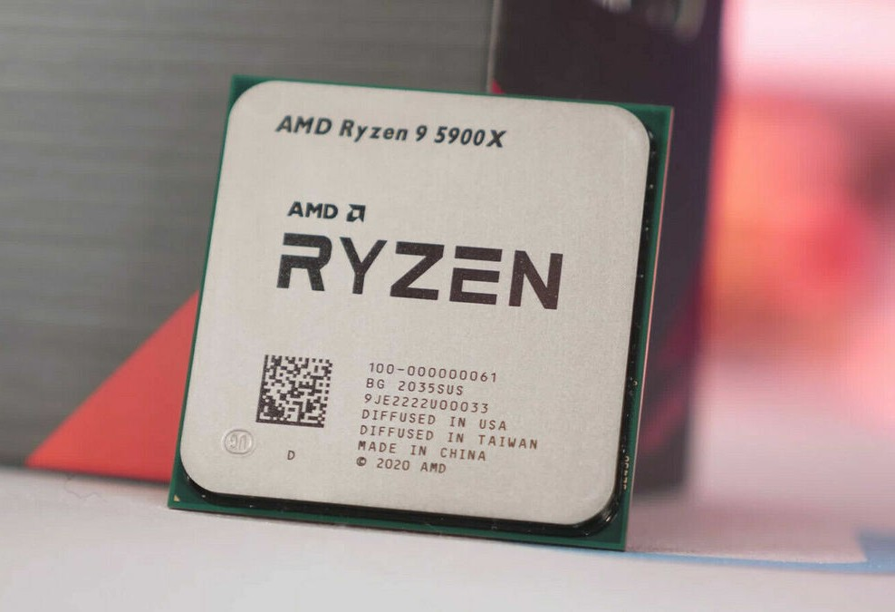
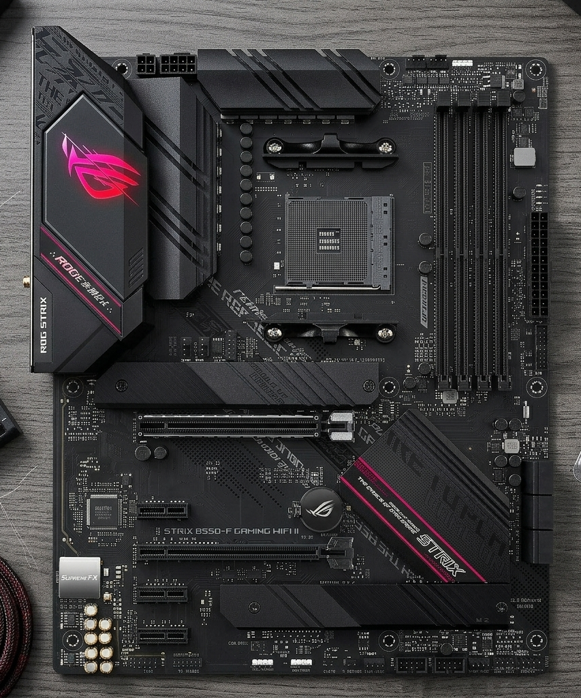
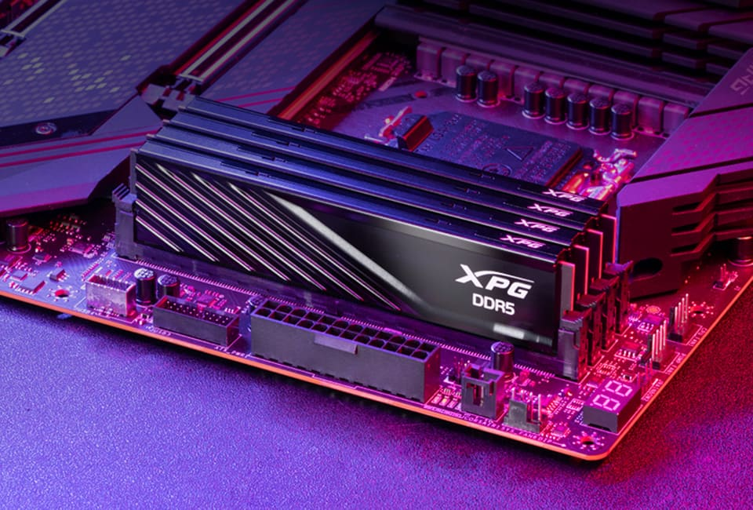
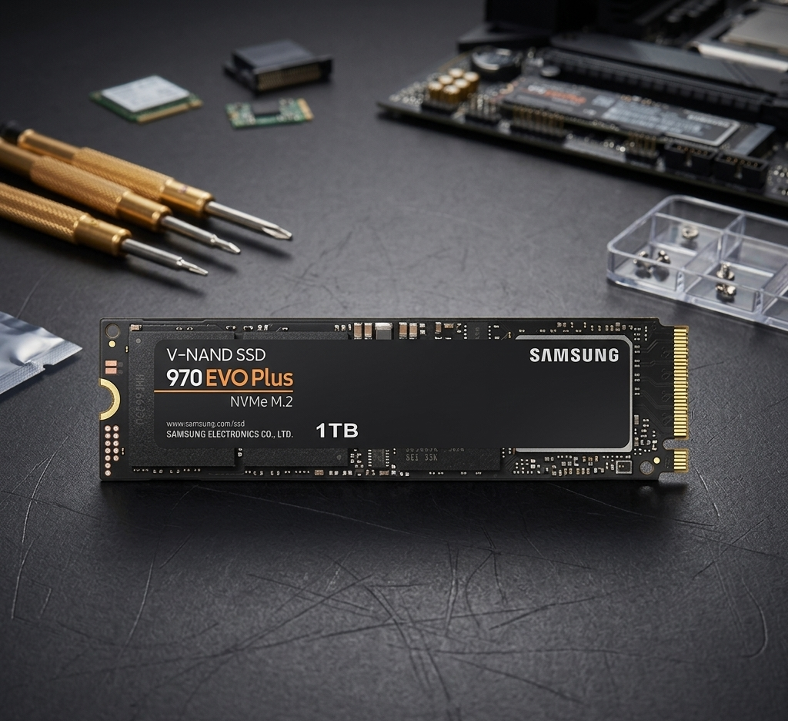
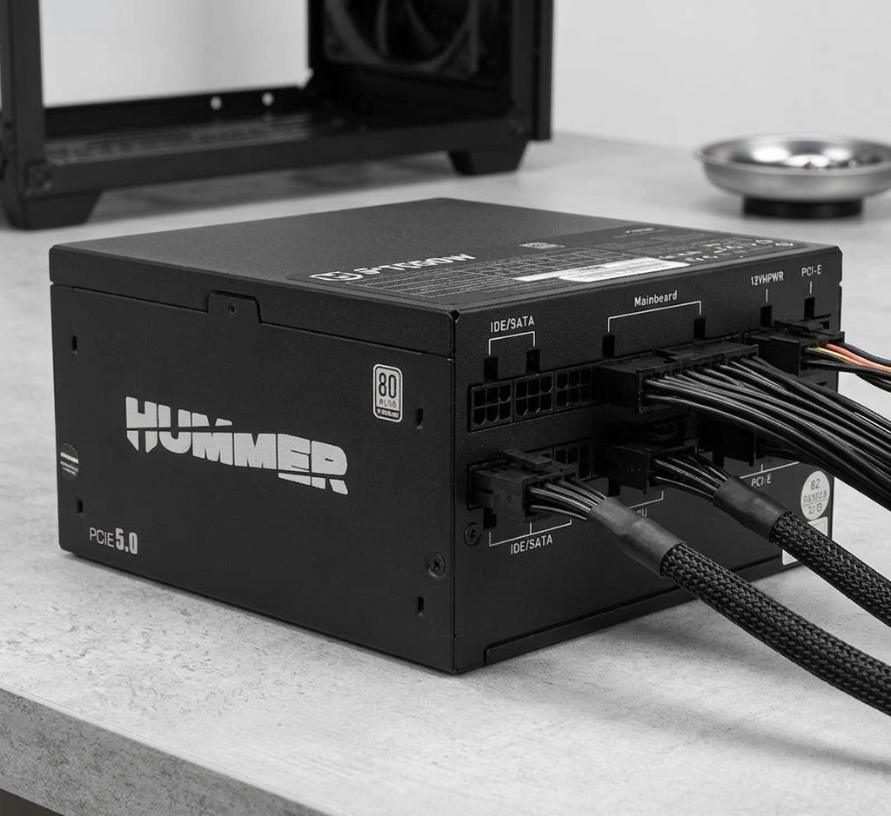
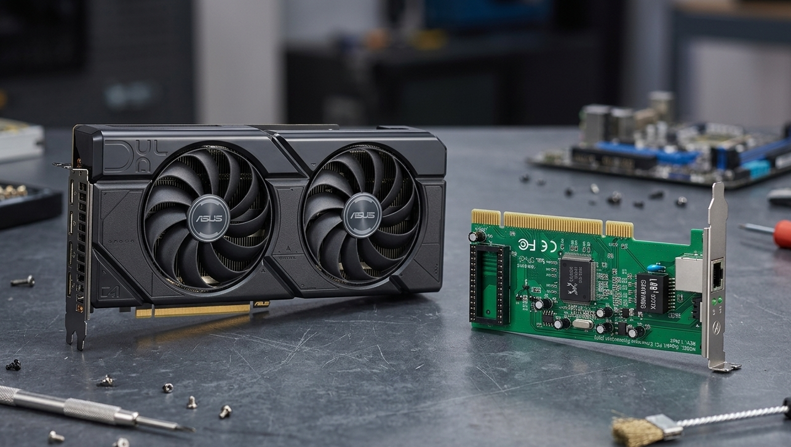

# 2. Descripción de los componentes del sistema

## Índice

- [Introducción](#21-introducción)
- [CPU o procesador](#22-cpu-o-procesador)
- [Placa base](#23-placa-base)
- [Memoria RAM](#24-memoria-ram)
- [Discos de almacenamiento](#25-discos-de-almacenamiento)
- [Fuente de alimentación](#26-fuente-de-alimentación)
- [Tarjetas de expansión](#27-tarjetas-de-expansión)
- [Relación de los componentes con el sistema](#28-relación-de-los-componentes-con-el-sistema)
- [Conclusión](#29-conclusión)

## 2.1 Introducción

Además del análisis de las necesidades de hardware de la empresa, es importante describir los componentes internos que forman parte de los equipos informáticos del sistema. Estos componentes son los que permiten que un ordenador procese información, ejecute programas, almacene datos y se comunique con el resto de la infraestructura de red.

En este proyecto, los equipos informáticos se destinan a distintos usos, desde tareas administrativas y corporativas hasta funciones más exigentes, como diseño gráfico, virtualización o soporte técnico. Por ello, resulta necesario comprender qué función cumple cada componente dentro del sistema y por qué su elección influye directamente en el rendimiento, la estabilidad y la vida útil del equipo.

## 2.2 CPU o procesador

La **CPU** o **Unidad Central de Procesamiento** es el componente encargado de ejecutar las instrucciones y procesar la información del ordenador. Se considera el “cerebro” del sistema, ya que coordina la ejecución de programas, realiza cálculos y gestiona buena parte del funcionamiento general del equipo.

Dentro del entorno del proyecto, la CPU permite ejecutar tareas habituales como ofimática, navegación web, correo electrónico, aplicaciones de gestión y acceso a servicios corporativos. También es un componente especialmente importante en los equipos de mayor rendimiento, donde se necesita más capacidad de proceso para soportar multitarea intensiva, diseño gráfico, herramientas técnicas o virtualización.

Por tanto, la elección del procesador influye directamente en la rapidez del sistema y en su capacidad para adaptarse a distintos perfiles de uso.

*CPU modelo AMD Ryzen 9 5900X.*

## 2.3 Placa base

La **placa base** es la estructura principal del ordenador sobre la que se conectan e integran el resto de componentes. En ella se instalan el procesador, la memoria RAM, las unidades de almacenamiento y, si es necesario, las tarjetas de expansión.

Su función es permitir la comunicación entre todos los elementos del equipo y garantizar que trabajen de manera coordinada. Además, la placa base determina aspectos importantes como el tipo de procesador compatible, la memoria admitida, el número de puertos disponibles y la capacidad de ampliación futura.

Dentro del sistema del proyecto, la placa base es esencial porque actúa como base física y lógica de cada equipo informático, asegurando estabilidad y conectividad interna.

*Placa base modelo Asus ROG STRIX B550-F GAMING WIFI II.*

## 2.4 Memoria RAM

La **memoria RAM** es la memoria principal de trabajo del ordenador. Su función consiste en almacenar de forma temporal los programas, datos e instrucciones que están siendo utilizados en ese momento por el sistema.

Gracias a la RAM, el procesador puede acceder rápidamente a la información necesaria para ejecutar aplicaciones sin tener que leer constantemente desde el disco de almacenamiento. Esto permite una mayor fluidez en el uso del equipo, especialmente cuando se trabaja con varias aplicaciones abiertas al mismo tiempo.

En el entorno del proyecto, la RAM resulta fundamental para mantener un rendimiento ágil tanto en los puestos de usuario estándar como en los equipos de alto rendimiento. Una mayor cantidad de RAM favorece la multitarea, la estabilidad y la capacidad de trabajo en escenarios más exigentes.

*Memoria Ram insertada en una placa base.*

## 2.5 Discos de almacenamiento

Los **discos de almacenamiento** son los componentes encargados de guardar de forma permanente el sistema operativo, las aplicaciones instaladas y los archivos del usuario. A diferencia de la memoria RAM, la información almacenada en estos dispositivos no se pierde al apagar el equipo.

En un sistema informático pueden utilizarse distintos tipos de almacenamiento, principalmente **SSD** y **HDD**. Los SSD ofrecen mayor velocidad de arranque, apertura de programas y respuesta general del sistema, mientras que los HDD suelen proporcionar mayor capacidad a menor coste, por lo que resultan útiles para almacenamiento masivo o servidores. Dentro de los SSD, una de las opciones más utilizadas actualmente es el formato **NVMe**, que aprovecha la interfaz PCIe para ofrecer velocidades de lectura y escritura muy superiores a las de otros SSD más antiguos, como los SATA. Gracias a ello, las unidades NVMe resultan especialmente adecuadas para equipos modernos que necesitan un acceso muy rápido a los datos, como estaciones de trabajo, portátiles profesionales o equipos de alto rendimiento.

Dentro del proyecto, los discos de almacenamiento permiten guardar documentos corporativos, aplicaciones de trabajo, archivos compartidos y servicios internos. Su elección depende del equilibrio entre velocidad, capacidad y coste.

*Modelo SDD en formato NVMe.*

## 2.6 Fuente de alimentación

La **fuente de alimentación** es el componente encargado de suministrar energía eléctrica a todos los elementos internos del ordenador. Convierte la corriente eléctrica procedente de la red en los voltajes necesarios para que funcionen correctamente la placa base, el procesador, la memoria, los discos y el resto de dispositivos.

Su función dentro del sistema es garantizar una alimentación estable y segura. Una fuente de mala calidad o insuficiente podría provocar inestabilidad, apagados inesperados o incluso daños en otros componentes. Por ello, en un entorno profesional es importante utilizar fuentes fiables y adecuadas al nivel de consumo del equipo.

En los puestos estándar de oficina la demanda energética suele ser moderada, mientras que en estaciones de trabajo o equipos más potentes puede ser necesario contar con fuentes de mayor capacidad.

*Fuente de alimentación modular de la marca NOX Hummer.*

## 2.7 Tarjetas de expansión

Las **tarjetas de expansión** son componentes adicionales que pueden instalarse en la placa base para ampliar o mejorar las capacidades del equipo. No siempre son imprescindibles, ya que muchas funciones básicas pueden venir integradas, pero resultan útiles cuando se necesitan prestaciones adicionales.

Entre las tarjetas de expansión más habituales se encuentran:

- **Tarjeta gráfica**, utilizada cuando se requiere más potencia visual o procesamiento gráfico.
- **Tarjeta de red**, empleada para mejorar o ampliar las opciones de conectividad.

Dentro del sistema del proyecto, las tarjetas de expansión tendrían más importancia en equipos de alto rendimiento o estaciones de trabajo, donde puede ser necesario ampliar funciones según la evolución de las necesidades técnicas.

*Una tarjeta gráfica y otra de red.*

## 2.8 Relación de los componentes con el sistema

Todos los componentes descritos trabajan conjuntamente para hacer posible el funcionamiento de los equipos informáticos de la empresa:

- La **CPU** procesa la información y ejecuta los programas.
- La **placa base** conecta todos los componentes del equipo.
- La **memoria RAM** permite trabajar con datos y aplicaciones en uso de forma rápida.
- Los **discos de almacenamiento** guardan el sistema operativo, los programas y los archivos.
- La **fuente de alimentación** suministra energía estable al conjunto.
- Las **tarjetas de expansión** permiten adaptar el equipo a necesidades específicas.

Gracias a la combinación de estos componentes, los ordenadores del sistema pueden responder tanto a tareas administrativas habituales como a funciones más técnicas o avanzadas.

## 2.9 Conclusión

La descripción de los componentes del sistema permite comprender cómo está formado un equipo informático y cuál es la función de cada una de sus partes. Todos estos elementos son esenciales para garantizar el correcto funcionamiento del ordenador y su adecuación al entorno de trabajo.

En el contexto de este proyecto, conocer estos componentes resulta fundamental para justificar posteriormente una configuración de hardware concreta y demostrar que el sistema ha sido diseñado de forma coherente con las necesidades reales de la empresa.