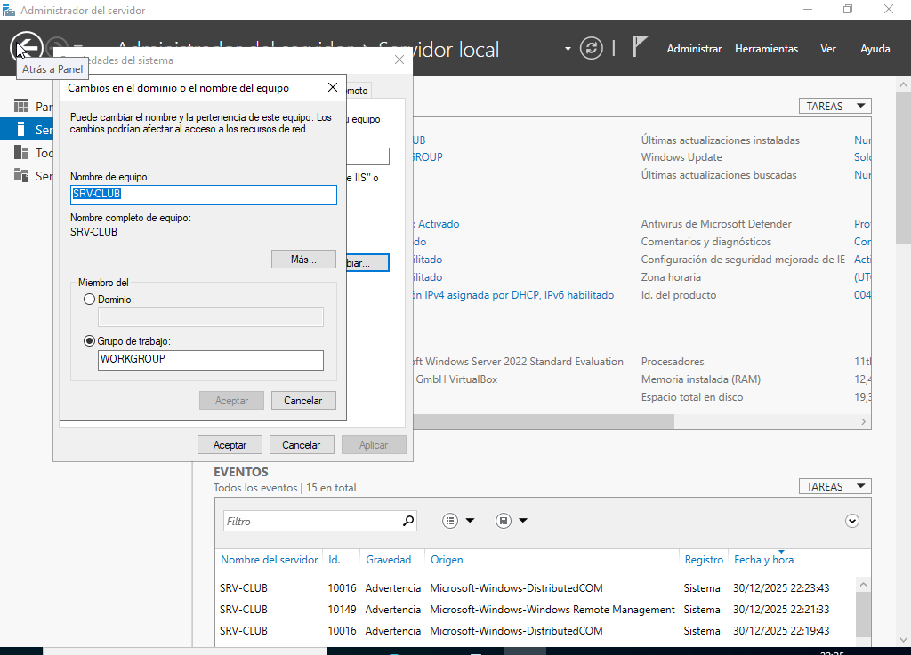
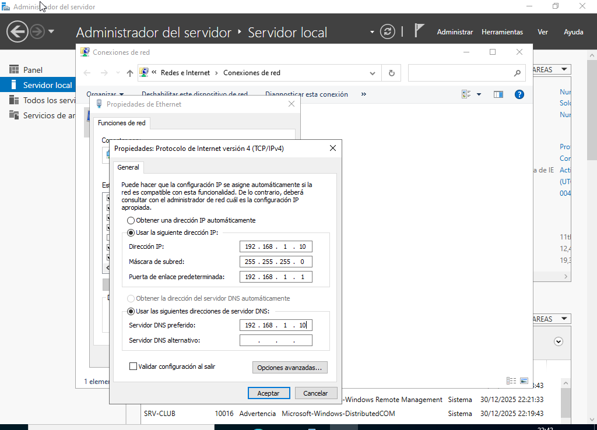
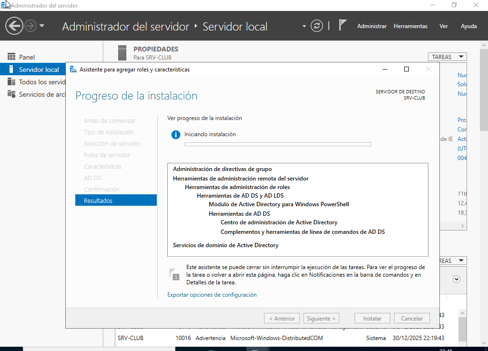
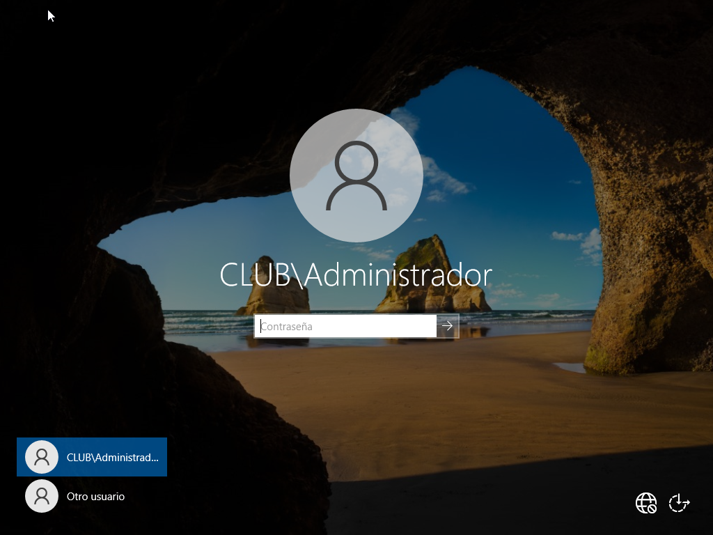
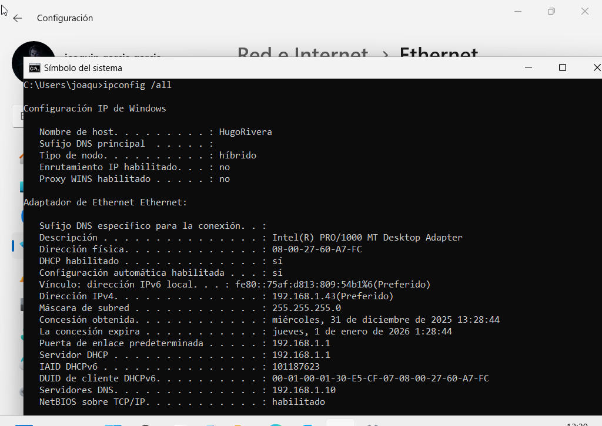
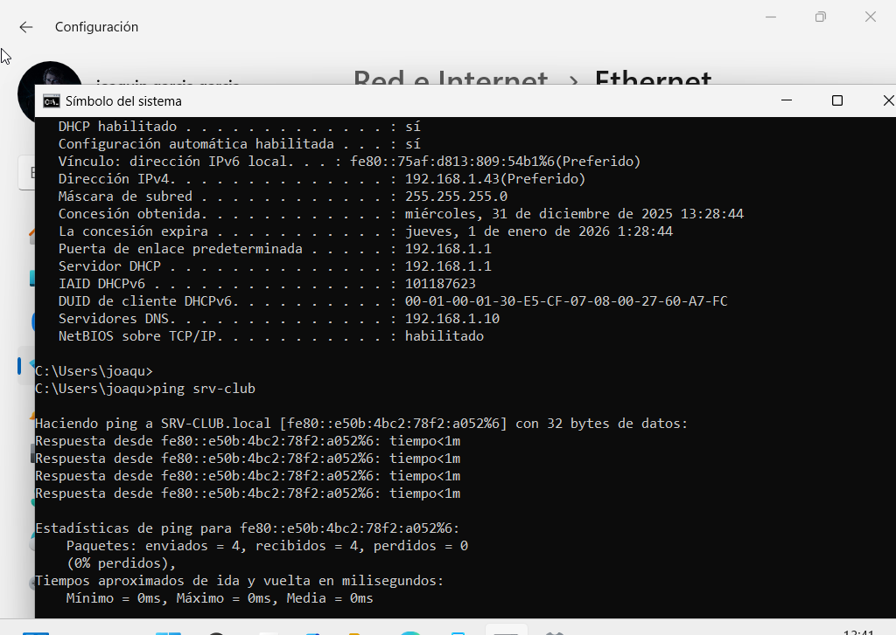
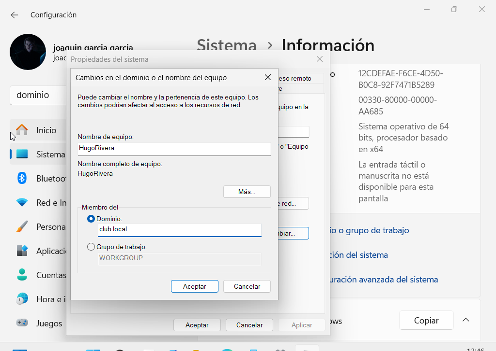
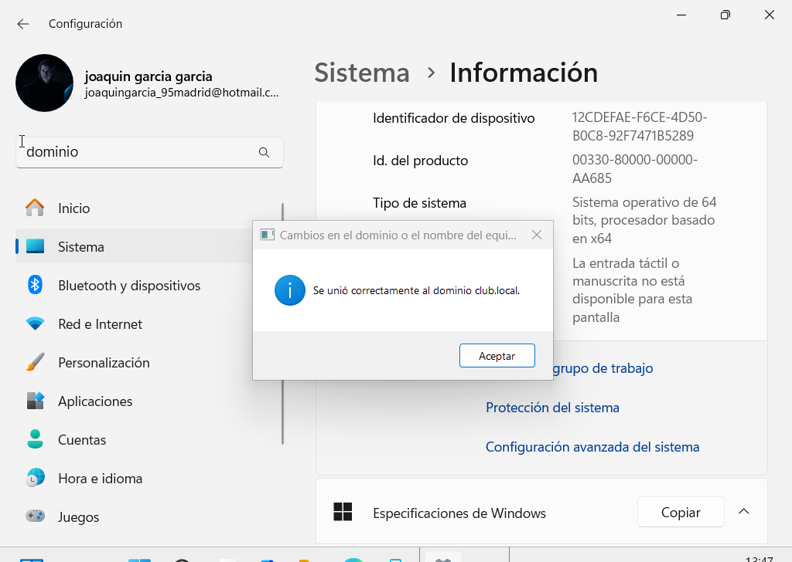

# Explicación de la configuración del sistema

## Índice

- [Active Directory](#active-directory)
- [Integración de equipos cliente en el dominio](#integración-de-equipos-cliente-en-el-dominio)

---

Una vez completada la instalación de los sistemas operativos, se procedió a configurar el entorno para permitir la administración centralizada de los equipos y recursos de la organización.

La configuración del sistema se centró principalmente en la preparación del servidor y en la integración de los equipos cliente dentro del dominio corporativo.

---

## Active Directory

Antes de instalar la herramienta de Active Directory, se cambió el nombre del servidor. Además, se configuró manualmente una dirección IP estática en el servidor, evitando así dependencias de DHCP y garantizando la estabilidad del servicio DNS con los demás equipos.

*Capturas durante el cambio de nombre del servidor y la configuración manual de la dirección IP.*

El siguiente paso, esta vez sí, proceder a instalar la herramienta de Active Directory.

*Instalación del rol de Active Directory y acceso al sistema tras la creación del dominio.*

## Integración de equipos cliente en el dominio

Una vez desplegado el servicio de Active Directory en el servidor Windows Server, se procedió a integrar un equipo cliente con **Windows 11 Pro** en el dominio corporativo **club.local**.

Para ello, el equipo cliente fue configurado para utilizar como servidor DNS la dirección IP del controlador de dominio, permitiendo así la correcta resolución de nombres dentro de la red.

*Capturas en donde se confirma que W11 ya tiene el mismo DNS que WServer y además realiza correctamente el ping.*

Posteriormente, desde la configuración del sistema de Windows 11 se accedió a la opción de **cambio de dominio**, donde se introdujo el nombre del dominio corporativo.

*Momento exacto en el que Windows 11 Pro se unió al dominio.*

Tras reiniciar el equipo, fue posible iniciar sesión utilizando las credenciales de un usuario del dominio, confirmando que la integración se había realizado correctamente.

*Al reiniciar la máquina, ya aparecía “Otro Usuario” y aceptó las credenciales sin problema.*

