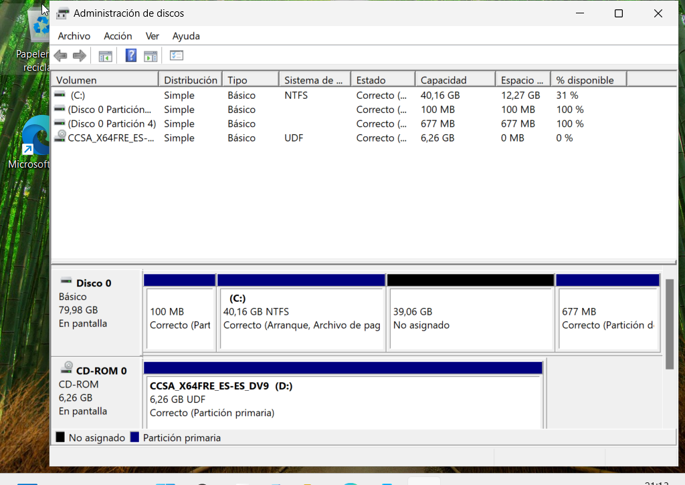
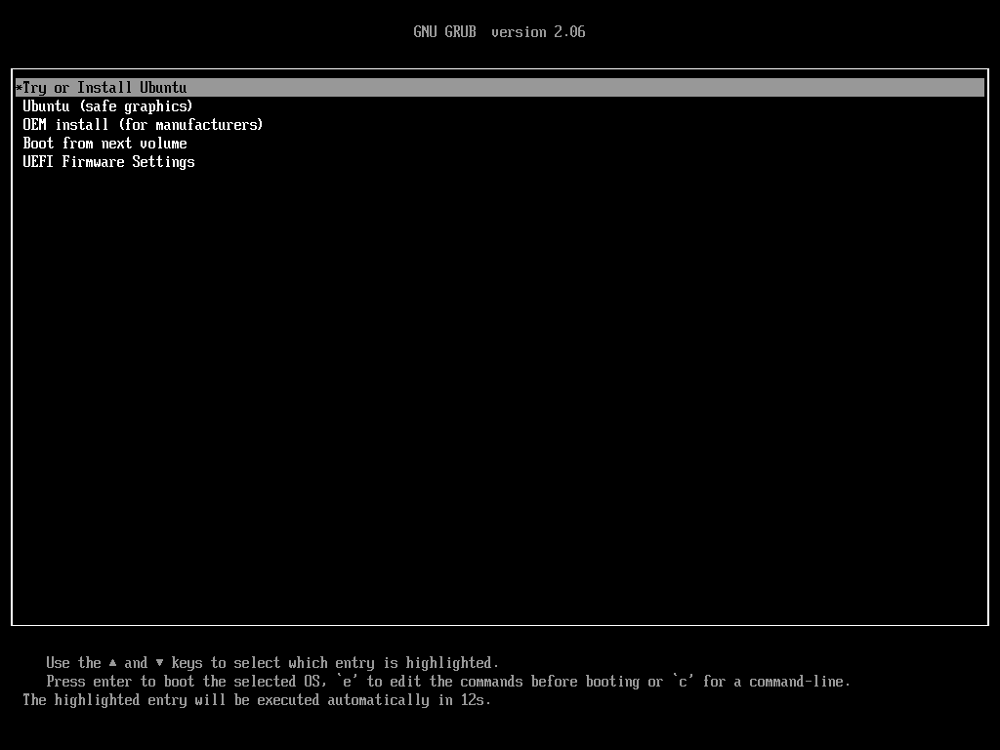
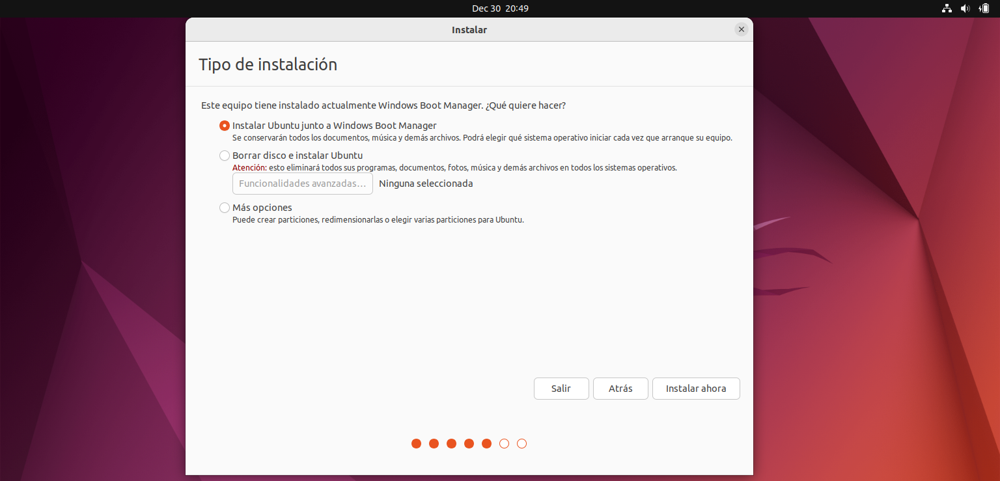
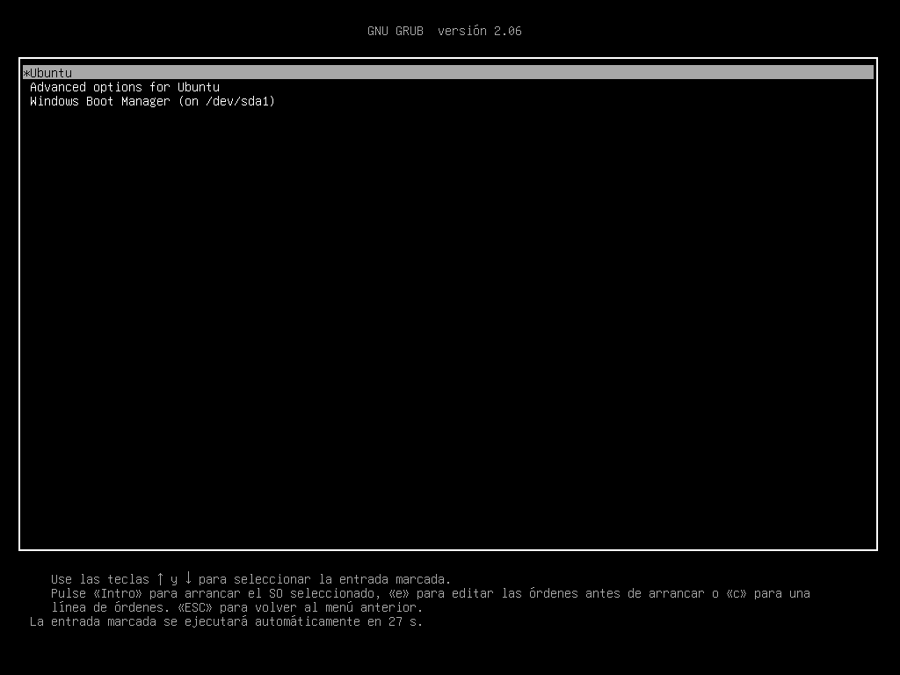

# Documento de análisis del sistema operativo

## Índice

- [Objetivo del entorno](#objetivo-del-entorno)
- [Sistema operativo del servidor](#sistema-operativo-del-servidor)
- [Sistemas operativos cliente](#sistemas-operativos-cliente)
- [Uso de sistemas Linux en el entorno corporativo](#uso-de-sistemas-linux-en-el-entorno-corporativo)
- [Kali Linux como herramienta de auditoría](#kali-linux-como-herramienta-de-auditoría)
- [Dual Boot](#dual-boot)
- [Conclusión](#conclusión)
---

## Objetivo del entorno

El objetivo de esta implantación es construir un entorno cliente-servidor realista, seguro y escalable, alineado con las necesidades de una organización estructurada por departamentos y con una administración centralizada de recursos y usuarios.

Para la implantación de los sistemas operativos del entorno cliente-servidor se ha optado por una selección basada en criterios de seguridad, actualidad tecnológica y compatibilidad, con el fin de simular un entorno corporativo realista y alineado con las prácticas habituales en empresas medianas.

---

## Sistema operativo del servidor

Como sistema operativo del servidor se ha seleccionado **Windows Server 2022 Standard**, desplegado en una máquina virtual mediante VirtualBox, simulando el servidor central ubicado en el CPD de la organización.

Windows Server 2022 permite implementar servicios fundamentales como:

- Active Directory
- DNS
- Gestión centralizada de usuarios
- Recursos compartidos
- Administración de dispositivos

Este servidor actúa como núcleo de la infraestructura de sistemas, integrándose con la red segmentada por VLANs definida previamente en el diseño.

---

## Sistemas operativos cliente

Para los equipos de usuario final se ha elegido **Windows 11 Pro** como sistema operativo principal en la mayoría de los puestos de trabajo.

Se trata de una plataforma actual y plenamente compatible con entornos de dominio basados en **Active Directory**, lo que permite integrar fácilmente los equipos dentro de la infraestructura corporativa.

Windows 11 Pro se ha desplegado en los equipos de los departamentos de:

- Atención al público  
- Dirección y finanzas  
- Tienda oficial  
- Cuerpo técnico  
- Salas de reuniones  

Estos puestos requieren un sistema operativo estable, fácil de usar y optimizado para utilizar aplicaciones corporativas habituales.

---

## Uso de sistemas Linux en el entorno corporativo

Además de los sistemas Windows, se ha decidido incorporar **sistemas operativos basados en Linux** con el objetivo de reflejar un entorno empresarial más realista, ya que muchas organizaciones utilizan Linux en determinados departamentos especializados.

En el departamento de **Prensa y Marketing** se ha desplegado **Ubuntu Desktop** en uno de los equipos, aprovechando las ventajas del software libre y las herramientas disponibles en Linux para tareas relacionadas con creación de contenido, automatización y scripting.

En el departamento de **Soporte IT** se ha optado por un enfoque más técnico ya que se ha configurado un **arranque dual (dual boot) con Windows 11 Pro y Ubuntu Desktop** en uno de los equipos de soporte, permitiendo alternar entre un entorno corporativo estándar y un sistema orientado a administración y tareas técnicas.

Por último, en los demás equipos de IT, el personal dispone de Ubuntu Desktop como sistema principal, reforzando el uso de Linux en tareas de administración avanzada.

---

## Kali Linux como herramienta de auditoría

De forma adicional, se ha incorporado **Kali Linux**, un sistema especializado de seguridad, en un equipo extra para el personal del departamento de IT. Gracias a este sistema operativo, los integrantes de IT podrán realizar tareas como:

- análisis de seguridad interna
- pruebas de conectividad
- detección de vulnerabilidades
- monitorización de red

La utilización de Kali Linux permite simular un entorno profesional en el que el departamento de sistemas también realiza tareas básicas de auditoría y comprobación de la seguridad de la infraestructura.

---

## Dual Boot

Uno de los equipos de soporte cuenta con arranque dual entre **Windows 11 Pro y Ubuntu Desktop**. Para ello, se realizó una partición del disco desde Windows y posteriormente se instaló Ubuntu junto al sistema existente.

*Antes de comenzar la instalación, se procedió a realizar una partición del disco duro para Ubuntu desde Windows.*

*Durante la instalación de Ubuntu se eligió instalarlo junto a Windows. La segunda captura muestra el gestor de arranque GRUB, que permite seleccionar el sistema operativo deseado.*

## Conclusión

De esta forma, la combinación de **Windows Server 2022, Windows 11 Pro y sistemas Linux** permite construir un entorno cliente-servidor moderno, seguro y escalable, alineado con la segmentación de red definida mediante VLANs y con las necesidades específicas de cada departamento. Esta elección garantiza una infraestructura equilibrada, realista y preparada para futuras ampliaciones o migraciones tecnológicas. Además, la implementación de un ordenador con Dual Boot aporta una gran diversidad al ecosistema de sistemas operativos instalados.