# Documentación de la instalación del sistema

## Índice

- [Entorno de instalación](#entorno-de-instalación)
- [Windows Server 2022](#windows-server-2022)
- [Windows 11 Pro](#windows-11-pro)
- [Linux Ubuntu Desktop](#linux-ubuntu-desktop)
- [Kali Linux](#kali-linux)

---

## Entorno de instalación

Al tratarse de un escenario simulado, se utilizó **VirtualBox** para instalar los distintos sistemas operativos.

En un escenario real, es posible que los ordenadores llegaran con los sistemas operativos preinstalados. En caso de que no fuera así, sería necesario utilizar un **USB booteable** para realizar la instalación.

Al tratarse de máquinas virtuales, se descargaron las **imágenes ISO desde los sitios oficiales** de cada sistema operativo para realizar la instalación.

## Windows Server 2022

Windows Server 2022 se implementó en primer lugar como **servidor central del entorno.**

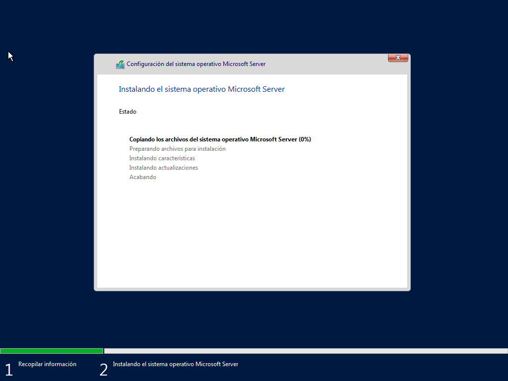
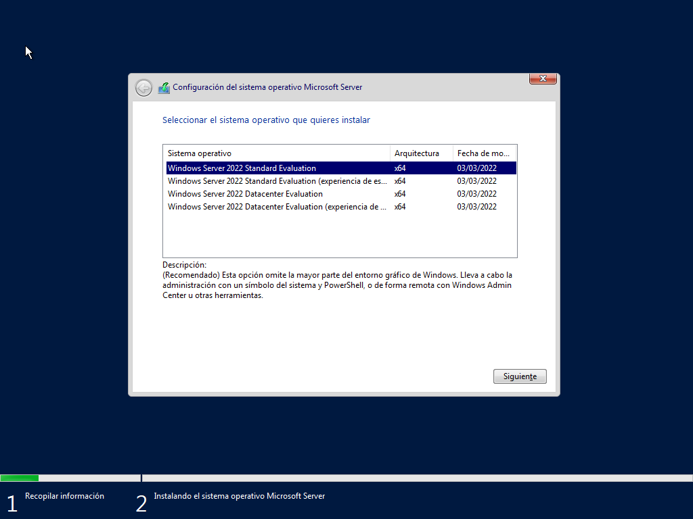

*Momento en el que se inicia la instalación. Se eligió Windows Server con interfaz gráfica.*

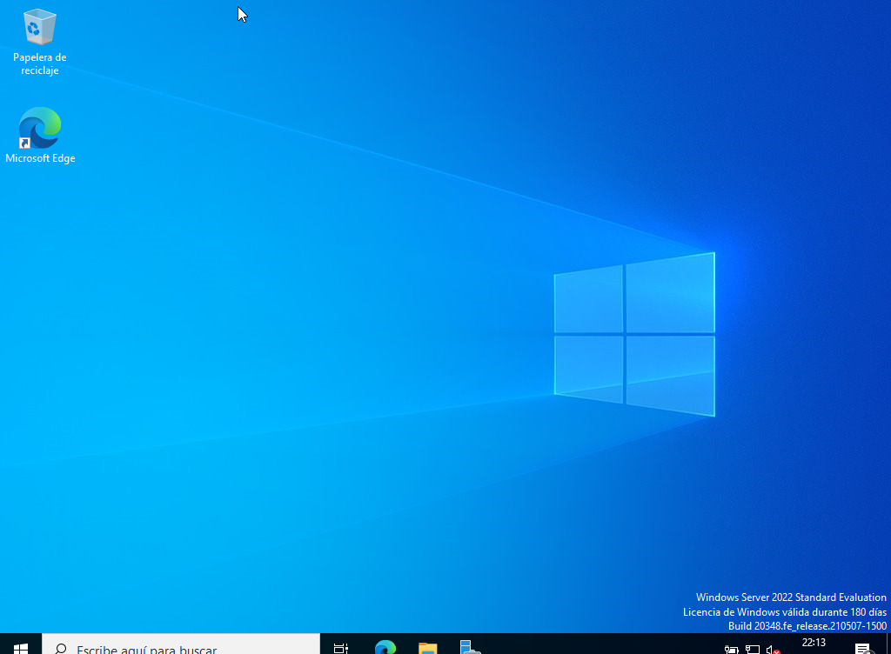

*Windows Server 2022 totalmente funcional.*

## Windows 11 Pro

Windows 11 Pro fue el sistema operativo elegido para **la mayoría de los equipos cliente.**

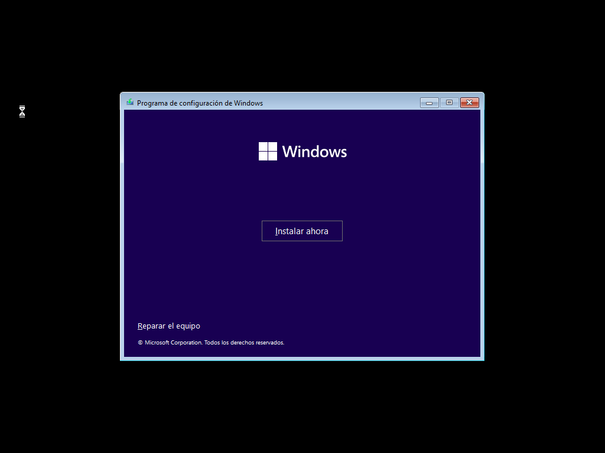
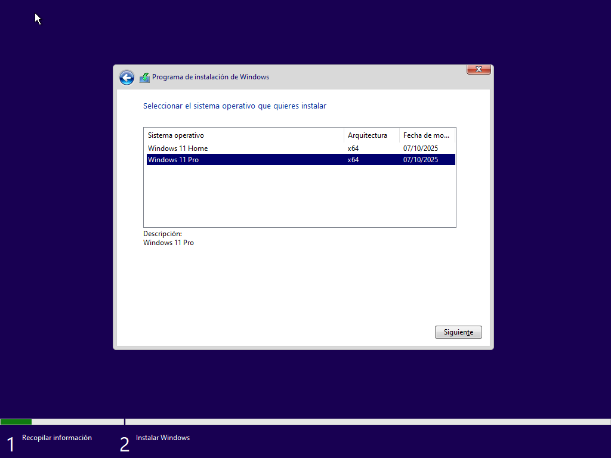

*Capturas tomadas al iniciar la instalación. Windows 11 Pro fue el SO elegido.*

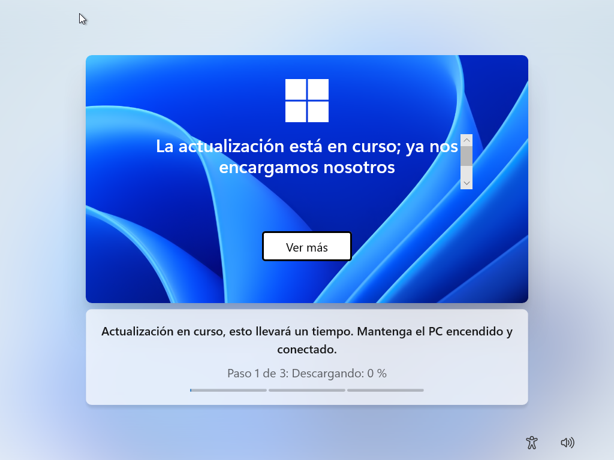

*Tras varios minutos, Windows 11 Pro quedó actualizado.*

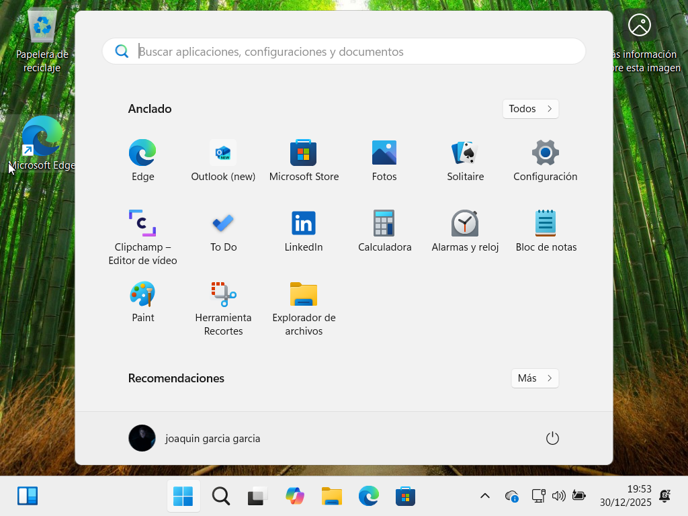

*Windows 11 Pro totalmente funcional.*

## Linux Ubuntu Desktop

Linux Ubuntu Desktop también estará presente en el club, aunque de una manera **muy selectiva**.

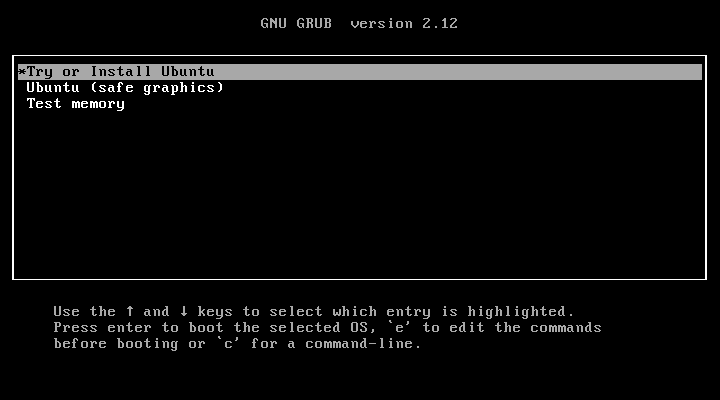

*Pantalla de Ubuntu antes de realizar la instalación.*

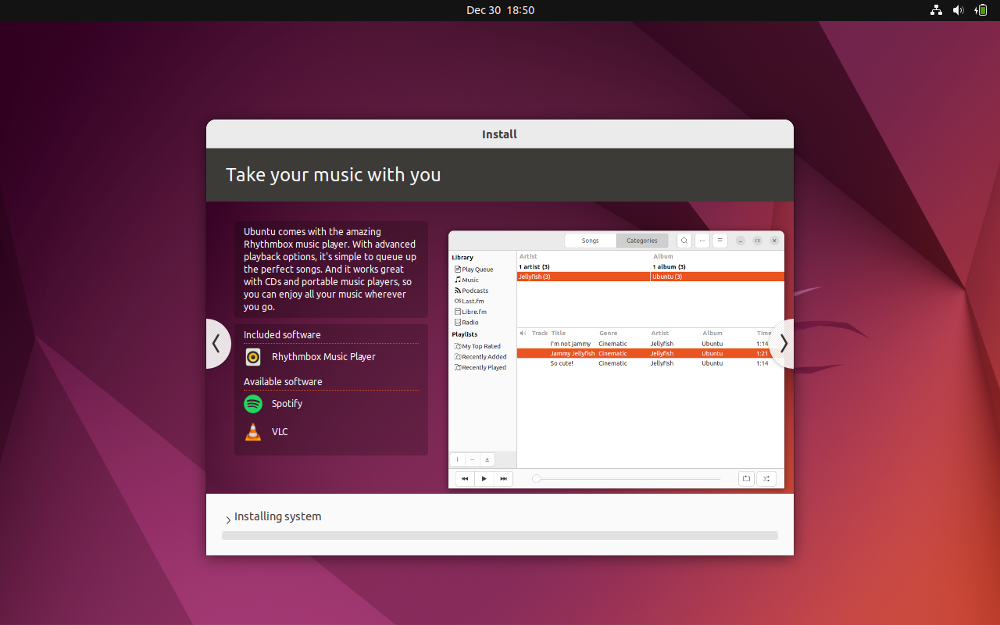
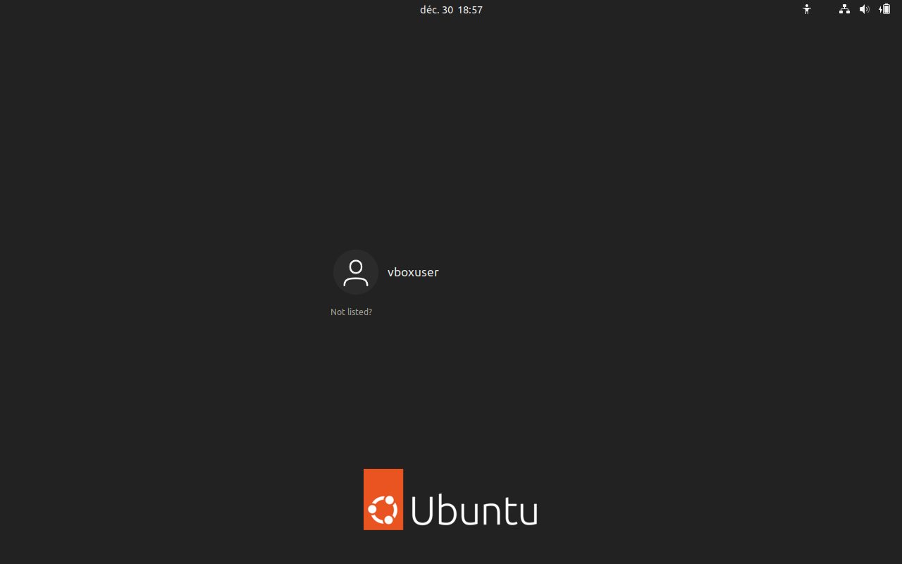

*Proceso de instalación de Ubuntu Desktop.*

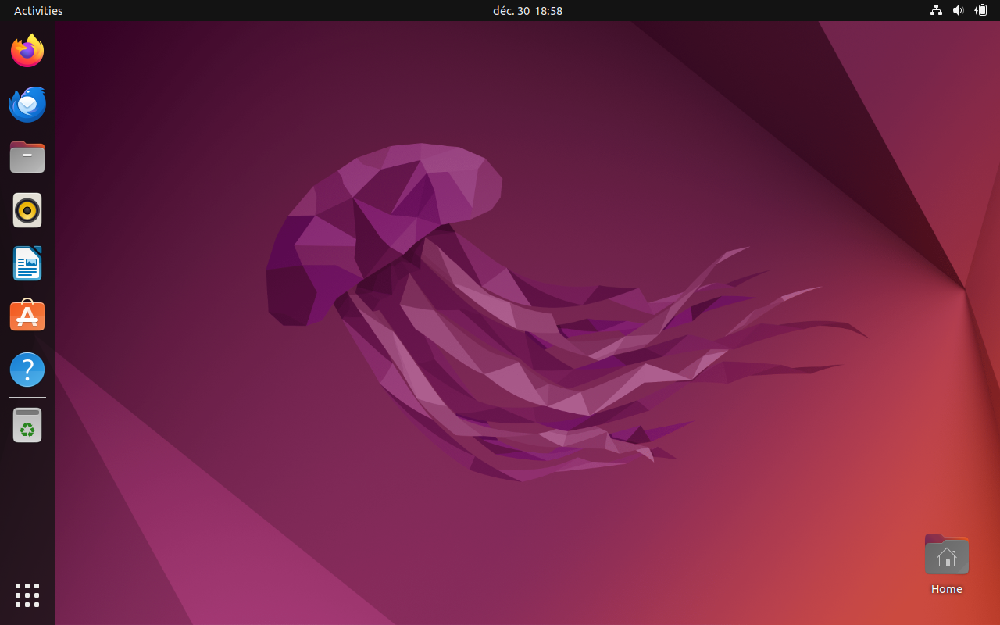

*Ubuntu Desktop totalmente funcional.*

## Kali Linux

Por último, uno de los empleados de IT cuenta con un portátil en el que está instalado el sistema operativo **Kali Linux**, ideal para monitorizar la seguridad interna de la empresa.

*Capturas durante el momento de la instalación de Kali Linux.*

*Herramientas como Wireshark son muy útiles dentro de Kali Linux.*

