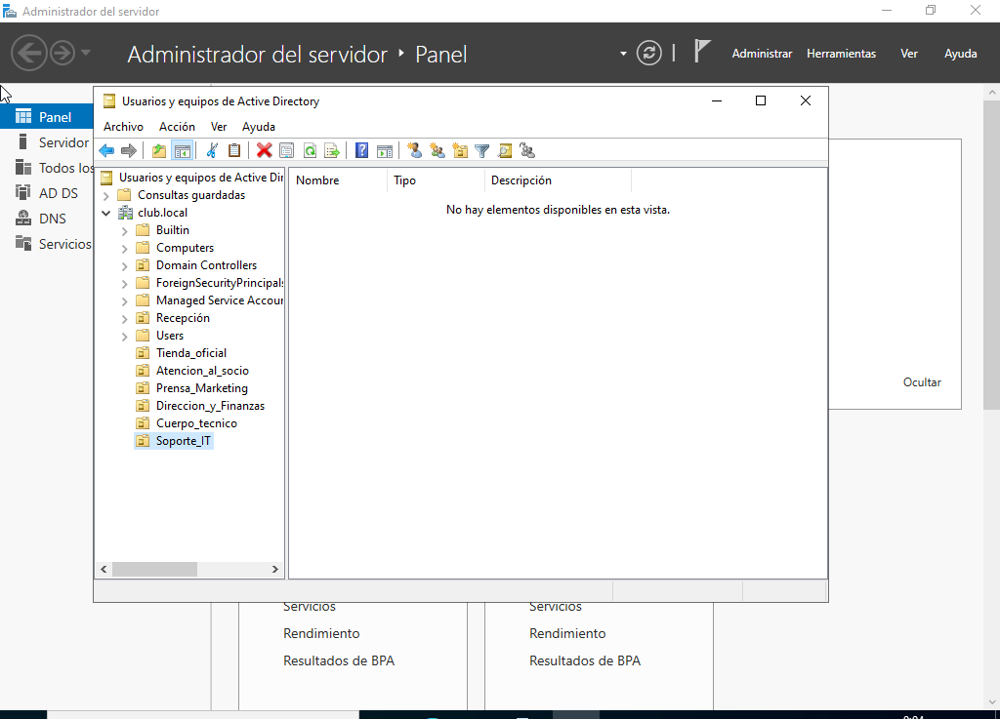
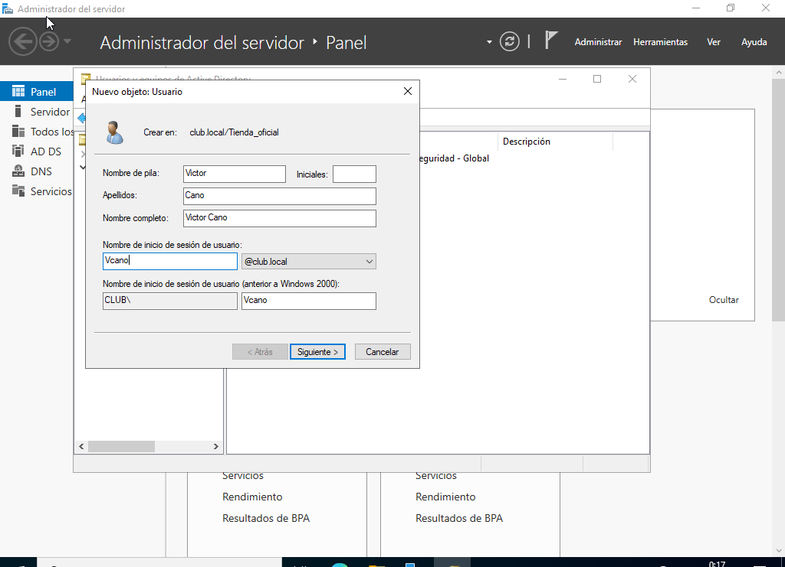
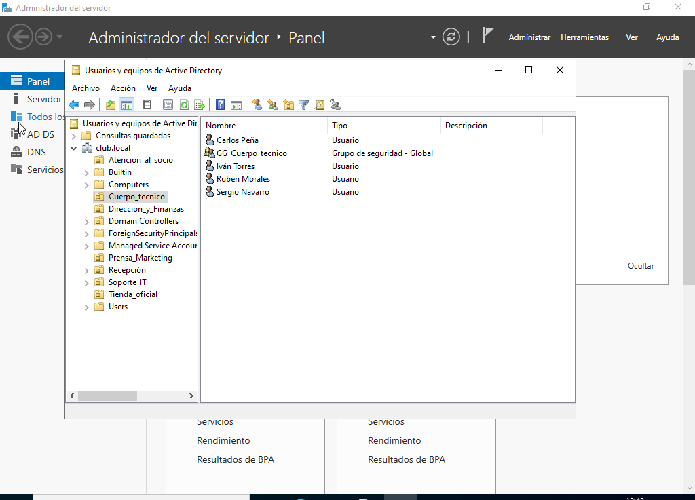
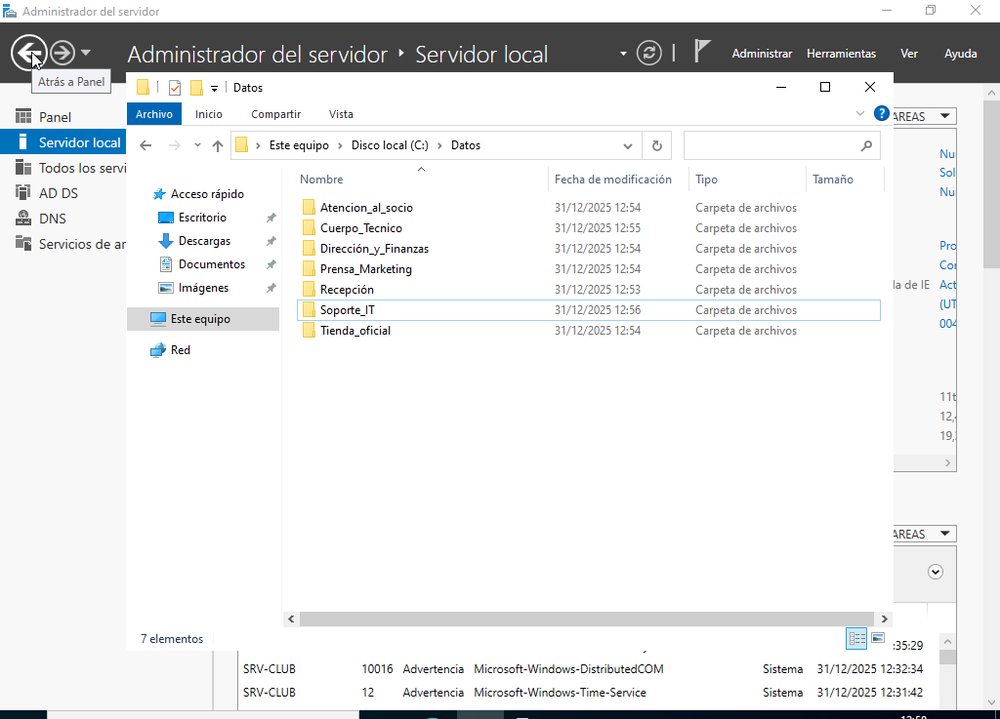
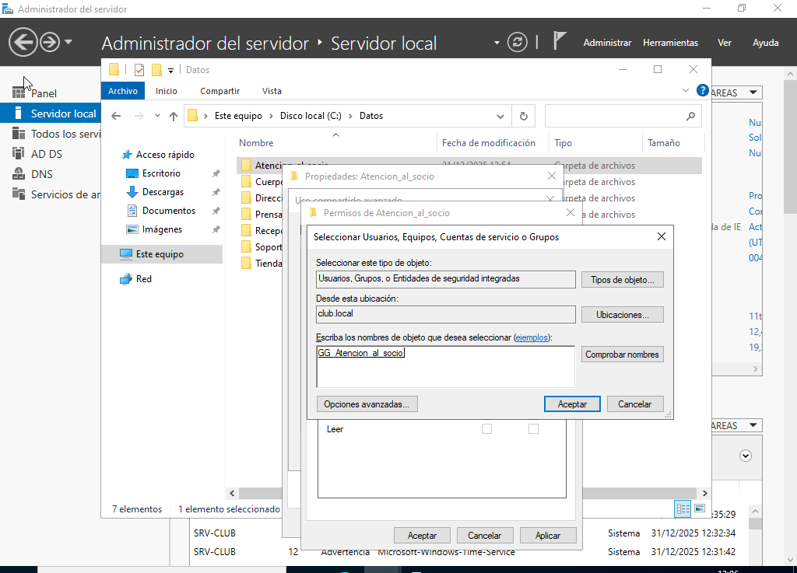
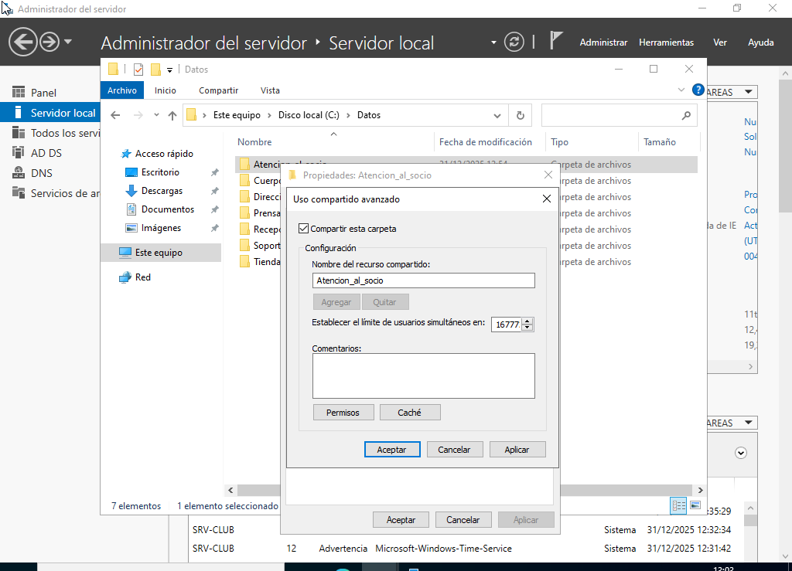
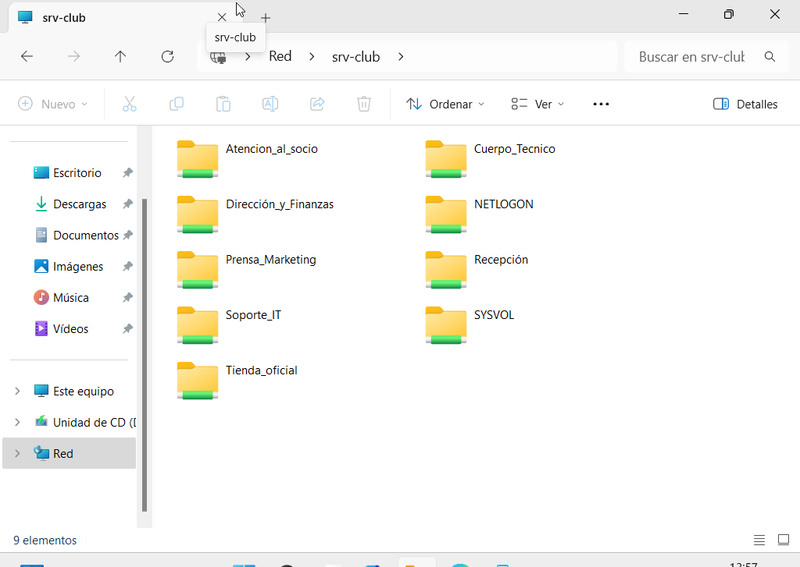
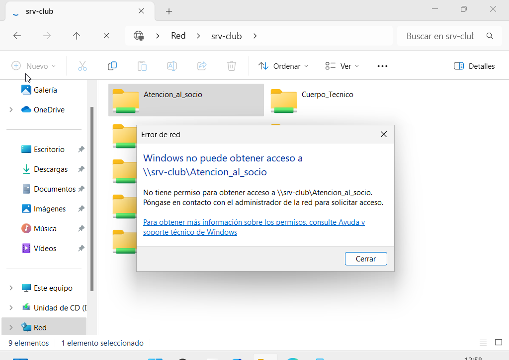
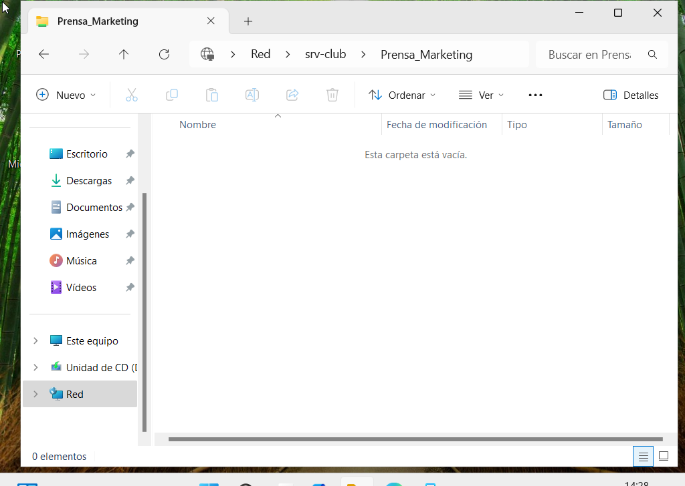

# Gestión de usuarios y permisos

## Índice

1. [Organización del dominio mediante Unidades Organizativas](#organización-del-dominio-mediante-unidades-organizativas)
2. [Creación de grupos de seguridad](#creación-de-grupos-de-seguridad)
3. [Asignación de permisos a carpetas](#asignación-de-permisos-a-carpetas)
4. [Comprobación de acceso desde los equipos cliente](#comprobación-de-acceso-desde-los-equipos-cliente)

---

Una vez configurado el dominio y conectados los equipos cliente, se procedió a organizar la gestión de usuarios y permisos dentro de Active Directory.

El objetivo de esta fase fue estructurar los usuarios por departamentos, facilitar la administración del sistema y controlar el acceso a los recursos compartidos del servidor.

Para ello se utilizaron **Unidades Organizativas (OU)**, **usuarios**, **grupos de seguridad** y **permisos sobre carpetas compartidas**.

## Organización del dominio mediante Unidades Organizativas

Una vez creado el dominio, la estructura de Active Directory se organizó mediante **Unidades Organizativas (OU)** separadas por departamentos.

Las Unidades Organizativas permiten agrupar objetos del dominio, como usuarios, grupos y equipos, facilitando una administración jerárquica y escalable dentro de la organización.

Cada departamento del club cuenta con su propia OU, lo que permite gestionar de forma independiente los usuarios y recursos asociados a cada área.

Además, dentro de cada Unidad Organizativa se crearon los **usuarios correspondientes a cada departamento**.

Cada usuario representa a un trabajador del club y permite acceder a los recursos del dominio utilizando sus propias credenciales.

La gestión de usuarios a través de Active Directory permite centralizar la autenticación y controlar el acceso a los distintos recursos de la organización.

*Primero se crearon las Unidades Organizativas y luego los usuarios correspondientes.*

## Creación de grupos de seguridad

Para gestionar los permisos de forma más eficiente, se crearon **grupos de seguridad globales** asociados a cada departamento.

Estos grupos permiten asignar permisos a recursos sin tener que hacerlo usuario por usuario, siguiendo las buenas prácticas de administración en entornos de dominio.

Por ejemplo, se creó el grupo:

GG_Cuerpo_Tecnico

Al que posteriormente se añadieron los usuarios pertenecientes a ese departamento.

*Ejemplo de UO, siendo GG_Cuerpo_Técnico el grupo de seguridad global al que luego se añaden esos usuarios.*

## Asignación de permisos a carpetas

En el proceso de asignar a cada carpeta sus permisos correspondientes, el primer paso fue crearlas. En este caso, se estableció una carpeta por departamento.

Una vez creadas, y aprovechando los **grupos de seguridad globales**,  se concedieron permisos a las carpetas según su grupo correspondiente, estableciendo los niveles de acceso necesarios (lectura o modificación).

Posteriormente, los usuarios fueron añadidos a los grupos de su departamento, heredando automáticamente los permisos sobre la carpeta asignada.

Este método simplifica la administración y evita tener que modificar los permisos de cada usuario de forma individual.

*Carpetas creadas.*

Tras la creación de las carpetas, se le asignó a cada una el grupo de seguridad global al que pertenece y los permisos correspondientes.

*Este proceso se repitió en todas las carpetas.*

## Comprobación de acceso desde los equipos cliente

Una vez configurados los permisos en el servidor, se realizó una prueba desde un equipo cliente conectado al dominio.

Se inició sesión con el usuario **Hugo Rivera**, perteneciente al departamento de Marketing y Prensa.

Desde el explorador de archivos fue posible visualizar las carpetas del servidor.

Sin embargo, el usuario solo podía acceder a la carpeta correspondiente a su departamento, mientras que el acceso a otras carpetas estaba restringido.

Esto confirma que la asignación de permisos mediante grupos de seguridad funciona correctamente.

*Acceso denegado a un departamento que no es el suyo.*

*No poder entrar a departamentos ajenos no evitó que pudiera acceder al suyo propio.*

