# Índice

- [1. Implementación de inter-VLAN routing mediante switch multicapa](#1--implementación-de-inter-vlan-routing-mediante-switch-multicapa)
  - [Creación de VLANs y configuración de interfaces SVI](#creación-de-vlans-y-configuración-de-interfaces-svi)
  - [Configuración de enlaces trunk en el switch multicapa](#configuración-de-enlaces-trunk-en-el-switch-multicapa)
  - [Configuración de los demás enlaces trunk](#configuración-de-los-demás-enlaces-trunk)
  - [Verificación de enlaces trunk](#verificación-de-enlaces-trunk)
  - [Configuración de VLANs y puertos de acceso en el Switch situado en el CPD](#configuración-de-vlans-y-puertos-de-acceso-en-el-switch-situado-en-el-cpd)
  - [Configuración de direccionamiento IP en el servidor](#configuración-de-direccionamiento-ip-en-el-servidor)
  - [Creación de VLANs y configuración de enlace trunk en el Switch de la planta 1](#creación-de-vlans-y-configuración-de-enlace-trunk-en-el-switch-de-la-planta-1)
  - [Configuración de puertos de acceso y activación de PortFast](#configuración-de-puertos-de-acceso-y-activación-de-portfast)
  - [Configuración IP de un equipo de usuario](#configuración-ip-de-un-equipo-de-usuario)
  - [Configuración del Switch de acceso de la planta 2 situado en Soporte IT](#configuración-del-switch-de-acceso-de-la-planta-2-situado-en-soporte-it)
  - [Prueba de conectividad dentro de la VLAN 40](#prueba-de-conectividad-dentro-de-la-vlan-40)
  - [Prueba de conectividad hacia otro equipo de la red](#prueba-de-conectividad-hacia-otro-equipo-de-la-red)

- [2. DHCP](#2--dhcp)
  - [Configuración del servidor DHCP en el switch multicapa](#configuración-del-servidor-dhcp-en-el-switch-multicapa)
  - [Obtención de dirección IP mediante DHCP en un equipo de la red](#obtención-de-dirección-ip-mediante-dhcp-en-un-equipo-de-la-red)

- [3. Configuración Wireless](#3--configuración-wireless)
  - [Configuración inicial de gestión en el WLC](#configuración-inicial-de-gestión-en-el-wlc)
  - [Interfaz del WLC](#interfaz-del-wlc)
  - [Creación de la cuenta de administrador](#creación-de-la-cuenta-de-administrador)
  - [Creación de las VLAN 70 y 80](#creación-de-las-vlan-70-y-80)
  - [Configuración de la Interfaz lógica (VLAN 70)](#configuración-de-la-interfaz-lógica-vlan-70)
  - [Configuración del SSID y Mapeo de Interfaz](#configuración-del-ssid-y-mapeo-de-interfaz)
  - [Configuración de la Opción 43 en el DHCP](#configuración-de-la-opción-43-en-el-dhcp)
  - [Configuración de la Interfaz para Invitados (VLAN 80)](#configuración-de-la-interfaz-para-invitados-vlan-80)
  - [Verificación de Registro del Access Point (AP)](#verificación-de-registro-del-access-point-ap)
  - [Escaneo de Redes Inalámbricas desde el Cliente](#escaneo-de-redes-inalámbricas-desde-el-cliente)
  - [Validación de IP dinámica en Portátil de Empleados](#validación-de-ip-dinámica-en-portátil-de-empleados)
  - [Validación de IP dinámica en Portátil de Invitados](#validación-de-ip-dinámica-en-portátil-de-invitados)

- [4. Simulación de internet en un Router 2911](#4--simulación-de-internet-en-un-router-2911)
  - [Configuración de la interfaz del switch multicapa 3 conectada al router](#configuración-de-la-interfaz-del-switch-multicapa-3-conectada-al-router)
  - [Configuración de la interfaz del router conectada al switch multicapa](#configuración-de-la-interfaz-del-router-conectada-al-switch-multicapa)
  - [Creación de una loopback para simular internet](#creación-de-una-loopback-para-simular-internet)
  - [Pruebas de conexión a internet simulado](#pruebas-de-conexión-a-internet-simulado)

- [5. Configuración de ACLs para control de acceso entre VLANs](#5--configuración-de-acls-para-control-de-acceso-entre-vlans)
  - [Creación de la primera ACL: VLAN 70 (WLAN_empleados) no puede comunicarse con VLAN 10 (Dirección)](#creación-de-la-primera-acl-vlan-70-wlan_empleados-no-puede-comunicarse-con-vlan-10-dirección)
  - [Creación de la segunda ACL: Marketing (VLAN 20) no puede acceder a Dirección (VLAN 10)](#creación-de-la-segunda-acl-marketing-vlan-20-no-puede-acceder-a-dirección-vlan-10)
  - [Solo VLAN 99 puede administrar los dispositivos](#solo-vlan-99-puede-administrar-los-dispositivos)
  - [Aislando la VLAN 80 de Invitados](#aislando-la-vlan-80-de-invitados)
  - [Pruebas de conectividad](#pruebas-de-conectividad)
    - [ACL](#acl)
    - [SSH](#ssh)
    - [BUG ACL](#bug-acl)

- [6. Configuración de Impresoras](#6--configuración-de-impresoras)
- [7. Conclusiones](#conclusiones)

# 1- Implementación de inter-VLAN routing mediante switch multicapa


Para la implementación de la red se ha utilizado un **switch multicapa (Layer 3)** como dispositivo encargado del **inter-VLAN routing**. Esta decisión se debe a que los switches de capa 3 permiten realizar el enrutamiento entre redes VLAN directamente dentro del propio switch.

El uso de un switch multicapa presenta varias ventajas frente al uso de un router tradicional para el enrutamiento entre VLANs:

- **Mayor rendimiento**, ya que el enrutamiento se realiza mediante hardware especializado dentro del propio switch.
- **Menor latencia**, al evitar un salto adicional hacia un router externo.
- **Arquitectura más sencilla**, centralizando el enrutamiento de todas     las VLAN en el núcleo de la red.

De esta manera, los switches de acceso se encargan únicamente de conectar los dispositivos finales, mientras que el switch multicapa actúa como **núcleo de la red**, gestionando el enrutamiento entre los distintos departamentos.

---

## Creación de VLANs y configuración de interfaces SVI

En esta captura se muestra la configuración inicial del **switch multicapa**, donde se han creado las diferentes **VLAN** que segmentan la red por departamentos. Cada VLAN representa una subred independiente con su propio espacio de direccionamiento IP.

Posteriormente se configuran las **interfaces virtuales de VLAN (SVI)**, que actuarán como **puertas de enlace (gateway)** para los dispositivos de cada red.

Para ello, se introducen los siguientes comandos:

```bash
enable
configure terminal
hostname SW
vlan 10
name Direccion_Finanzas
vlan 20
name Marketing_Prensa
vlan 30
name Servidores
vlan 40
name Recepcion_Taquilla
vlan 50
name Tienda_Oficial
vlan 60
name Cuerpo_Tecnico
vlan 99
name IT_Gestion


interface vlan 10
ip address 192.168.10.1 255.255.255.0
no shutdown
interface vlan 20
ip address 192.168.20.1 255.255.255.0
no shutdown
interface vlan 30
ip address 192.168.30.1 255.255.255.0
no shutdown
interface vlan 40
ip address 192.168.40.1 255.255.255.0
no shutdown
interface vlan 50
ip address 192.168.50.1 255.255.255.0
no shutdown
interface vlan 60
ip address 192.168.60.1 255.255.255.0
no shutdown
interface vlan 99
ip address 192.168.99.1 255.255.255.0
no shutdown
```

Cada interfaz VLAN recibe una dirección IP correspondiente a su red:

| VLAN | Departamento | Red |
|------|--------------|-----|
| 10 | Dirección / Finanzas | 192.168.10.0/24 |
| 20 | Marketing / Prensa | 192.168.20.0/24 |
| 30 | Servidores | 192.168.30.0/24 |
| 40 | Recepción / Taquilla | 192.168.40.0/24 |
| 50 | Tienda oficial | 192.168.50.0/24 |
| 60 | Cuerpo técnico | 192.168.60.0/24 |
| 99 | Gestión IT | 192.168.99.0/24 |

Estas interfaces permiten al switch multicapa realizar el **enrutamiento entre las diferentes VLANs**.

</div>

<div align="center">

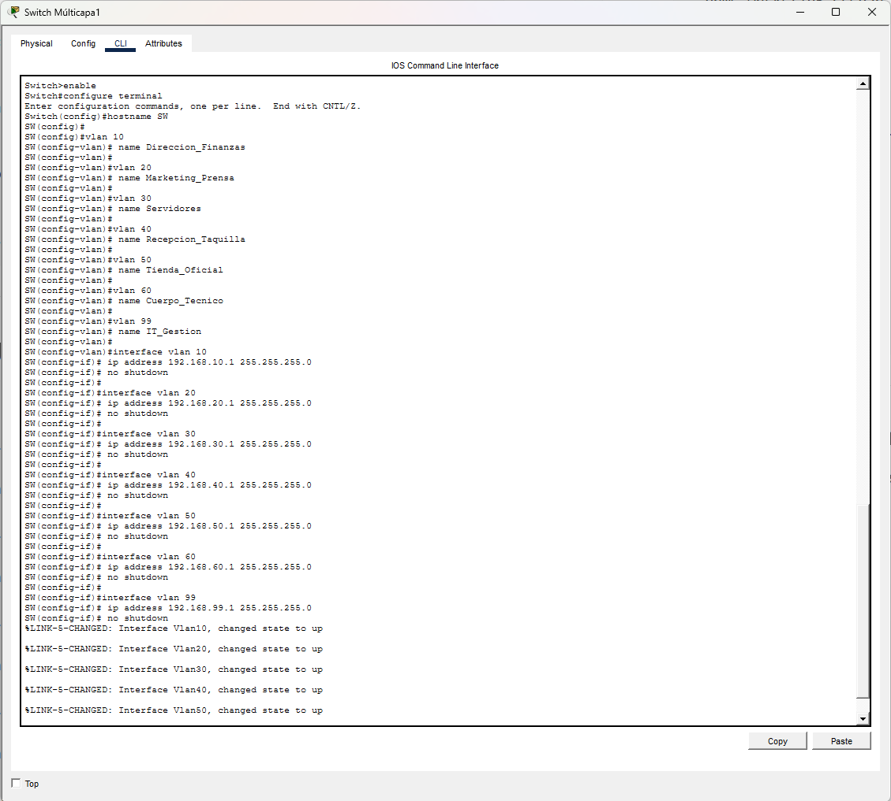

</div>

<div align="center">

*Configuración de VLANs y asignación de direcciones IP a las interfaces SVI del switch multicapa.*

</div>

**Observación: Las WLAN se han implementado más tarde, al configurar la red inalámbrica.**
---

## Configuración de enlaces trunk en el switch multicapa

En este paso se configuran los enlaces **trunk** entre el switch multicapa y los switches de acceso. Los enlaces trunk permiten transportar tráfico de múltiples VLAN a través de un único enlace físico utilizando el protocolo **IEEE 802.1Q (dot1q)**.

Se configuran la única interfaz **GigabitEthernet** que va directa a un switch de acceso como enlaces trunk y se especifican las VLAN que pueden circular por dichos enlaces. La otra interfaz GigabitEthernet se configurará más adelante, ya que conecta con el Router que simula internet, mientras que los otros dos switches de acceso van conectados mediante FastEthernet.

Los comandos usados son:

```bash
interface gigabitEthernet0/2
switchport trunk encapsulation dot1q
switchport mode trunk
switchport trunk allowed vlan 10,20,30,40,50,60,99
no shutdown

interface fastEthernet0/1
switchport mode trunk
switchport trunk allowed vlan 10,20,30,40,50,60,99
no shutdown
```

Esto permite que los switches de acceso puedan transportar tráfico de todas las redes configuradas hacia el núcleo de la red.

</div>

<div align="center">

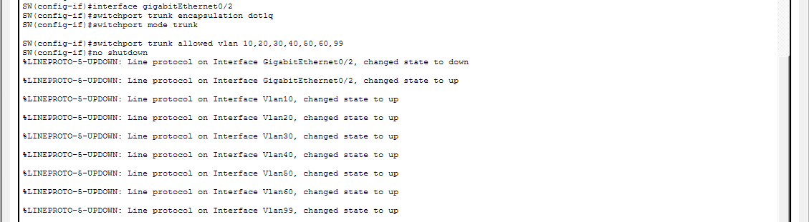

</div>

<div align="center">

*Configuración de enlaces trunk 802.1Q entre el switch multicapa y un switches de acceso.*

</div>


---

## Configuración de los demás enlaces trunk 

En esta captura se muestra la configuración de otro enlace **trunk** en una interfaz **FastEthernet**. En esta interfaz también se habilita el encapsulado **802.1Q** y se especifica la lista de VLAN permitidas.

Este enlace permite extender las VLAN hacia los otros switches de acceso dentro de la infraestructura. En la captura se realiza al puerto **Fast Ethernet 0/1** pero también se aplicó al **F0/2**.

Se usaron estos comandos:

```bash
interface fastEthernet0/1
switchport mode trunk
switchport trunk allowed vlan 10,20,30,40,50,60,99
no shutdown
```


</div>

<div align="center">

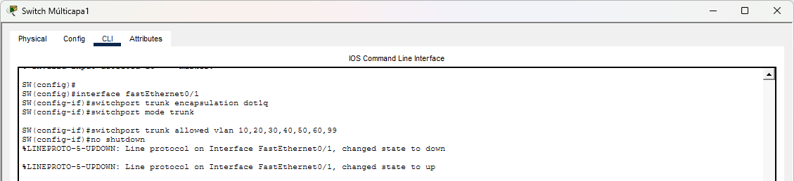

</div>

<div align="center">

*Configuración del enlace trunk, este caso al puerto Fast Ethernet 0/1 del Switch 1 .*

</div>


---

## Verificación de enlaces trunk

Una vez configurado las VLAN y los enlaces trunk, se verificó el estado de estos. Para ello, se uso el siguiente comando: 

```bash
show interfaces trunk
```

La salida de este comando permite muestra:

Los puertos configurados como trunk

El protocolo de encapsulación utilizado (802.1Q)

El estado del enlace

Las VLAN permitidas en el trunk

Las VLAN activas en el dominio de gestión

Así, esta verificación confirma que las VLAN configuradas pueden circular correctamente entre los switches de la red.

</div>

<div align="center">

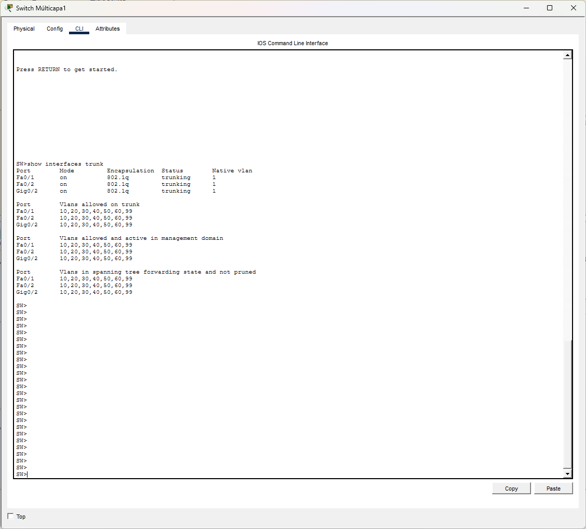

</div>

<div align="center">

*Verificación del estado de los enlaces trunk mediante el comando show interfaces trunk.*

</div>

---

 ## Configuración de VLANs y puertos de acceso en el Switch situado en el CPD 
 
En esta captura se muestra la configuración del switch de acceso Switch situado en el CPD de la planta 2, encargado de conectar los servidores.

Primero se crean las VLAN necesarias, respetando la coherencia con la estructura de la red ya mencionada. Posteriormente se configura el puerto Fa0/1 como enlace trunk hacia el switch multicapa.

Los puertos Fa1/1 y Fa2/1 se configuran como puertos de acceso pertenecientes a la VLAN 30, correspondiente a la red de servidores.

Esto permite que los servidores se encuentren dentro de una red aislada del resto de departamentos, aumentando la seguridad y facilitando la administración de los servicios.

Los comandos utilizados:

```bash
enable
configure t

vlan 10
vlan 20
vlan 30
vlan 40
vlan 50
vlan 60
vlan 99

interface fa0/1
switchport mode trunk
switchport trunk allowed vlan 10,20,30,40,50,60,99
no shutdown

interface fa1/1
switchport mode access
switchport access vlan 30
no shutdown

interface fa2/1
switchport mode access
switchport access vlan 30
no shutdown
```


</div>

<div align="center">

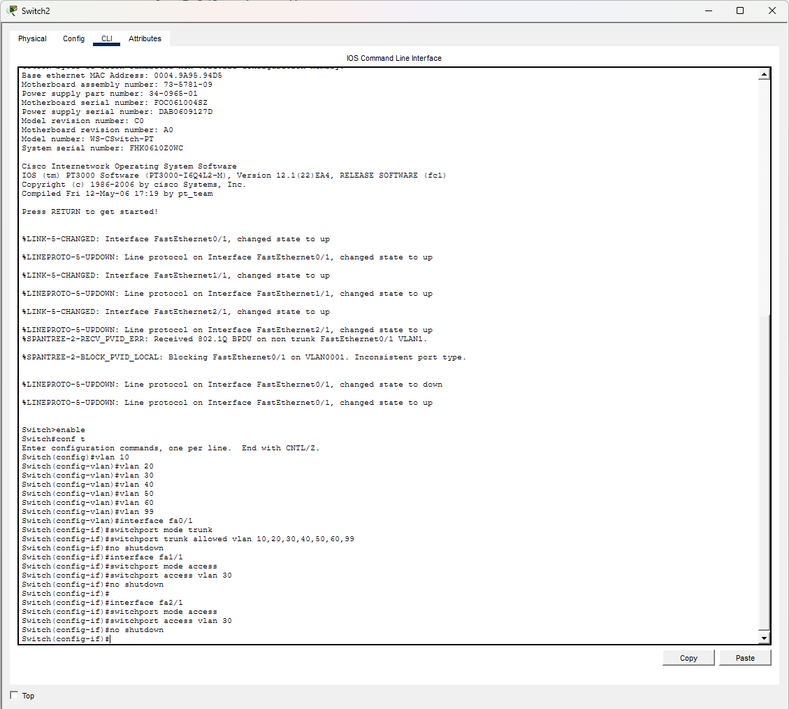

</div>

<div align="center">

*Configuración del switch de acceso del CPD de planta 2 y asignación de puertos de acceso a la VLAN de servidores.*

</div>

## Configuración de direccionamiento IP en el servidor

En esta captura se muestra la configuración manual de la dirección IP en uno de los servidores de la red. El servidor pertenece a la **VLAN 30**, destinada al segmento de servidores dentro de la infraestructura.

Se asigna la siguiente configuración de red:

- **Dirección IP:** 192.168.30.11  
- **Máscara de subred:** 255.255.255.0  
- **Gateway:** 192.168.30.1  

El gateway configurado corresponde a la **interfaz VLAN 30 del switch multicapa**, que actúa como puerta de enlace para todos los dispositivos de esta red.

Esta configuración permite que el servidor pueda comunicarse con otras VLAN mediante el **enrutamiento inter-VLAN realizado por el switch de capa 3**.

</div>

<div align="center">

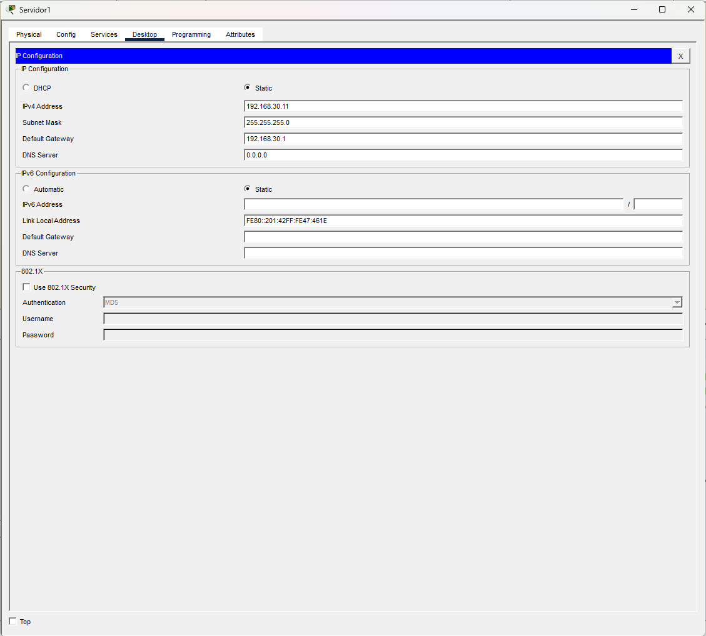

</div>

<div align="center">

*Configuración de dirección IP estática en el servidor perteneciente a la VLAN de servidores.*

</div>

---

## Creación de VLANs y configuración de enlace trunk en el Switch de la planta 1

En esta captura se observa la configuración inicial del **Switch planta 1**, otro de los switches de acceso de la red.

Como en el anterior switch, primero se crean las VLAN necesarias para que el switch pueda manejar el tráfico correspondiente a cada segmento de red.

Posteriormente se configura la interfaz **FastEthernet0/1** como enlace **trunk**, permitiendo transportar tráfico de múltiples VLAN hacia el switch multicapa.

Comandos utilizados:

```bash
enable
configure t

vlan 10
vlan 20
vlan 30
vlan 40
vlan 50
vlan 60
vlan 99

interface fa0/1
switchport mode trunk
switchport trunk allowed vlan 10,20,30,40,50,60,99
no shutdown
```

De esta manera, el switch puede transportar tráfico etiquetado de todas las VLAN hacia el núcleo de la red.

</div>

<div align="center">

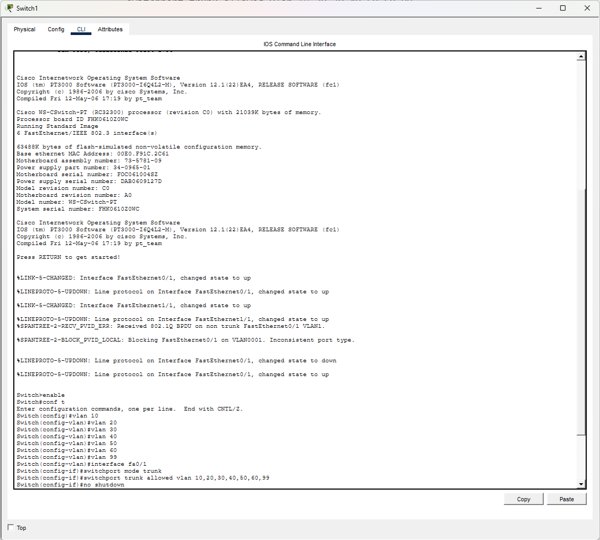

</div>

<div align="center">

*Creación de VLANs y configuración del enlace trunk en el switch de acceso de la planta 1.*

</div>

---

## Configuración de puertos de acceso y activación de PortFast

A continuación, se configuran varios **puertos de acceso** en el switch de la planta 1, los cuales se utilizan para conectar dispositivos finales como ordenadores o impresoras.

Cada puerto se configura con:

- **Modo access**
- **Asignación a una VLAN específica**
- **Activación de PortFast**

Ejemplo de configuración aplicada:

```bash
interface fastEthernet1/1
switchport mode access
switchport access vlan 20
spanning-tree portfast
```

La activación de **PortFast** permite que los puertos conectados a dispositivos finales pasen directamente al estado *forwarding*, evitando los tiempos de espera del protocolo **Spanning Tree**.

Esto reduce el tiempo de conexión de los dispositivos finales a la red.

Esta configuración se realiza también en los demás switches de acceso.


</div>

<div align="center">

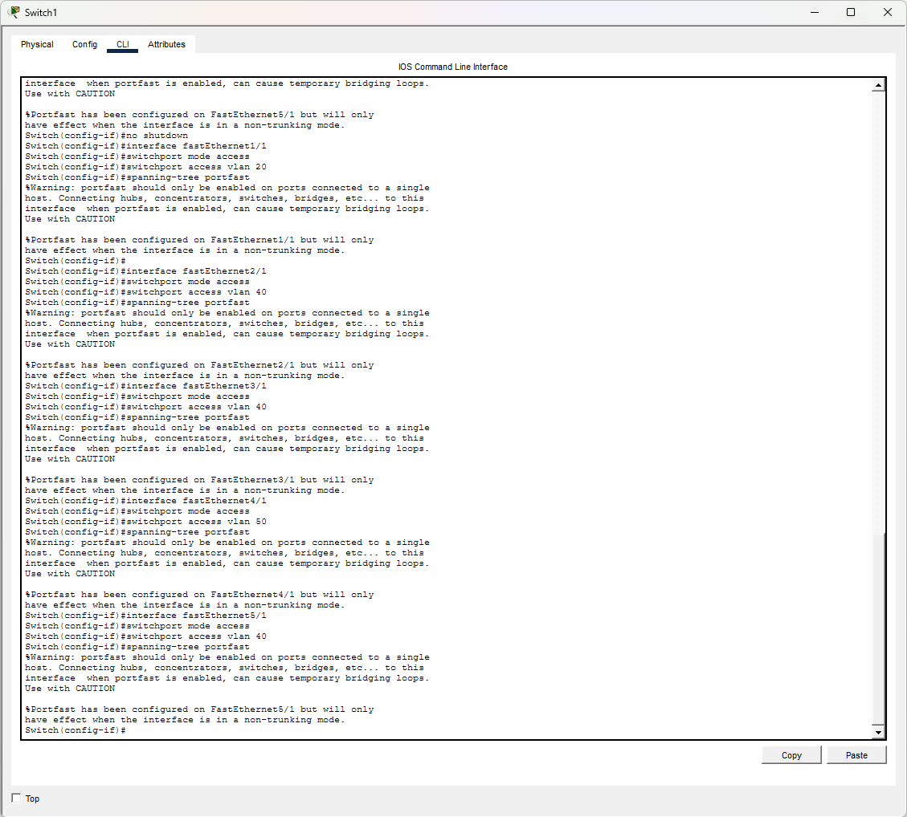

</div>

<div align="center">

*Configuración de puertos de acceso para dispositivos finales y activación de PortFast.*

</div>

---

## Configuración IP de un equipo de usuario

En esta captura se muestra la configuración de red de un equipo de usuario perteneciente a la **VLAN 20**.

Se asigna una dirección IP estática con los siguientes parámetros:

- **Dirección IP:** 192.168.20.11  
- **Máscara de subred:** 255.255.255.0  
- **Gateway:** 192.168.20.1  

El gateway corresponde a la **interfaz VLAN 20 del switch multicapa**, que permite a este equipo comunicarse con otras redes de la organización mediante el **enrutamiento inter-VLAN**.

Esta configuración permite que el dispositivo acceda a servicios ubicados en otras VLAN de la infraestructura pero luego será sustituida por una configuración DHCP.


<div align="center">

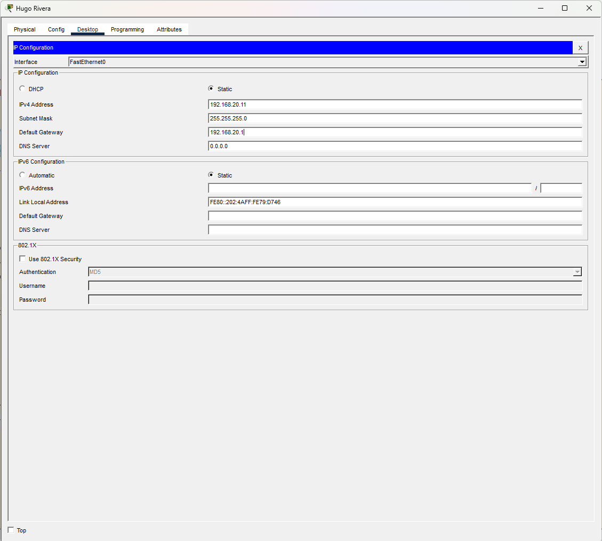

</div>

<div align="center">

*Configuración manual de red en un equipo de usuario perteneciente a la VLAN 20.*

</div>

---

## Configuración del Switch de acceso de la planta 2 situado en Soporte IT

En esta captura se muestra la configuración del **Switch de acceso** situado en la planta 2.

Los comandos utilizados han sido: 


```bash
enable
configure terminal

vlan 10
vlan 20
vlan 30
vlan 40
vlan 50
vlan 60
vlan 99

interface fastEthernet0/1
switchport mode trunk
switchport trunk allowed vlan 10,20,30,40,50,60,99
no shutdown

interface fastEthernet1/1
switchport mode access
switchport access vlan 10
spanning-tree portfast
no shutdown

interface fastEthernet2/1
switchport mode access
switchport access vlan 10
spanning-tree portfast
```

Además, se configuran varios puertos de acceso para conectar dispositivos finales, asignándolos a la VLAN correspondiente y activando **PortFast** para mejorar el tiempo de convergencia de la red.


<div align="center">

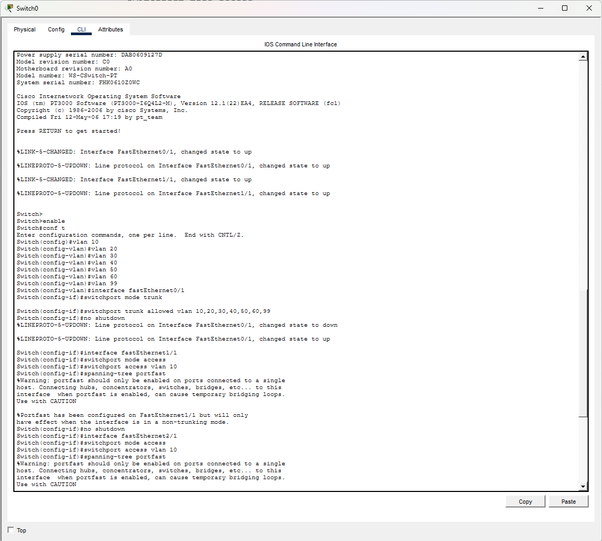

</div>

<div align="center">

*Configuración del switch de acceso situado en el departamento de IT en la planta 2.*

</div>

---

## Prueba de conectividad dentro de la VLAN 40

En este punto se realiza una prueba de conectividad mediante el comando **ping** desde un equipo perteneciente a la **VLAN 40**.

El equipo ejecuta el comando:

```bash
ping 192.168.40.12
```

El resultado muestra **respuestas correctas sin pérdida de paquetes**, lo que confirma que la comunicación dentro de la misma VLAN funciona correctamente.

Además, se ejecuta el comando:

```bash
ipconfig
```

que permite verificar la configuración de red del equipo:

- **IP:** 192.168.40.20  
- **Máscara:** 255.255.255.0  
- **Gateway:** 192.168.40.1  

Esto confirma que el equipo está correctamente configurado dentro de su red.

<div align="center">

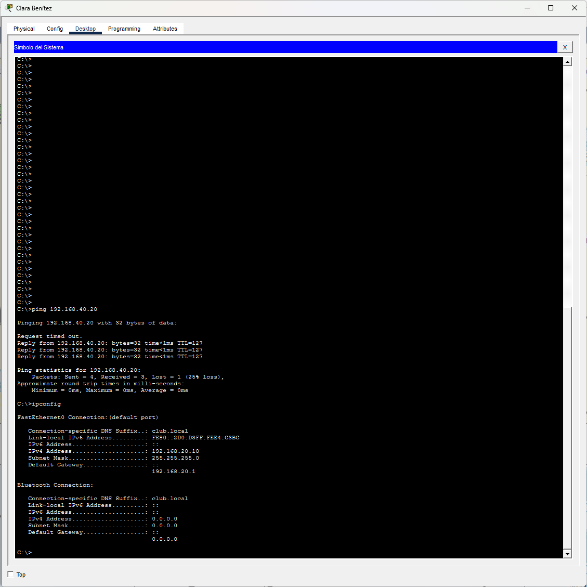

</div>

<div align="center">

*Verificación de conectividad dentro de la VLAN 40 mediante prueba de ping.*

</div>

---

## Prueba de conectividad hacia otro equipo de la red

En esta captura se realiza otra prueba de conectividad desde un equipo perteneciente a la **VLAN 20**.

El equipo ejecuta el siguiente comando:

```bash
ping 192.168.40.20
```

Se observa que el primer paquete se pierde, algo habitual debido al proceso de **resolución ARP**, pero los siguientes paquetes reciben respuesta correctamente.

Esto confirma que el **enrutamiento inter-VLAN está funcionando correctamente**, permitiendo la comunicación entre dispositivos pertenecientes a diferentes redes.

También se muestra la configuración del equipo mediante:

```bash
ipconfig
```

con los siguientes parámetros:

- **IP:** 192.168.20.10  
- **Máscara:** 255.255.255.0  
- **Gateway:** 192.168.20.1  


<div align="center">

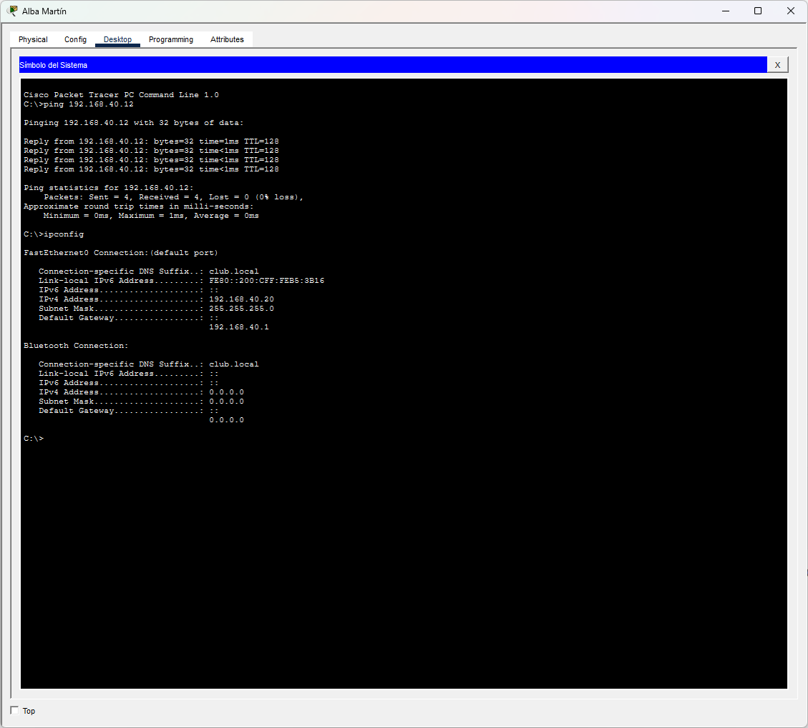

</div>

<div align="center">

*Prueba de conectividad entre VLANs que confirma el correcto funcionamiento del inter-VLAN routing.*

</div>

# 2- DHCP

## Configuración del servidor DHCP en el switch multicapa

Tras configurar correctamente los switches, es el momento de aplicar la **configuración del servicio DHCP directamente en el switch multicapa**, lo que permite asignar direcciones IP automáticamente a los equipos de cada VLAN.

Para ello, se utilizan los siguientes comandos, teniendo en cuenta las **direcciones excluidas del DHCP**, que normalmente corresponden a las **puertas de enlace (gateway) o direcciones reservadas** dentro de cada red:

```bash
ip dhcp excluded-address 192.168.10.1
ip dhcp excluded-address 192.168.20.1
ip dhcp excluded-address 192.168.30.1 192.168.30.20
ip dhcp excluded-address 192.168.40.1
ip dhcp excluded-address 192.168.50.1
ip dhcp excluded-address 192.168.60.1
ip dhcp excluded-address 192.168.70.1
ip dhcp excluded-address 192.168.80.1
ip dhcp excluded-address 192.168.99.1 192.168.99.10
```
Después se crean distintos pools de DHCP, uno para cada VLAN o departamento de la red.
Cada pool define:

La red a la que pertenece

La puerta de enlace predeterminada

El servidor DNS

Ejemplo de configuración de un pool:

```bash
ip dhcp pool POOL_MARKETING
network 192.168.20.0 255.255.255.0
default-router 192.168.20.1
dns-server 8.8.8.8
```

En esta captura se pueden observar varios pools configurados, correspondientes a diferentes áreas de la red.

De esta forma, el switch multicapa actúa como servidor DHCP para todas las VLANs, facilitando la asignación automática de direcciones IP a los dispositivos de la red.

<div align="center">


</div>

<div align="center">

*Configuración del servicio DHCP en el switch multicapa para proporcionar direcciones IP a todas las VLANs.*

</div>

## Obtención de dirección IP mediante DHCP en un equipo de la red

En esta captura se muestra la configuración IP de un equipo llamado “Clara Benítez” dentro de la red. El equipo está configurado para **obtener su dirección IP automáticamente mediante DHCP**.

La asignación automática de estos valores confirma que el servidor DHCP configurado en el switch multicapa está funcionando correctamente, proporcionando direcciones IP y parámetros de red a los dispositivos conectados.


<div align="center">


</div>

<div align="center">

*Equipo obteniendo automáticamente su configuración IP desde el servidor DHCP del switch multicapa.*

</div>


# 3- Configuración Wireless

Para la configuración de un punto de acceso que contuviese dos SSID, tanto de empresa como de invitados, se optó por configurar un **WLC-2504 Wireless Lan Controller**. De esta configuración se aprovecharía un dispositivo básico LAP-PT, que solo tendría que servir la señal a los dispositivos de salida.

## Configuración inicial de gestión en el WLC

Tras situar el WLC en la infraestructura, se accede al menú de configuración para, dentro del Management, asignarle unos parámetros asociados a la VLAN 99. 

Se decide que esté vinculada a la VLAN 99 porque está dedicada exclusivamente a la gestión de la infraestructura. De esta forma, se garantiza que el tráfico de administración esté aislado del tráfico de usuarios, siguiendo las buenas prácticas de seguridad y permitiendo que el WLC se comunique correctamente con el switch multicapa y el access point.

<div align="center">

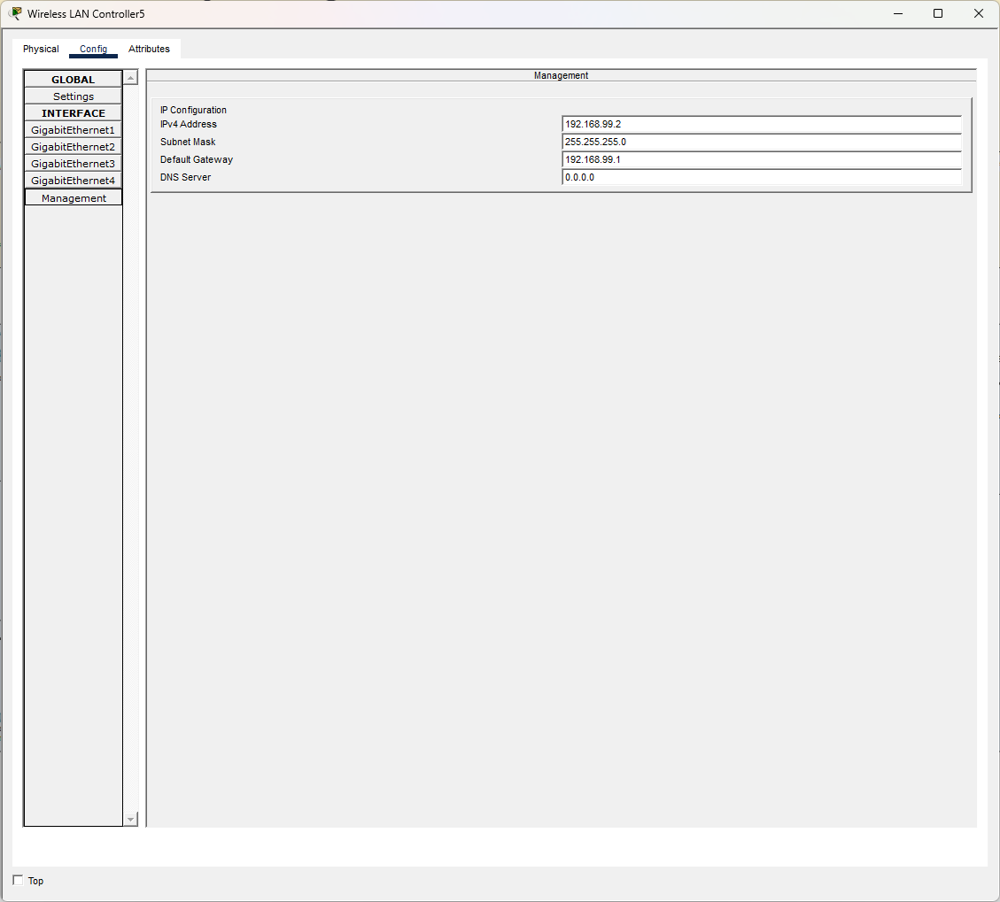

</div>

<div align="center">

*Asignación de la VLAN 99 para su correcta gestión.*

</div>

## Interfaz del WLC

En esta captura se muestra como se accede a la interfaz del WLC tras introducir en el navegador la IP de este dispositivo. Esta interfaz nos permite crear un usuario y contraseña con el que se entrará para realizar toda la configuración.

<div align="center">

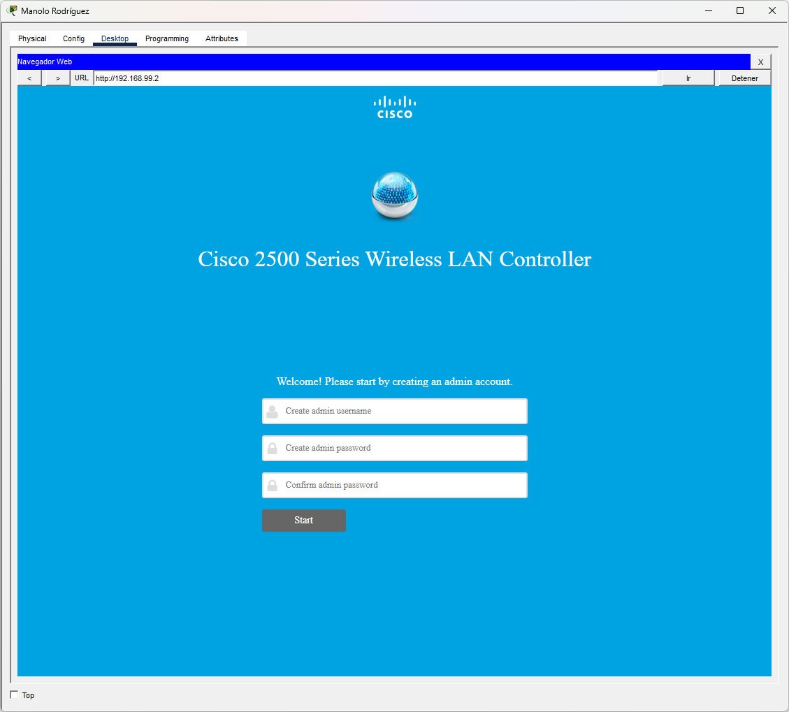

</div>

<div align="center">

*Se accede a la interfaz gráfica desde un navegador en un equipo perteneciente a la VLAN 99. Basta con introducir la ip asignada anteriormente.*

</div>

## Creación de la cuenta de administrador

Esta pantalla marca el acceso final al portal web de la controladora, donde se requiere la creación de las credenciales de administrador. Este paso es el filtro de seguridad previo antes de poder configurar las redes inalámbricas (WLANs) de empleados e invitados y sus respectivos protocolos de seguridad WPA2.

<div align="center">

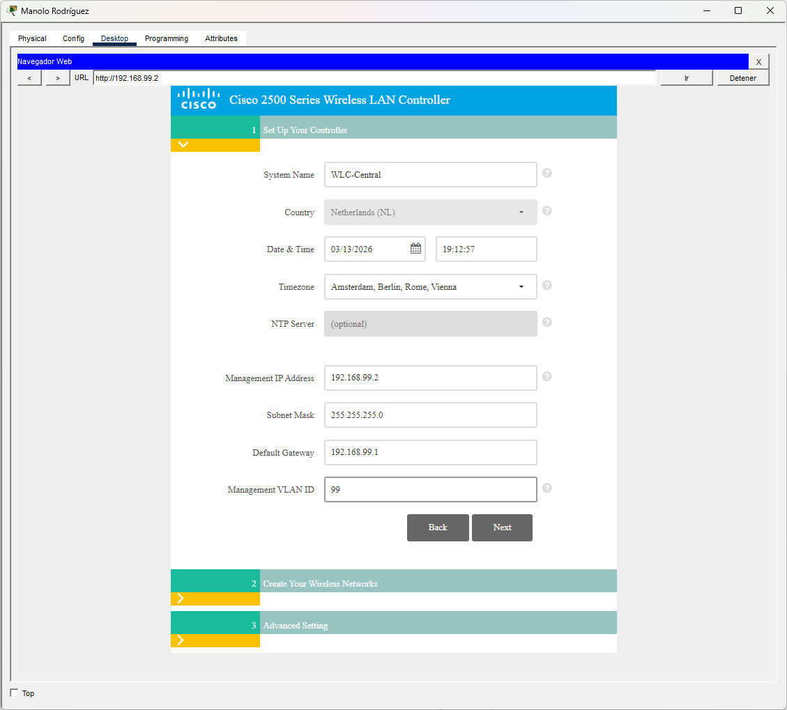

</div>

<div align="center">

*Configuración de credenciales de acceso para la administración del WLC.*

</div>

## Creación de las VLAN 70 y 80

De la misma forma que se añadieron las demás VLAN de la red, también se añadieron dos nuevas VLAN destinadas a las redes WiFi: VLAN 70 (empleados) y 80 (invitados). 
Primero se registraron en el switch multicapa, donde se gestionan las interfaces de enrutamiento, y posteriormente se añadieron también en los switches de acceso de la planta 1 y la planta 2 para permitir el transporte del tráfico inalámbrico a través de los enlaces trunk. 

## Configuración de la Interfaz lógica (VLAN 70)

En esta captura se configura la interfaz VLAN70-Emp en el WLC. Se le asigna la IP 192.168.70.2 y se establece el Switch Multicapa (192.168.70.1) como puerta de enlace y servidor DHCP. 

<div align="center">

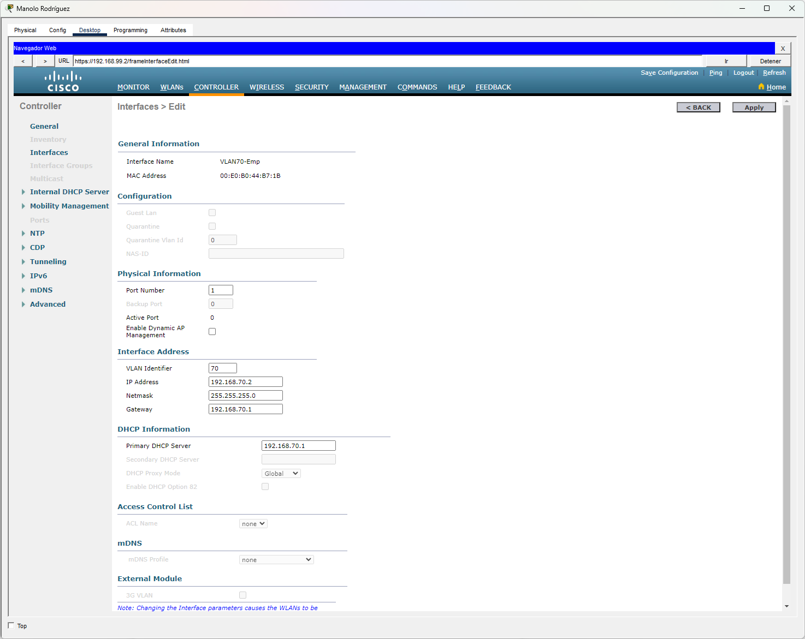

</div>

<div align="center">

*Creación y direccionamiento de la interfaz lógica para la VLAN de empleados.*

</div>

## Configuración del SSID y Mapeo de Interfaz

Se muestra la configuración de la WLAN "empleados". En este apartado se activa el SSID, se aplica la seguridad WPA2 y, lo más importante, se vincula la red inalámbrica con la interfaz VLAN70-Emp configurada previamente. Esto asegura que cualquier usuario que se conecte a este WiFi sea dirigido automáticamente a la VLAN 70.

<div align="center">

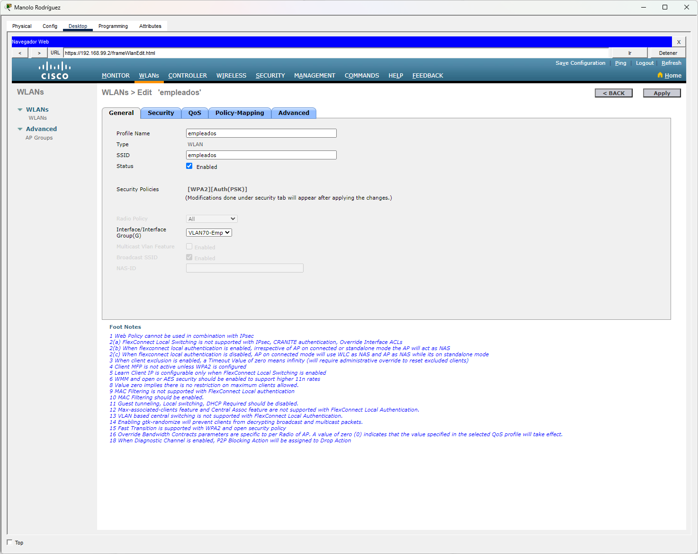

</div>

<div align="center">

*Activación del SSID "empleados" y vinculación con su interfaz de red.*

</div>

## Configuración de la Opción 43 en el DHCP

Tras introducir el LAP-PT dentro de la infraestructura es necesario configurarlo dentro del switch multicapa. Para ello, dentro del CLI del switch multicapa se configura el pool de gestión para el access point. 
Se utiliza el comando option 43 ip 192.168.99.2 para que los puntos de acceso, al recibir su propia IP por DHCP, sepan automáticamente cuál es la dirección IP de la controladora (WLC) y puedan unirse a ella.

<div align="center">

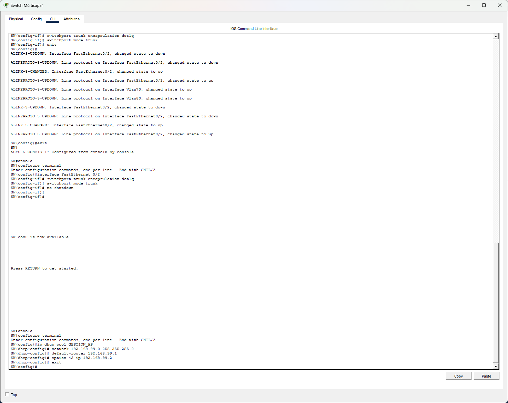

</div>

<div align="center">

*Configuración de la Opción 43 para el auto-descubrimiento del WLC por parte de los APs.*

</div>


## Configuración de la Interfaz para Invitados (VLAN 80)

Siguiendo el mismo esquema que con la WLAN de empresa, en esta captura se configura la interfaz dinámica VLAN80-Inv en el WLC perteneciente a la WLAN empleados. Se establece la dirección IP 192.168.80.2 y se vincula al Gateway 192.168.80.1, que actúa también como servidor DHCP. Esta segmentación es fundamental para asegurar que el tráfico de invitados permanezca aislado de la red interna de la organización.

<div align="center">

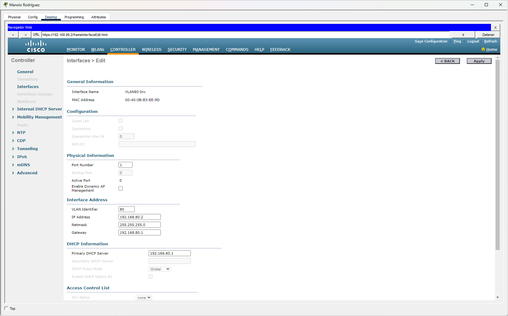

</div>

<div align="center">

*Configuración de la interfaz lógica y direccionamiento para la VLAN de invitados en el WLC.*

</div>

## Verificación de Registro del Access Point (AP)

En esta pantalla del WLC, dentro de AP Groups, se confirma que el LAP-PT se ha asociado correctamente a la WLC. Esta unión es el resultado directo de la configuración previa de la Opción 43 en el Switch Multicapa, permitiendo que el AP sea gestionado centralizadamente y esté listo para emitir los SSIDs configurados.

<div align="center">

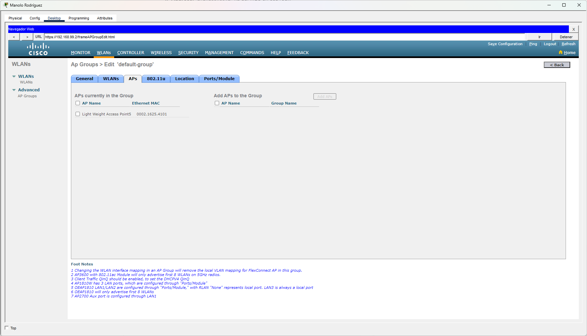

</div>

<div align="center">

*Confirmación de la vinculación y gestión centralizada del Punto de Acceso en el WLC.*

</div>


## Escaneo de Redes Inalámbricas desde el Cliente

Finalmente, se muestra la herramienta de conexión inalámbrica de un ordenador portátil donde se validan los resultados. El adaptador detecta correctamente ambos SSIDs: "empleados" e "invitados", mostrando un nivel de señal óptimo y el uso de seguridad WPA2-PSK. Esto verifica que el AP está difundiendo las redes según las políticas definidas en el controlador.

<div align="center">

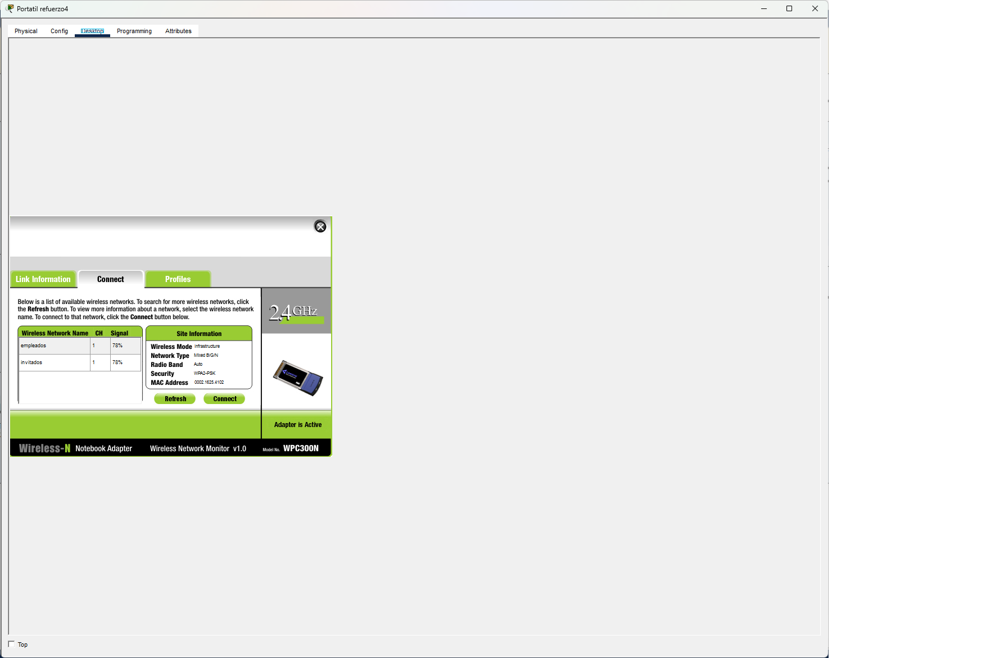

</div>

<div align="center">

*Vista desde el terminal de usuario confirmando la disponibilidad de las redes WiFi configuradas.*

</div>


## Validación de IP dinámica en Portátil de Empleados

En esta captura se confirma que el portátil de refuerzo asignado a la red de empleados ha obtenido correctamente su direccionamiento a través del servidor DHCP configurado en el Switch Multicapa. El dispositivo muestra la dirección 192.168.70.12, lo que garantiza que la comunicación a través del SSID "empleados" y su correspondiente mapeo a la VLAN 70 es totalmente funcional.

<div align="center">

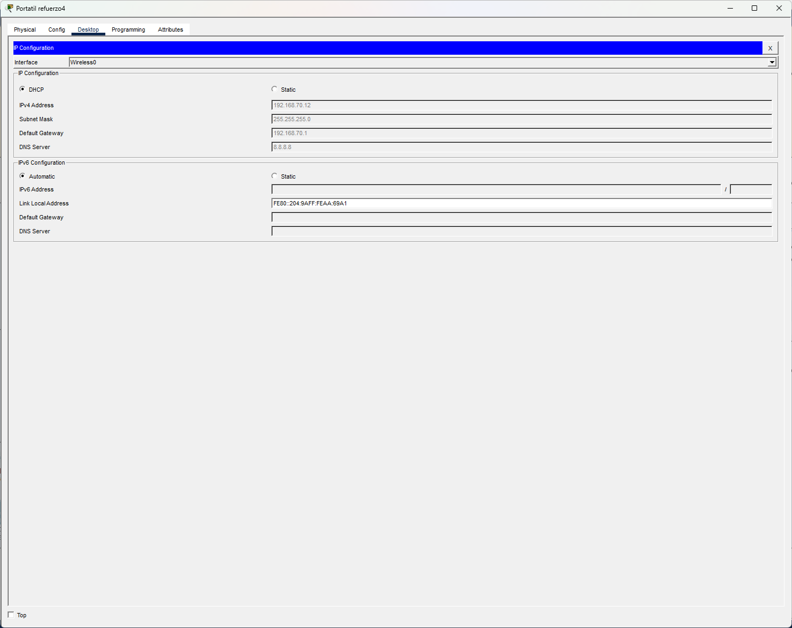

</div>

<div align="center">

*Verificación de la recepción de parámetros de red vía DHCP en la red inalámbrica de empleados.*

</div>

## Validación de IP dinámica en Portátil de Invitados

Se realiza la misma comprobación en el portátil de refuerzo de la red de invitados. En este caso, el terminal ha recibido la dirección 192.168.80.2, perteneciente al rango de la VLAN 80. El resultado resulta positivo.

<div align="center">


</div>

<div align="center">

*Confirmación de direccionamiento IP exitoso en el cliente inalámbrico de la red de invitados.*

</div>

# 4- Simulación de internet en un Router 2911

La incorporación de un Router 2911 permite recrear una salida real a la WAN (Internet). Su propósito principal es actuar como el límite de confianza de la infraestructura, sirviendo como destino para las rutas por 
defecto del Switch Multicapa. Es una buena manera de validar las políticas de seguridad (ACLs) que se configurarán a posteriori.

## Configuración de la interfaz del switch multicapa 3 conectada al router

En primer lugar, mediante los siguientes comandos se configura la interfaz conectada al router:

```bash
enable
configure terminal
interface gigabitEthernet0/1
no switchport
ip address 200.0.0.1 255.255.255.252
no shutdown
exit
```
Luego, se añade una ruta por defecto hacia el router para enviar el tráfico externo con:

```bash
ip route 0.0.0.0 0.0.0.0 200.0.0.2
```

<div align="center">

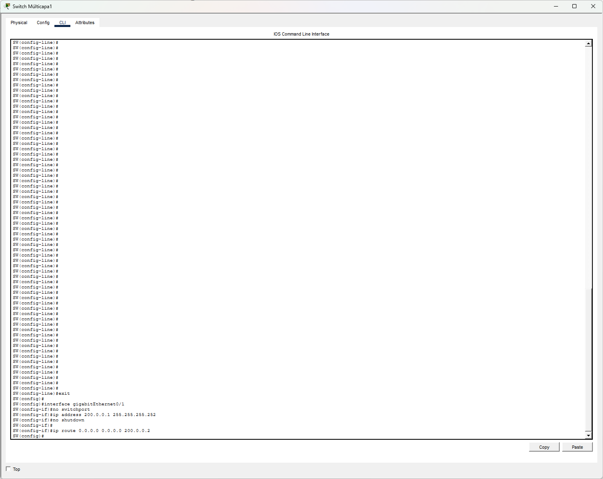

</div>

<div align="center">

*Configuración de la interfaz del switch que conecta con el router*

</div>

## Configuración de la interfaz del router conectada al switch multicapa

Para ello, se introducen estos comandos para conectar la interfaz con el switch multicapa. Se usa la red 200.0.0.0 simplemente como red de tránsito entre el switch multicapa y el router que simula Internet. Esa red solo sirve para comunicación entre dispositivos de capa 3:

```bash
enable
configure terminal
interface gigabitEthernet0/0
ip address 200.0.0.2 255.255.255.252
no shutdown
exit
```
Después, se añaden las rutas que van hacia las VLAN internas

<div align="center">

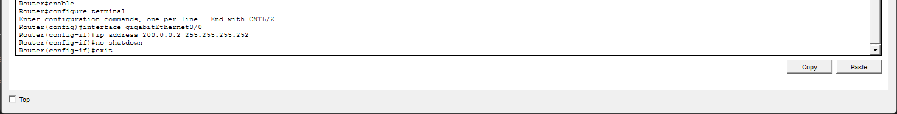
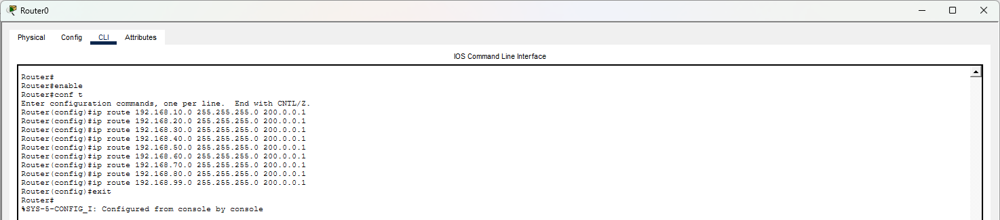

</div>

<div align="center">

*Comandos para configurar la interfaz y las rutas del router*

</div>

## Creación de una loopback para simular internet

Para simular Internet, y tras varias pruebas, se comprobó que, utilizando una interfaz física, no funcionaba. Por ello, se creo una loopback que siempre está activa. Se usaron estos comandos:

```bash
interface loopback0
ip address 8.8.8.1 255.255.255.0
no shutdown
exit
```

<div align="center">

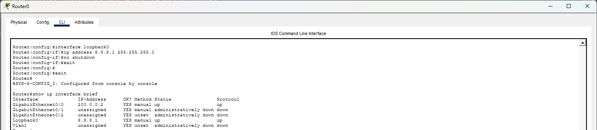

</div>

<div align="center">

*Aplicación de los comandos para crear una loopback y comprobación de que está UP.*

</div>

## Pruebas de conexión a internet simulado

A continuación se muestran las pruebas de conectividad para verificar que el internet simulado funciona.

Las pruebas se realizaron desde el switch multicapa, el router y desde un PC escogido al azar, dando un resultado positivo. Realizando ping 200.0.0.2 desde el switch multicapa y un ping 200.0.0.1 desde el router se confirmó que ambos dispositivos llegaban el uno al otro. Después, con un ping 8.8.8.1 desde el switch multicapa y desde un pc comprobamos que el router responde desde la loopback.

<div align="center">

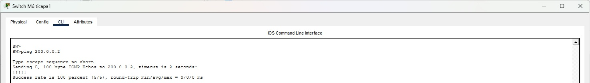
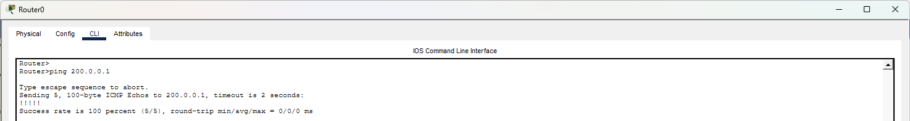
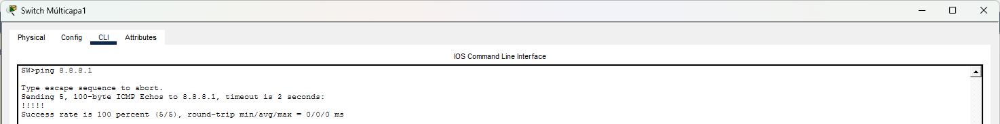
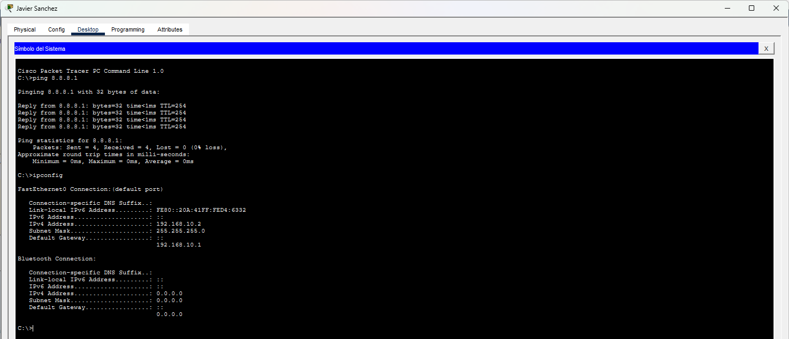
</div>

<div align="center">

*Pruebas realizadas.*

</div>


# 5- Configuración de ACLs para control de acceso entre VLANs

Para aplicar diferentes políticas de seguridad entre las VLANs de la red es necesario configurar **Listas de Control de Acceso (ACL)**.

Los objetivos, y que se deben cumplir mediante las ACL, son:

- La **VLAN 70 (WLAN_empleados)** no puede acceder a **Dirección (VLAN 10)**.
- La **VLAN 20 (Marketing)** no puede acceder a **Administración (VLAN 10)**.
- **Administración (VLAN 10)** sí puede acceder a **Servidores (VLAN 30)**.
- Solo la **VLAN 99 (Gestión IT)** puede administrar dispositivos de red.
- La **VLAN 80 (Invitados)** quedará aislada para permitir únicamente salida a Internet (se configurará más adelante).

---

## Creación de la primera ACL: VLAN 70 (WLAN_empleados) no puede comunicarse con VLAN 10 (Dirección)

Desde el switch multicapa se crea la ACL y después se aplica en la VLAN 70. Los comandos usados han sido:

```bash
enable
configure terminal
ip access-list extended ACL_VLAN70
deny ip 192.168.70.0 0.0.0.255 192.168.10.0 0.0.0.255
permit ip any any
exit
```

Se aplica IN en la VLAN origen (70) para bloquear el tráfico antes de que salga hacia otras redes.

```bash
interface vlan 70
ip access-group ACL_VLAN70 in
```

<div align="center">

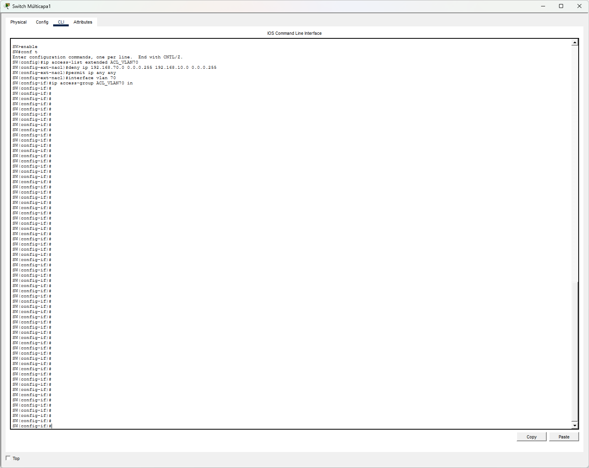

</div>

<div align="center">

*Se utilizan estos comandos para crear la ACL.*

</div>


## Creación de la segunda ACL: Marketing (VLAN 20) no puede acceder a Dirección (VLAN 10)

Siguiendo el mismo patrón que en la anterior ACL, aplicamos los siguientes comandos:

```bash
ip access-list extended ACL_VLAN20
deny ip 192.168.20.0 0.0.0.255 192.168.10.0 0.0.0.255
permit ip any any

interface vlan 20
ip access-group ACL_VLAN20 in
```

<div align="center">

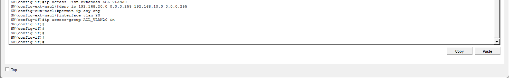

</div>

<div align="center">

*Configurando la segunda ACL*

</div>

## Solo VLAN 99 puede administrar los dispositivos

Primero se crea una lista de acceso (ACL 10) que solo permite conexiones desde la red de gestión 192.168.99.0/24. Posteriormente, esta ACL se aplica a las líneas VTY (0–4) para restringir quién puede acceder al switch de forma remota. 

Además, se habilita únicamente el protocolo SSH como método de acceso remoto y se establece la autenticación mediante usuarios locales, mejorando así la seguridad en la administración del dispositivo.

Comandos utilizados:

```bash
access-list 10 permit 192.168.99.0 0.0.0.255

line vty 0 4
access-class 10 in
transport input ssh
login local
```

<div align="center">

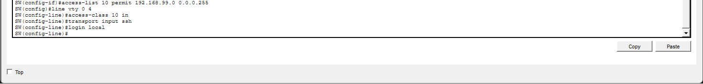

</div>

<div align="center">

*En primer lugar se crea la ACL para luego aplicarla a las líneas VTY (SSH/Telnet).*

</div>

## Aislando la VLAN 80 de Invitados

Una vez internet ya está simulado y funcional, la idea es que la VLAN 80 (invitados) no pueda acceder a ninguna red interna pero sí pueda salir a Internet (8.8.8.1). Para ello, aplicamos una ACL en la interfaz VLAN 80 del switch multicapa, porque es donde nace el tráfico de los invitados.

Para ello, se ejecutan los siguientes comandos:

```bash
enable
configure terminal
ip access-list extended ACL_INVITADOS
deny ip 192.168.80.0 0.0.0.255 192.168.10.0 0.0.0.255
deny ip 192.168.80.0 0.0.0.255 192.168.20.0 0.0.0.255
deny ip 192.168.80.0 0.0.0.255 192.168.30.0 0.0.0.255
deny ip 192.168.80.0 0.0.0.255 192.168.40.0 0.0.0.255
deny ip 192.168.80.0 0.0.0.255 192.168.50.0 0.0.0.255
deny ip 192.168.80.0 0.0.0.255 192.168.60.0 0.0.0.255
deny ip 192.168.80.0 0.0.0.255 192.168.70.0 0.0.0.255
deny ip 192.168.80.0 0.0.0.255 192.168.99.0 0.0.0.255
permit ip any any
exit
```
Luego es aplicada mediante: 

```bash
interface vlan 80
ip access-group ACL_INVITADOS in
```

<div align="center">

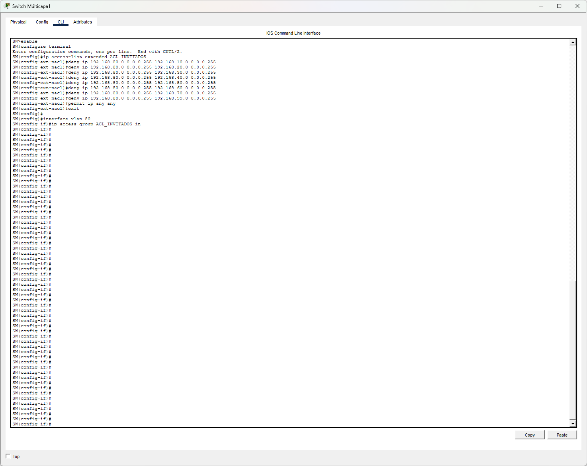

</div>

<div align="center">

*Se introducen los comandos en el switch.*

</div>

## Pruebas de conectividad

Tras introducir las ACL, se comprobó su funcionamiento real, siendo el resultado positivo.

### ACL

La primera comprobación, un ordenador de la **WLAN 70 no hace ping con uno de VLAN 10**. Sin embargo, con otra VLAN, como la VLAN 60, si que lo realiza. 

<div align="center">

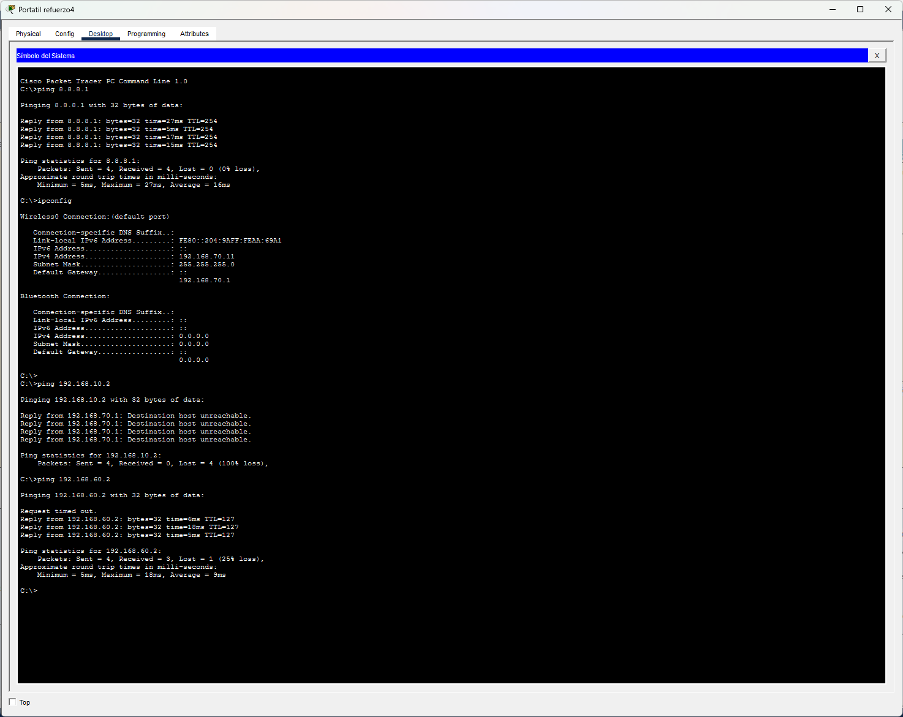

</div>

<div align="center">

*Prueba de Ping WLAN 70 con VLAN 10.*

</div>

La segunda comprobación se realiza mediante **un ping desde Marketing (VLAN 20) a Dirección y Finanzas (VLAN 10)**, siendo el resultado negativo. Pero, si lo hace a otra, como Recepción(VLAN 40), funciona.

<div align="center">

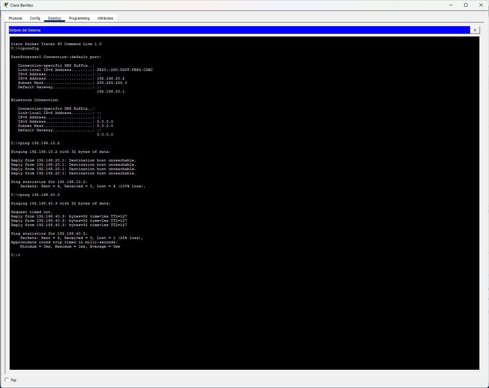

</div>

<div align="center">

*Prueba de Ping VLAN 20 con VLAN 10.*

</div>

La tercera comprobación pasa por observar si **invitados (WLAN 80) se comunica con el exterior pero no con las VLAN internas**. La captura muestra el resultado positivo de la prueba.

<div align="center">

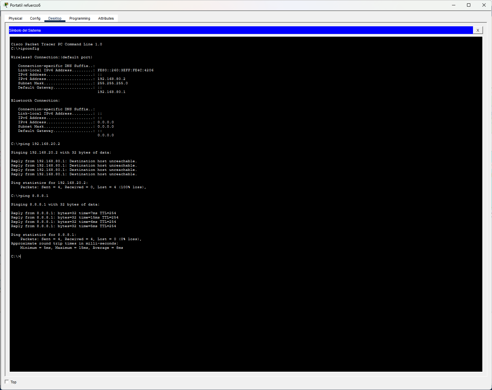

</div>

<div align="center">

*WLAN 80 no realiza ping con ningún ordenador pero si con el exterior.*

</div>

### SSH

Para comprobar el funcionamiento de SSH, primero se configuró correctamente el servicio desde el switch multicapa.

Primero se creó un usuario con:

```bash
enable
configure terminal
username admin secret cisco
```

A continuación, se configuraron las líneas VTY, para controlar el acceso remoto al dispositivo:

```bash
line vty 0 4
login local
transport input ssh
exit
```
Después se definió un dominio, necesario para generar las claves de cifrado utilizadas por SSH. Se utilizó:

```bash
ip domain-name red.local
```
Por último, se generaron las claves RSA que utiliza SSH para establecer la conexión segura. También la elección de tamaño de la clave:

```bash
crypto key generate rsa
1024
```

<div align="center">


</div>

<div align="center">

*Configuración de SSH en el switch multicapa.*

</div>

Una vez realizados estos pasos, ya se puede realizar la prueba. Para ello, se utilizó un PC de la VLAN 99 y otro de la VLAN 10. El resultado es claro: en uno si conecta mientras que en el otro no.

<div align="center">

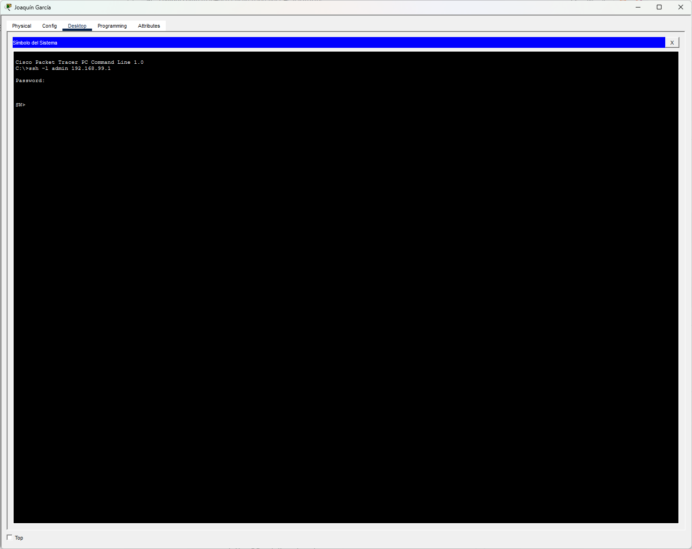
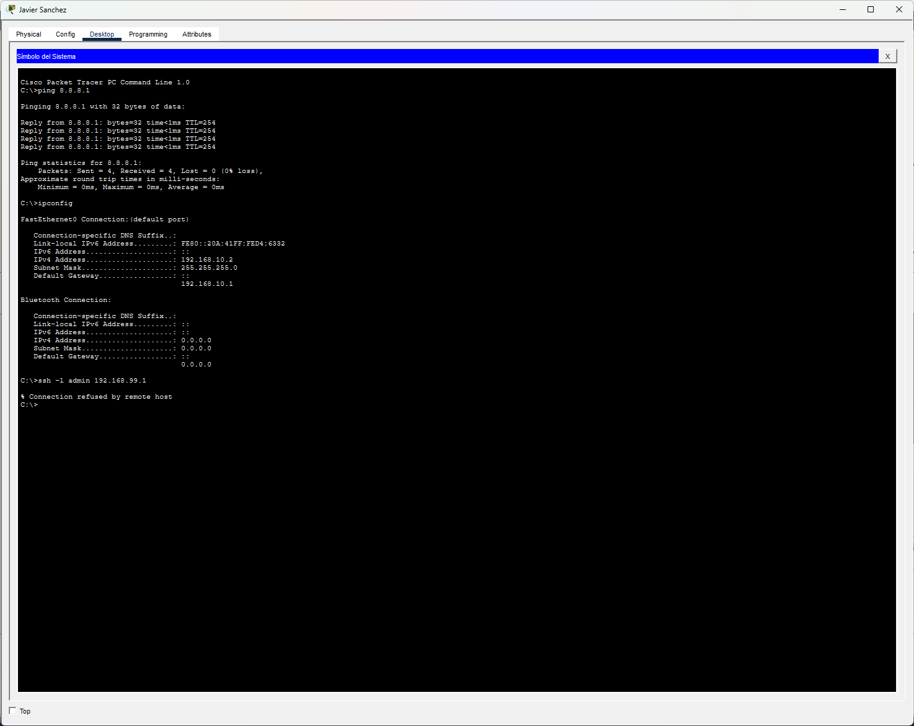

</div>

<div align="center">

*En el dispositivo conectado en la VLAN 99 se produce la conexión mientras que el de la VLAN 10 es rechazada.*

</div>

### BUG ACL

Durante las pruebas de conectividad se detectó un comportamiento anómalo relacionado con la aplicación de las ACL. A pesar de configurar correctamente las listas de control de acceso en el switch multicapa, estas quedaban almacenadas en la configuración pero no aparecían aplicadas a las interfaces VLAN correspondientes. **Este problema se produce cada vez que se abre el archivo .pkt**, ya que redes que deberían estar bloqueadas entre sí, en el momento de iniciar el programa pueden comunicarse mediante ping. No obstante, al volver a aplicar manualmente las ACL sobre las interfaces VLAN, las restricciones de tráfico se restablecían y el filtrado funcionaba con normalidad. A pesar de intentar aplicar repetidamente los comandos correspondientes (ip access-group ... in), el parámetro **IN** no aparecía reflejado en la configuración mostrada por el dispositivo, como si que lo hace la ACL de SSH.

Comandos insertados correctamente pero que, debido al bug, no funcionan correctamente.

```bash
enable
configure terminal

interface vlan 70
ip access-group ACL_VLAN70 in
exit

interface vlan 20
ip access-group ACL_VLAN20 in
exit

interface vlan 80
ip access-group ACL_INVITADOS in
exit

end
```
<div align="center">

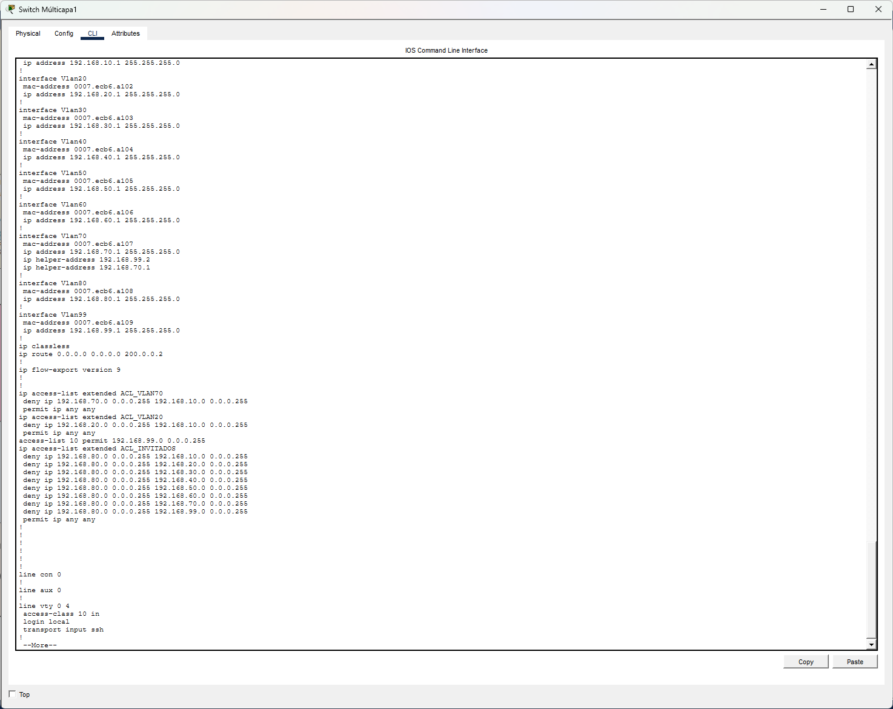

</div>

<div align="center">

*Se puede comprobar que IN no está en las ACL, mientras que en SSH, sí.*

</div>

# 6- Configuración de Impresoras

Se decidió incorporar a la infraestructura cuatro impresoras, dos en cada planta. Para ello, se conectó cada impresora por cable al switch de cada planta. Además, se decidió que las impresoras pertenecieran a la VLAN 30, la de los servidores, ya que las impresoras son recursos compartidos, al igual que los servidores. 

Esta decisión también permite aprovechar las ACL creadas, además de que desde la WLAN Invitados no se podrá imprimir.

Para incorporar la impresora a la VLAN 30, desde el switch de cada planta se implementaron los siguientes comandos:


 ```bash
 interface range fa1/1
 switchport mode access
 switchport access vlan 30
```
<div align="center">

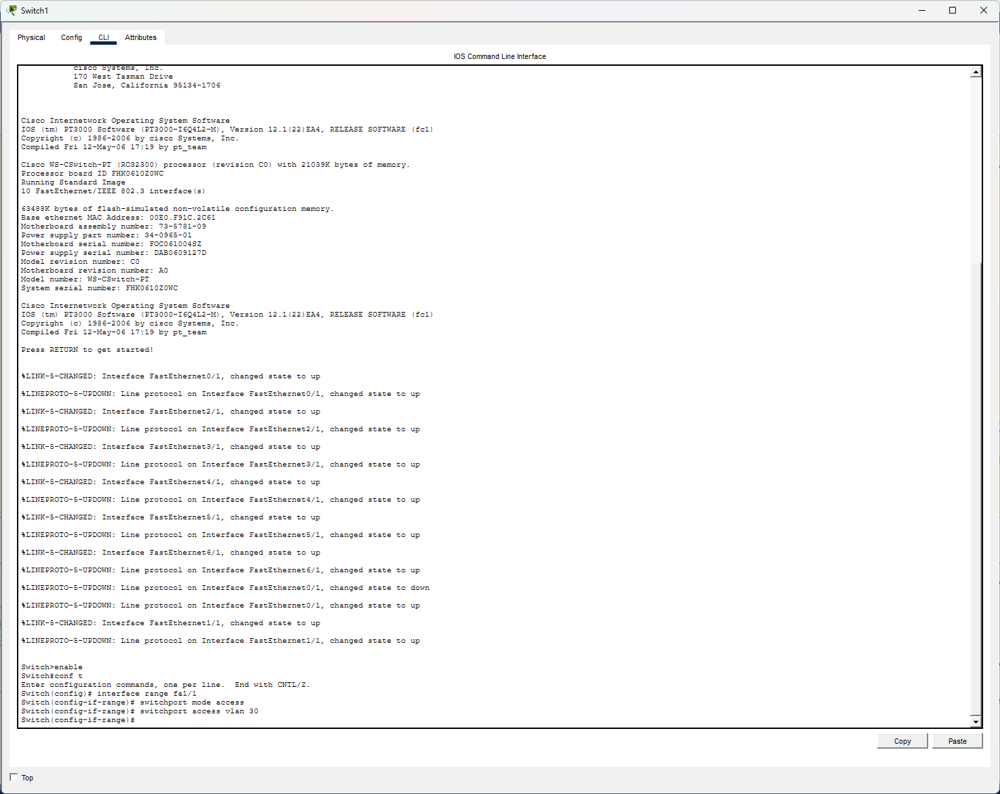

</div>

<div align="center">

*Momento en el que se incorpora las impresoras de la planta 1 a la VLAN 30.*

</div>

Para comprobar el correcto funcionamiento, se realizó una prueba. Un empleado al azar, de la VLAN 50, pudo hacer ping sin problema a la impresora. Mientras que un equipo conectado a la red de invitados no.

<div align="center">

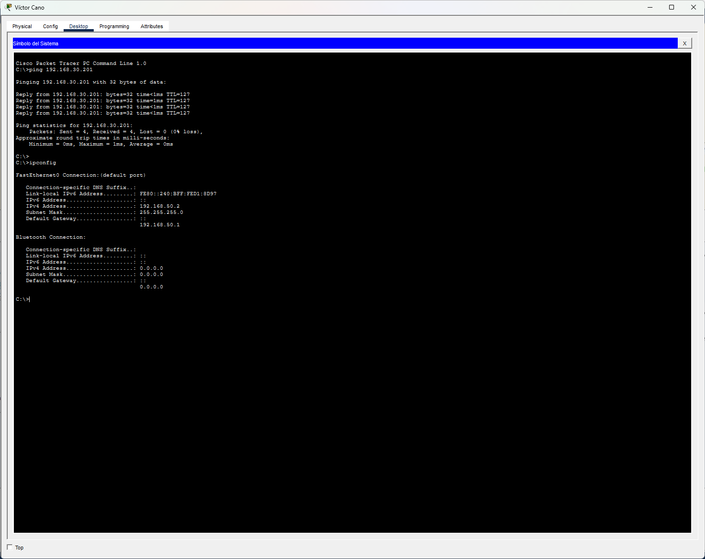
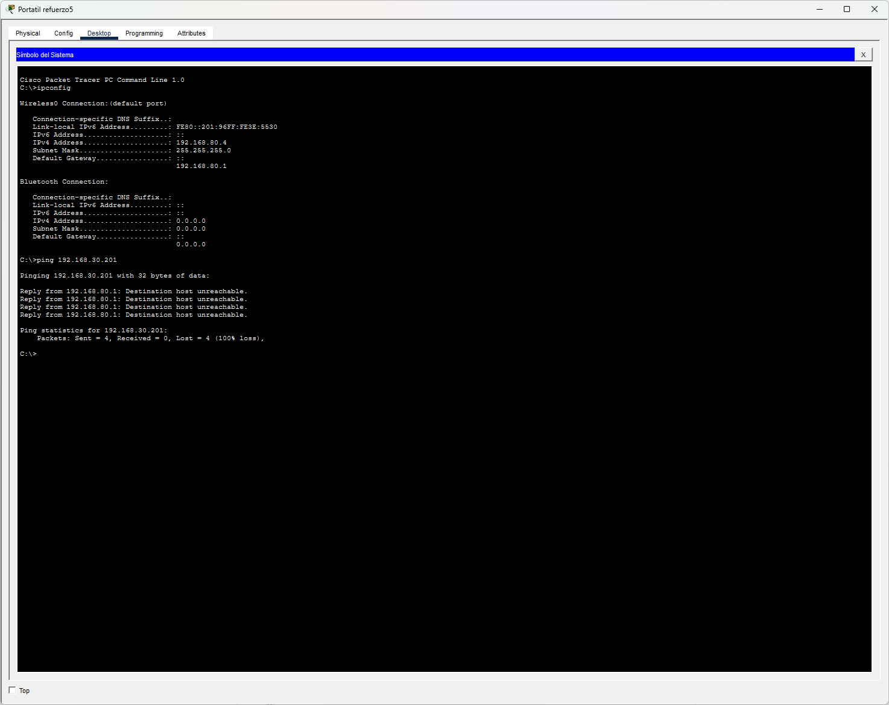

</div>

<div align="center">

*Capturas que demuestran el buen funcionamiento de la impresora*

</div>

---

# 7- Conclusiones

A lo largo de este proyecto se ha montado una infraestructura de red, partiendo desde la segmentación por VLAN hasta la configuración de servicios clave como DHCP, red inalámbrica, ACL y salida a internet simulada. En conjunto, el resultado ha sido positivo, ya que la red ha quedado organizada, funcional y con una base de seguridad coherente para cada tipo de usuario y dispositivo.

Además, este trabajo ha servido para entender mucho mejor cómo se relacionan entre sí los distintos elementos de una red real. Aunque surgieron algunos problemas, como el bug de las ACL en Packet Tracer, la práctica también ha permitido comprobar que la mayor parte de la configuración funciona correctamente y que el diseño general es sólido y escalable.