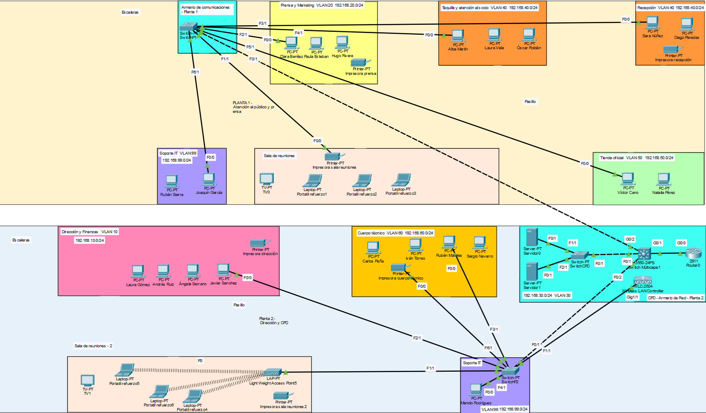
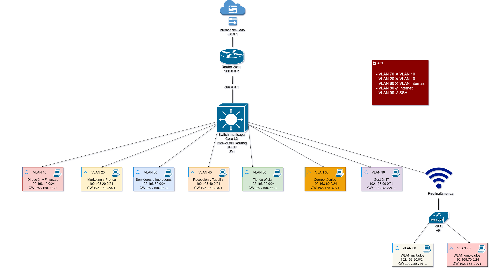

# Esquema lógico y físico de la red

## Índice

- [Esquema físico](#esquema-físico)
  - [Planta 1](#planta-1)
  - [Planta 2](#planta-2)
  - [CPD](#cpd)
  - [Topología física adoptada](#topología-física-adoptada)
- [Esquema lógico](#esquema-lógico)

## Esquema físico

La infraestructura de red se ha diseñado para una oficina distribuida en **dos plantas** y un **CPD central** donde se concentran los elementos principales de red y los servidores.

### Planta 1

En la planta 1 se sitúan los departamentos orientados a atención y trabajo de oficina, además de una habitación auxiliar donde se encuentra el switch de acceso de esa planta y un despacho IT, ya que este departamento tiene presencia en ambas plantas.

- Recepción
- Taquilla
- Marketing y Prensa
- Tienda oficial
- Soporte IT

Todos los dispositivos de esta planta se conectan al mencionado **switch de acceso**, que a su vez se conecta mediante un enlace trunk al **switch multicapa principal**.

### Planta 2

En la planta 2 se ubican los departamentos de gestión y perfil técnico, además del CPD y el departamento de IT:

- Dirección y Finanzas
- Cuerpo técnico
- Soporte IT

Los equipos de esta planta se conectan a otro **switch de acceso**, que también se enlaza mediante un trunk con el switch multicapa principal.

Además, la oficina cuenta con dos salas de reuniones equipadas con **cuatro ordenadores portátiles, todos con módulos de conexión Wi-Fi incorporados**.

Por último, también existen **cuatro impresoras**, dos por planta, para ofrecer servicio de impresión a los trabajadores.

### CPD

En el CPD se concentran los elementos críticos de la red:

- **Switch multicapa (núcleo de red)**
- **Switch de acceso para servidores**
- **Router para simular internet**
- **Servidor 1**
- **Servidor 2**
- **WLC-2504 Wireless Lan Controller**

El **switch multicapa** actúa como núcleo de la infraestructura, realizando el **enrutamiento inter-VLAN** y centralizando la conectividad entre los switches de acceso de ambas plantas y el CPD.

Hay **tres switches de capa 2**:

- Uno en el CPD que enlaza con los dos servidores
- Otro en la planta 2 que da conectividad a los dispositivos de esa planta
- Y un último en la planta 1 que conecta los dispositivos de esa planta

Los **dos servidores** se encuentran ubicados en el CPD, ya que esta es la opción más adecuada en una infraestructura profesional por motivos de:

- seguridad
- facilidad de administración
- mejor control del cableado
- centralización de servicios
- mejores condiciones eléctricas y de refrigeración

Se optó por implementar un **WLC-2504 Wireless LAN Controller en el CPD** para configurar y gestionar dos redes Wi-Fi: Empleados e Invitados. En este dispositivo se definen los SSID_Empresa y SSID_Invitados. La cobertura Wi-Fi es proporcionada por un LAP-PT, situado en una de las salas de reuniones, que emite ambas redes inalámbricas para que los usuarios puedan conectarse según el tipo de acceso que tengan.

### Topología física adoptada

La red sigue una **topología jerárquica en estrella**, donde el **switch multicapa** actúa como nodo central y de él dependen los switches de acceso del resto de la infraestructura.

Este diseño facilita:

- la escalabilidad
- la administración
- la detección de fallos
- el aislamiento de problemas de red

**Resumen físico de la infraestructura:**

- **Planta 1** → 1 switch de acceso + puestos de usuario 
- **Planta 2** → 1 switch de acceso + puestos de usuario + punto de acceso
- **CPD** → switch multicapa + switch de servidores + router + 2 servidores + WLC-2504 Wireless LAN Controller

A continuación, se muestra el esquema físico general de la infraestructura de red implementada en Cisco Packet Tracer:

*Esquema físico de la infraestructura de red implementada en Cisco Packet Tracer.*

---

## Esquema lógico

Para mejorar la seguridad, la organización y la escalabilidad, la red se ha dividido en varias **VLAN**, de forma que cada departamento o área funcional quede aislada en una red independiente.

Las VLAN implementadas son las siguientes:

| VLAN | Nombre | Red |
|------|--------|-----|
| 10 | Dirección y Finanzas | 192.168.10.0/24 |
| 20 | Marketing y Prensa | 192.168.20.0/24 |
| 30 | Servidores | 192.168.30.0/24 |
| 40 | Recepción / Taquilla | 192.168.40.0/24 |
| 50 | Tienda oficial | 192.168.50.0/24 |
| 60 | Cuerpo técnico | 192.168.60.0/24 |
| 70 | WLAN_empleados | 192.168.70.0/24 |
| 80 | WLAN_invitados | 192.168.80.0/24 |
| 99 | Gestión IT | 192.168.99.0/24 |

Cada VLAN dispone de una **interfaz virtual (SVI)** en el switch multicapa, que actúa como **gateway** de los dispositivos de dicha red.

A nivel lógico, el funcionamiento general de la red es el siguiente:

1. Los dispositivos finales se conectan a su switch de acceso correspondiente.
2. Cada puerto de usuario se asigna a la VLAN del departamento al que pertenece.
3. Los switches de acceso envían el tráfico al switch multicapa mediante enlaces trunk.
4. El switch multicapa enruta el tráfico entre VLANs cuando es necesario.
5. Los servidores y recursos compartidos se encuentran en una VLAN dedicada.
6. La red de gestión queda separada del resto para tareas administrativas.

Además, en el esquema lógico también se representa la integración de la **red inalámbrica**, donde el **WLC** gestiona las WLAN de empleados e invitados, asociadas respectivamente a las **VLAN 70 y 80**, así como la salida hacia el **router** que simula el acceso a Internet.

A continuación, se proporciona el esquema lógico de la infraestructura de red:

*Esquema lógico de la infraestructura de red, con segmentación por VLAN, red inalámbrica, enrutamiento inter-VLAN y salida a internet simulada.*

